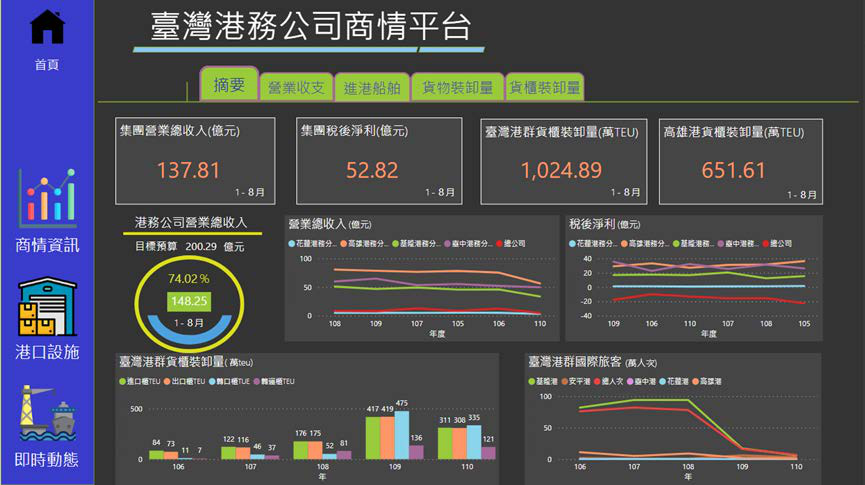
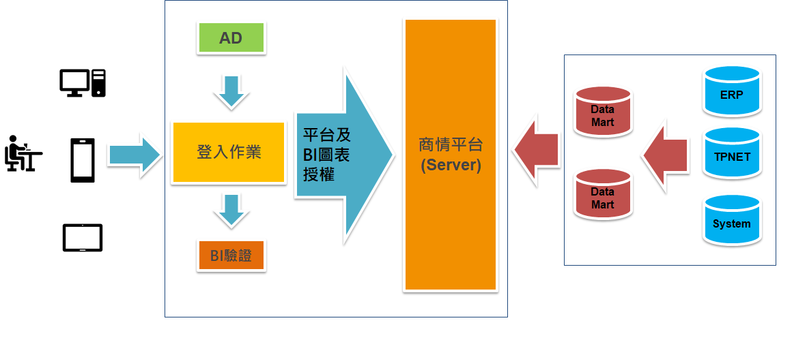
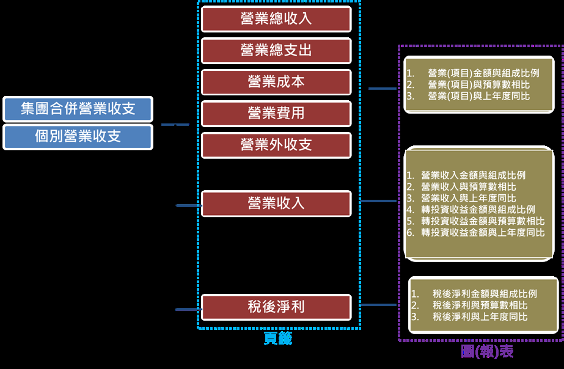
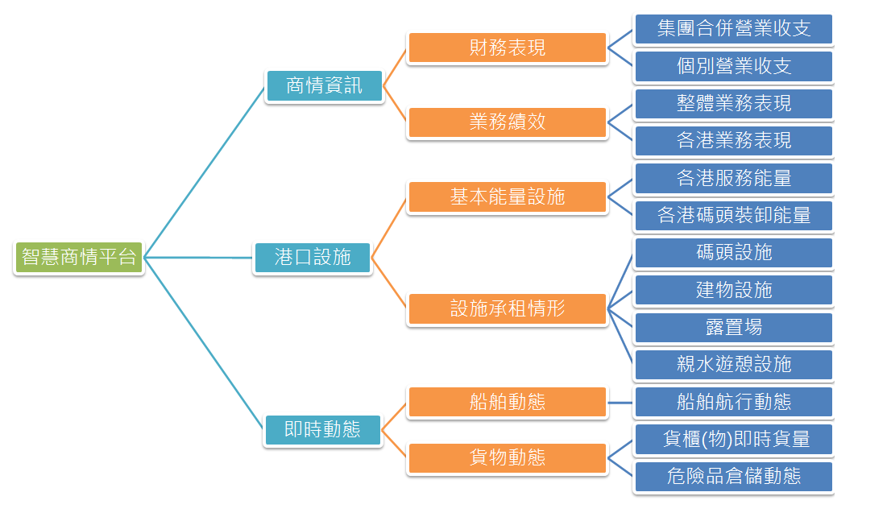

# 檔案來源: 03-需求規格書.pdf

## 📄 第 1 頁

臺灣港務股份有限公司
111 年度「智慧商情平台」委外建置案
需求規格書
中華民國 110 年 12 月
1

---
## 📄 第 2 頁

目 錄
壹、 專案概述 ........................................................................................................... 2
一、 專案名稱.................................................................................................... 2
二、 專案目標.................................................................................................... 2
三、 專案範圍.................................................................................................... 3
四、 現有系統、設備及工具說明 .................................................................... 3
貳、 專案需求 ........................................................................................................... 4
一、 系統範圍.................................................................................................... 4
二、 系統共通性要求 ...................................................................................... 14
三、 使用者介面 .............................................................................................. 15
四、 系統開發/測試/正式環境 ...................................................................... 16
五、 系統效能.................................................................................................. 16
六、 資訊安全.................................................................................................. 17
七、 成果展示影片 .......................................................................................... 21
參、 專案時程 ......................................................................................................... 22
肆、 專案管理及監控 .............................................................................................. 25
一、 專案管理原則 .......................................................................................... 25
二、 專案組織.................................................................................................. 25
三、 專案會議.................................................................................................. 28
伍、 審查/驗收 ....................................................................................................... 28
陸、 教育訓練 ......................................................................................................... 29
柒、 交付標的 ......................................................................................................... 30
捌、 保固服務 ......................................................................................................... 37
玖、 附錄 ................................................................................................................. 38
壹拾、 附件 ........................................................................................................ 52
壹、 專案概述
一、專案名稱
111 年度「智慧商情平台」委外建置案（以下簡稱本專案）。
二、專案目標
本案將串接機關各項重要營運資料數據，結合本平台原生工具以建置數
位儀表板，並整合機關各港埠設施資料及介接已自建系統，呈現港口重要即時
2

---
## 📄 第 3 頁

動態資訊。期提供一站式資料、多維度與視覺化之分析資訊，提高機關各級主
管及業務單位承辦人員判讀資料之便利性，簡化取得資訊的過程，輔助決策與
規劃。
三、專案範圍
專案範圍內之需求與細項詳本需求規格書貳、專案需求。
(一) 建置本專案商情平台系統，包含前台與後台。
(二) 依機關需求訪談製作客製化圖表並自動化介接圖表資料源頭系統。
(三) 介接機關3D-GIS圖台圖資及已自建系統之資料。
(四) 辦理系統管理者/操作者及一般使用者教育訓練。
(五) 錄製成果展示影片。
四、現有系統、設備及工具說明
建置本專案所需之硬體設備由機關提供，廠商須於機關所提供之伺服器
主機、資料庫系統及使用者環境，開發及建置本案功能需求，如有額外之軟硬
體設備需求應由廠商負責提供，經機關同意後施作。
(一) 本案建置智慧商情平台服務運作環境如下(採VMware架構):
1. 伺服器作業系統：Windows Server 2019企業版(或以上版本)。
2. 資料庫：Microsoft SQL Server 2019標準版(或以上版本)。
(二) 本平台看板展示畫面輸出環境:個人電腦(含筆記型電腦)、行動裝置、戰情
(監控)中心電視牆、多個投影屏幕。
(三) 連線環境:機關內部網路（含各分公司）及網際網路。
(四) 使用者環境
1. 個人電腦
(1) 作業系統：Windows 10及macOS，畫面及功能均能正常顯示與操作。
3

---
## 📄 第 4 頁

(2) 瀏覽器軟體：本案建置智慧商情平台服務必須完全支援Microsoft
IE11、Google Chrome、Mozilla Firefox、Microsoft Edge、Safari...
等一般通用瀏覽器，畫面及功能均能正常顯示與操作。
2. 行動裝置
(1) 本案建置智慧商情平台服務之前台視覺化介面呈現與操作，應以響應
式網頁 (Responsive Web Design, RWD)設計應用程式，提供機關商情
決策資訊整合入口，並可通用於智慧型手機、平板電腦自動偵測使用
者所使用的瀏覽裝置，依不同螢幕尺寸，自動調整網頁圖文內容，提
供使用者最佳瀏覽環境。
(2) 上述行動裝置之作業系統，至少須支援iOS 14.X（含）、Android 10.X
（含）以上版本，畫面及功能均能正常顯示與操作。
貳、 專案需求
~
一、系統範圍:本專案除客製化開發視覺化圖表(一) (三)屬非固定項目採實支實
付外，其餘工作事項皆屬商情平台建置固定項目範圍，如下說明:
(一) 商情平台系統建置
1. 商情平台前台建置:
4

---
## 📄 第 5 頁

|  | 功能列 |
| --- | --- |

|  | 儀表板 |
| --- | --- |

(1) 廠商須依系統網頁規劃架構，客製化開發本平台，如下圖。
功能列 模組 儀表板
(2) 本平台首頁規劃如下示意圖，其視覺化圖表或儀表板所顯示資訊，需依
後台、跨系統或每日資料的變異而自動同步動態更新呈現，惟平台設計
上仍需與機關需求訪談為準。
5

### 🖼️ 相關圖表

---
## 📄 第 6 頁

(3) 可依照個人需求設計個人化首頁，以手動方式自由配置新增(勾/拉選
擇)視覺化圖表，可針對前台使用者瀏覽權限進行控管，並提供後台管
理稽核紀錄功能。
(4) 須具備接收、驗證、轉換、儲存及管理不同資料來源(如：DB、web API、
檔案等)並轉入機關自建之「營運數據資料庫」或轉入得標廠商自行建
置之資料庫，提供後續分析應用，以自動化整合機關內部不同業務資訊
系統之結構化、半結構化或非結構化資料，接收資料方式至少包含系統
介接、資料匯入(人工及自動)等；如本專案平台得標廠商採用自行建立
之資料庫，需協助將機關已自建之「營運數據資料庫」資料匯入。
(5) 須提供使用者可快速且方便搜尋本平台資料源及視覺化圖表。
(6) 須具備儀表版及視覺化圖表管理模組(新增，註銷，修改，歸類及搜索)，
可讓使用者能方便搜索到目標項目，也讓管理者能方便管理及歸類儀
表版及視覺化圖表。
(7) 須具備資料源管理模組，讓管理者能方便管理資料源。
(8) 軟體授權:投標廠商提供之 ETL(EXTRACTION-TRANSFORMATION-LOADING，
以下簡稱 ETL)、商業智慧分析軟體(BI)等原生工具軟體授權，均應提
供最新之合法授權正式版本（選用 Microsoft SQL Server 內含工具軟
體除外，如 SQL Server Integration Services(SSIS)、SQL Server
Analysis Services(SSAS)），同時應於服務建議書載明其版本(如標準
版、專業版…等)以及包含模組，並於服務建議書載明是否有相關使用
限制。
2. 商情平台後台權限管理及系統整體自動化機制(至少須包含以下功能，其他
以實際需求訪談為準)(固定項目)
(1) 本專案前後台之各項作業登入均須結合機關單一簽入機制(SSO)或 AD
6

---
## 📄 第 7 頁

網域帳號，進行使用者認證及授權，使用者無須再記憶另一組帳號密
碼，如下規劃。
(2) 帳號密碼重設機制須提供電子郵件通知。
(3) 身分驗證機制應防範自動程式之登入或密碼嘗試機制，如提供圖形檢
查碼或 2 階段驗證。
(4) 功能清單、站點管理、同步站點資訊及排程管理、標準排程管理、基本
設定發送 e-mail、我的最愛、BI 工具授權管理、取得授權數及設定授
權人員、動態參數管理、客製化排程、報表排程設定、排程清單管理、
資料元密碼更改及視覺化圖表之載體。
(5) 使用者權限管理模組：可針對個別使用者設定所屬權限群組。
(6) 權限控管功能需能設定使用者群組對應到系統功能權限、操作權限、資
料表(瀏覽)權限，於需求訪談時進行確認。
(7) 帳號管理：提供帳號啟用、權限變更、停用等功能。
(8) 系統日誌稽核：系統須保存登入資訊（包含登入帳號、登入時間、存取
資料的時間及 IP 位址）紀錄，管理者可以針對時間區間去查詢、帳號
啟用、權限變更、帳號停用等記錄，相關保存紀錄需符合行政院資通安
全會報技術服務中心「資通安全責任等級分級辦法」之附表 10「資通
系統防護基準表」之等級「普」之必要控制措施，詳玖、附錄四、資通
7

### 🖼️ 相關圖表

---
## 📄 第 8 頁

系統防護基準表。
(9) 本專案數位儀表板規劃使用對象為機關各級主管、各業務單位及資訊
處同仁，且未來可能逐步擴大使用範圍，廠商應針對上述使用人員，提
出權限規劃方案。
(10) 視覺化看板展示模組，可統一設定編輯看板內儀表板或視覺化圖表之
位置及數量於不同的輸出設備，例如:個人行動裝置(2*2)、個人電腦
(3*2)、戰情(監控)中心電視牆(4*3)、多個投影屏幕(1*3)。
3. 商情平台數位儀表板、頁籤及視覺化圖表設計規則(固定項目)
(1) 開發本專案需求項目相關之互動式統計分析圖表，儀表板內頁籤及所
含包含之視覺化圖表顯示資訊架構如下圖(頁籤及視覺化圖表仍需與
機關需求訪談為準)
儀表板
(2) 數位儀表板、視覺化圖表資料須依後台、跨系統或每日資料的變異而自
動同步動態更新，確保資料一致性。
(3) 規劃設計本專案需求項目所需的分析維度(DIMENSION)、度量(MEASURE)
與階層(HIERARCHY)等，提供使用者進行多維度的線上分析處理(OLAP)。
8

### 🖼️ 相關圖表

---
## 📄 第 9 頁

(4) 得標廠商需協助機關將已自行完成開發之 power bi 圖表嵌入至儀表板
內。
(5) 可設定數據臨界點，以監控數據變化，並警示異常狀態。
(6) 各張視覺化圖表應顯示最後更新日期(時間)。
(7) 依據業務需求將多個關鍵性指標同時呈現在單一分析數位儀表板，以
利使用者判讀與追蹤。
(8) 運用顏色管理或警示燈號顯示等機制，突顯異常或警示訊息，以提升管
理效率及資訊品質
(9) 視資料特性結合數據資料與地理資訊，詮釋與地理(或空間)相關資訊，
協助使用者判讀與理解資料。
(10) 須提供視覺化圖表匯出下載功能，至少提供匯出 PDF 等檔案格式。
(二) 客製化開發視覺化圖表(一)(非固定項目，採實支實付)
9

---
## 📄 第 10 頁

1. 本次智慧商情平台數位儀表板之需求分析及實作，計有5項儀表板之視覺化
圖表:集團合併營業收支、個別營業收支、整體業務表現、各港業務表現及
貨櫃(物)即時貨量，如下圖示。
儀表板
2. 客製化開發特殊性視覺化圖表，如:櫃場圖、航線圖、水滴圖…等。
3. 廠商須配合新增製作視覺化圖表需求，上限為249張視覺化圖表，此客製化
視覺化圖表須能自動化介接資料源頭系統，透過資料清理程序，進行原始
資料檢核，確保資料之正確性與可用性，詳玖、附錄一、視覺化圖表需求一
覽表，惟詳細視覺化圖表製作仍需與機關需求訪談為準。
4. 因每個視覺化圖表可能會涉及多個資料來源、多種資料維度(如：年、月、
經緯度座標、行政區、描述性欄位、計數等)呈現及多種視覺化圖表元件(如
圓餅圖、長條圖、地圖等)，客製化難易度不同，故得標廠商在需求訪談後
應提供每個視覺化圖表報價單，內容至少包含:主題、資料來源、資料維度、
視覺化圖表元件、需求訪談時間、預計完工時間、預估天數/費用、需求單
位簽名確認、資訊處簽名確認…等相關訊息。
5. 針對客製化視覺化圖表需求提出資料萃取、轉換、載入(ETL)作業之建構機
制、方式及程序。
10

### 🖼️ 相關圖表

---
## 📄 第 11 頁

|  | 儀表板 |
| --- | --- |

6. 依據客製化視覺化圖表資料的應用需求、執行效能與安全性等考量，設計
所需之自動化資料載入與更新流程。
7. 規劃客製化視覺化圖表ETL作業日誌，記錄轉檔程序歷次轉檔結果，包含轉
檔狀態（成功或失敗等）、轉檔時間、轉入筆數、處理成功筆數、失敗筆
數。
8. 配合機關需求介接機關已自建系統資料及呈現即時動態資訊，如TPNET(新
港棧系統)、AIS(船舶動態系統)、ERP(企業資源規劃系統)、工程資訊管理
系統、GIS、危險品系統等，得標廠商應提供每個視覺化圖表報價單，內容
至少包含:主題、資料來源、資料維度、視覺化圖表元件、需求訪談時間、
預計完工時間、預估天數/費用、需求單位簽名確認、資訊處簽名確認…等
相關訊息。
(三) 客製化開發視覺化圖表(二)(非固定項目，採實支實付)
1. 本次智慧商情平台數位儀表板之需求分析及實作，計有4項儀表板之視覺化
圖表:各港服務能量、各港碼頭裝卸能量、船舶航行動態及危險品倉儲動態，
如下圖示。
2. 客製化開發特殊性視覺化圖表，如:櫃場圖、航線圖、水滴圖…等。
11

### 🖼️ 相關圖表

---
## 📄 第 12 頁

3. 介接機關3D-GIS圖台圖資資訊。
4. 配合機關需求介接機關已自建系統資料及呈現即時動態資訊，如TPNET(新
港棧系統)、AIS(船舶動態系統)、ERP(企業資源規劃系統)、工程資訊管理
系統、GIS、危險品系統等，得標廠商應提供每個視覺化圖表報價單，內容
至少包含:主題、資料來源、資料維度、視覺化圖表元件、需求訪談時間、
預計完工時間、預估天數/費用、需求單位簽名確認、資訊處簽名確認…等
相關訊息。
5. 配合機關需求新增製作各式視覺化圖表，此客製化視覺化圖表須能自動化
介接資料源頭系統，透過資料清理程序，進行原始資料檢核，確保資料之
正確性與可用性，詳玖、附錄一、視覺化圖表需求一覽表，惟詳細視覺化
圖表製作仍需與機關需求訪談為準。
6. 因每個視覺化圖表可能會涉及多個資料來源、多種資料維度(如：年、月、
經緯度座標、行政區、描述性欄位、計數等)呈現及多種視覺化圖表元件(如
圓餅圖、長條圖、地圖等)，客製化難易度不同，故得標廠商在需求訪談後
應提供每個視覺化圖表報價單，內容至少包含:主題、資料來源、資料維度、
視覺化圖表元件、需求訪談時間、預計完工時間、預估天數/費用、需求單
位簽名確認、資訊處簽名確認…等相關訊息。
7. 針對客製化視覺化圖表需求提出資料萃取、轉換、載入(ETL)作業之建構機
制、方式及程序。
8. 依據客製化視覺化圖表資料的應用需求、執行效能與安全性等考量，設計
所需之自動化資料載入與更新流程，將資料匯入機關建置之營運數據資料
庫。
9. 規劃客製化視覺化圖表ETL作業日誌，記錄轉檔程序歷次轉檔結果，包含轉
檔狀態（成功或失敗等）、轉檔時間、轉入筆數、處理成功筆數、失敗筆
數。
(四) 客製化開發視覺化圖表(三)(非固定項目，採實支實付)
12

---
## 📄 第 13 頁

1. 本次智慧商情平台數位儀表板之需求分析及實作，計有4項儀表板之視覺
化圖表:碼頭設施、建物設施、露置場及親水遊憩設施，如下圖示。
2. 客製化開發特殊性視覺化圖表，如:櫃場圖、航線圖、水滴圖…等。
儀表板
3. 配合機關需求介接機關已自建系統資料及呈現即時動態資訊，如TPNET(新
港棧系統)、AIS(船舶動態系統)、ERP(企業資源規劃系統)、工程資訊管理
系統、GIS、危險品系統等，得標廠商應提供每個視覺化圖表報價單，內容
至少包含:主題、資料來源、資料維度、視覺化圖表元件、需求訪談時間、
預計完工時間、預估天數/費用、需求單位簽名確認、資訊處簽名確認…等
相關訊息。
4. 配合機關需求新增製作各式視覺化圖表，此客製化視覺化圖表須能自動化
介接資料源頭系統，透過資料清理程序，進行原始資料檢核，確保資料之
正確性與可用性，詳玖、附錄一、視覺化圖表需求一覽表，惟詳細視覺化
圖表製作仍需與機關需求訪談為準。
5. 因每個視覺化圖表可能會涉及多個資料來源、多種資料維度(如：年、月、
經緯度座標、行政區、描述性欄位、計數等)呈現及多種視覺化圖表元件(如
圓餅圖、長條圖、地圖等)，客製化難易度不同，故得標廠商在需求訪談後
13

### 🖼️ 相關圖表

---
## 📄 第 14 頁

應提供每個視覺化圖表報價單，內容至少包含:主題、資料來源、資料維
度、視覺化圖表元件、需求訪談時間、預計完工時間、預估天數/費用、需
求單位簽名確認、資訊處簽名確認…等相關訊息。
6. 針對客製化視覺化圖表需求提出資料萃取、轉換、載入(ETL)作業之建構機
制、方式及程序。
7. 依據客製化視覺化圖表資料的應用需求、執行效能與安全性等考量，設計
所需之自動化資料載入與更新流程，將資料匯入機關建置之營運數據資料
庫。
規劃客製化視覺化圖表 ETL 作業日誌，記錄轉檔程序歷次轉檔結果，包含轉
檔狀態（成功或失敗等）、轉檔時間、轉入筆數、處理成功筆數、失敗筆數。
二、系統共通性要求
(一) 廠商須負責本專案內問題釐清及處理、Bug 修正、資訊安全漏洞修正、未
來規劃討論及使用者訪談等，並協助解決本專案營運數據資料庫與各資料
來源之資料同步異常情形。
(二) 依國家發展委員會共通性應用程式介面規範，建立一致性且符合 OAS(Open
API Specification)標準之 API 規範。
(三) 建立來源資料 API 更新監測機制，以定期監測來源資料是否有更新，如未
更新以電子郵件通知管理者。
(四) 資料庫及程式設計必須符合萬國碼 Unicode（UTF-8）編碼原則。
(五) 如系統有使用 MS Office 相關軟體，必須能相容於 2010 版(含)以上所有
版本，且均能正常運作。
(六) 系統須採用以瀏覽器（Browser）為主之 3 層式（3-tier）架構設計。
(七) 應用系統架構設計時需符合負載平衡(load balance)規劃的設計要求。
(八) 系統設計盡量以系統參數方式設計，不要寫到程式中，例如：使用資料庫
連接參數、帳號、密碼，系統管理者的 E-mail 等，可在不需變更程式的情
14

---
## 📄 第 15 頁

況下更改系統參數。
(九) 需提供完整線上操作手冊(以圖文敘述方式或以影音操作教學方式)，供使
用者下載瀏覽。
(十) 得標廠商之系統設計或報表除資料庫外，如需搭配相關之系統軟體、中介
軟體、或應用程式軟體套件（如 Crystal Report）時，所需軟體及授權應
提供機關安裝使用。
(十一) 應用系統除開發語言之限制外均需符合 IPv6 需求，無論機關使用 IPv4 或
IPv6 通訊協定，應用系統均需能正常運作，另如因調整至 IPv6 通訊協定，
而須升級資料庫或相關軟體及元件，廠商須協助應用系統修正及測試。
(十二) 提供機關下載之文件，如為可編輯者，應至少提供 ODF-CNS15251 之文書
格式；如為非可編輯者，應至少提供 ODF-CNS15251 或 PDF 之文書格式。
(十三) 若本平台有提供對外服務需要，廠商應協助將可對外公告之圖表資料(Web)
及 AP 端主機架設置於機關 DMZ 區，後端管理介面在機關內網，若有特殊
考量經機關同意除外。
(十四) 若圖表資料(Web)於 DMZ 區提供對外服務時，對於行動裝置登入網站，廠
商應提供雙因子驗證 (Two-factor authentication)，可提供簡訊或
app(如:Google Authenticator)等驗證方式，驗證完成後方可登入網站。
三、使用者介面 (User Interface, UI)/使用者體驗(UX, User Experience)設計
(一) 介面設計及視覺風格應符合機關設計原則，再針對本專案軟體開發作業要
求及特性進行設計，並需以全站一致性的概念，定義統一性的頁面編排與
操作介面，讓使用者可流暢的瀏覽與操作，性質相同之項目應有相同的單
元名稱，不應因名稱差異造成使用者之困擾，請參閱玖、附錄三、UI/UX 設
計原則規範。
(二) 對使用者之所有系統訊息均應以易懂之文句顯示，避免使用一般使用者難
以識別之系統訊息。
(三) 操作介面設計需以人員操作便利性及自動化為優先考量，不能因資訊技術
15

---
## 📄 第 16 頁

或系統設計等因素要求使用者增加非必要之操作步驟。
(四) 各網頁設計需分類清楚且位置一致，功能選項以美工圖案設計為原則，使
用者點選任何功能以不超過 3 層(含)為原則，且每一畫面皆需顯示完整層
次路徑，並提供回首頁、回上一層及離開系統之連結。
(五) 網頁內容排版以串接樣式表 CSS(Cascading Style Sheets)設計，各標籤
語言以 CLASS 定義樣式屬性，統一系統整體外觀樣式。
(六) 版面設計需注重美學概念，相關配圖及色系需配合機關需求辦理。
(七) 文字需考量對比、大小及易讀性，不可因色彩使用不當造成閱讀困難。
四、系統開發/測試/正式環境
(一) 機關將提供 3 個環境供廠商使用，為開發環境、測試環境及正式環境。
(二) 廠商於系統功能開發設計期間，須至開發環境進行一切作業。
(三) 廠商於開發環境完成系統功能開發設計後，於程式交付機關前需於測試環
境自行完成「防呆測試」、「單元測試」及「整體測試」等，且備有測試人
員簽名之測試報告，如機關於系統測試時發現以上報告有造假或不實之情
事，可退還得標廠商交付之系統程式及文件，視同得標廠商未交付，並依
合約之違約條款處理。
(四) 廠商於測試環境完成相關測試後，將系統功能上線至正式環境前，須填妥
並簽名壹拾、附件 4、系統開發測試及上線紀錄單，並經機關同意後，方
能上線至正式環境。
(五) 系統建置、維護及保固期間，得標廠商需協助建構與正式系統相同功能的
測試系統環境，供測試及教學使用。
(六) 得標廠商系統(功能)開發/測試/正式時應透過遠端虛擬桌面方式於機關
所建置之開發環境上作業，遠端連線存取方式應遵守機關 ISMS 規定。
五、系統效能
(一) 得標廠商系統規劃及設計時，必須考量整體系統效能及運作流暢，得標廠
16

---
## 📄 第 17 頁

商必須以真實輸入、查詢或運用工具自動進行模擬負載與壓力測試（測試
軟體需為商業化軟體程式而非免費或自由共享軟體，以確保其有效性，所
使用之測試軟體並需經機關同意），並產生出易於閱讀之視覺化圖表與報
告並交付機關。
(二) 測試持續期間至少 20 分鐘，每一台應用程式伺服器至少需能負荷 100 以
上人員同時連線且測試持續期間資料存取量達 100 request/sec 以上，如
在機關內部網路（Intranet）環境下使用者作業均能在 7 秒內獲得系統回
應，如在外部網路（Internet）環境連線本專案 DMZ Web 下，使用者作業
均能在 15 秒內獲得系統回應，惟大量資料查詢等特殊作業經機關同意並
以書面方式協議後得除外；若測試結果秒數不符需求，因機關設備或其他
非本案因素造成無法達標者，應於報告中進行說明，將請各相關單位進行
相關審查後決議；測試報表內容至少需包含報表名稱、壓力測試日期與時
間、壓力測試總時間、requests 個數、回應時間、測試時間長度等。
(三) 應用程式伺服器及資料庫伺服器之主機硬體規格以共同供應契約中階伺
服器為基準或另由機關提供。
(四) 系統效能測試所需之環境（含軟、硬體）及版權等均由得標廠商提供，且
進行應用系統軟體壓力測試檢測前需通知機關專案負責人同步檢視測試
情形，以確認報告與專案內容之正確關連性，交付之檢測報告需蓋有公司
印信以示負責。
(五) 應用系統必須做好有效的資源管理，所有使用者因作業佔用之系統資源，
均需在登出或斷線後合理時間內歸還系統。
(六) 若使用者未登出且在設定 Session time out 區間內（如 20 分鐘，確實時
間視機關需求以系統參數方式設定）未進行任何操作，則系統應自動斷線
並歸還系統資源。
六、資訊安全
有關資訊安全下述各條款如與機關委外資通安全條款規範有衝突時，以機關
委外資通安全條款規範為主。
17

---
## 📄 第 18 頁

（一） 系統安全設計
1. 廠商需設計各種型態之程式異常處理程序，顯示於使用者之訊息須經系統
設計，不得顯示原始系統錯誤信息（如SQL語法、系統版本、資料庫名稱、
連線等資訊）並保留錯誤相關LOG。
2. 系統需將程式錯誤訊息及相關排程程式失敗訊息以電子郵件通知管理者。
3. 程式新增或修改應於程式內標示建立時間、修改時間、撰寫者等資料，若
有複雜程序則應備註說明，以方便程式閱讀。
4. 得標廠商須遵守機關資訊安全管理系統（ISMS）相關作業要點，並依機關
資訊安全管理系統之修正公告機制，注意文件版本之更新。
5. 網頁間之資訊與參數、使用者之帳號及密碼等傳遞，不可以網址列參數方
式傳輸。
6. 網站導入HTTPS服務且加密協定須為TLS1.2(含)以上。
7. 系統必須防止資料隱碼(SQL Injection)、Cross Site Scripting（XSS）
等攻擊與使用者在網址列輸入網址及帶參數方式進入系統其他網頁破壞、
新增、修改、刪除、查詢及列印系統任何資料。
8. 得標廠商應提出開發及維護之軟體系統中，無植入木馬程式、後門程式或
任何有危害機關資訊安全之程式碼，否則應負一切法律責任並賠償機關損
失之保證，如為維護人員個人行為，得標廠商亦應負連帶責任。
9. 應用程式及排程作業不得使用作業系統（如Windows、Linux、AIX等）管理
者（如administrator、root等）為登入帳號即可正常運作，且作業系統之
系統管理者（如administrator、root等）密碼改變亦不影響其應用程式正
常功能。
10. 資料庫連線帳號不得使用資料庫系統管理者（如 sa、dba等）為登入帳號
即可正常運作，且資料庫系統管理者（如sa、dba等）密碼改變亦不影響其
應用程式正常功能。
11. 資料庫連線帳號及密碼必須適當加密保護，以確保程式碼、WebConfig檔洩
漏時能達到保密功能。
12. 得標廠商必須進行適當設定，防止一般使用者因系統設定不當，藉由網頁
方式瀏覽目錄，進而獲得系統檔案資訊及進行破壞。
18

---
## 📄 第 19 頁

13. 必須確保使用者用一台電腦同時開兩瀏覽器頁面，登入同一應用系統（無
論帳號是否相同），作業時資料之一致性、完整性及正確性。
14. 為避免系統之服務中斷，得標廠商應於軟體系統建置完成後配合機關需求
執行之營運持續演練，以確認可執行性。
（二） 資訊安全防護
1. 本專案須依循行政院國家資通安全會報技術服務中心「資通安全責任等級
分級辦法」之附表10「資通安全防護基準」之等級「普」之必要控制措施，
詳玖、附錄四、資通系統防護基準表。
2. 開發前、中、後應注意避免存在已知之安全漏洞，應參考行政院國家資通
安全會報技術服務中心「政府資訊作業委外安全參考指引」辦理源碼檢測、
弱點掃描及滲透測試安全檢測(須經機關同意之第三方單位進行檢測，該費
用包含於契約價金中)，上線前必須完成全網站程式源碼安全檢測，對於
OWASP（Open Web Application Security Project）最新發布的Top 10安
全漏洞，且經程式源碼安全檢測後認定屬「高風險者」應於1個月內予以修
復，屬「中風險者」應輔以人工檢視判別，判別結果如確屬系統弱點者應
於3個月內予以修復，屬誤判時，經機關同意後於檢測報告中詳述其判別依
據；於維護及保固期間如經機關檢測發現之問題或OWASP最新發布的Top 10
安全漏洞，得標廠商仍須配合機關要求進行修補。
3. 廠商應有資安管理制度，機關得要求實施定期或不定期稽查，並保留至廠
商實地資安稽核權利，以監督本專案各項安全管理執行情形，廠商應配合
並提供機關稽核所需相關文件資料之義務；上級機關至機關進行督導或稽
核作業，廠商應配合相關作業及出席會議。
4. 資訊安全建議:廠商應隨時研究與注意最新資訊安全現況，遇有系統或設備
原廠重大系統安全漏洞更新發布或外界重大安全事件發生，或接獲修正通
知時，應向機關發布資訊安全改善建議，並協助辦理防護及修正、修補工
作。
5. 廠商應依據日常監控主動分析是否發生資安事件，如發生資安事件時，應
立即通報機關並採取相對應措施，於機關指定期限內，完成緊急應變處理
並復原系統正常運作。資安事件處理過程應製作紀錄，至少應包含發生時
間、參與人員、事件編號、結束時間、問題描述及因應措施等資訊。
19

---
## 📄 第 20 頁

6. 廠商於系統上線後之程式修正，應先於機關之測試環境進行相關測試，並
經審慎評估測試無誤後，始得轉移至正式環境中使用。測試環境不應使用
正式環境資料，如因測試功能項目確實須使用正式環境資料，應於使用前
告知機關，並經機關同意後，方可使用於測試環境，且應於功能測試完後
立即刪除，並應留存紀錄送機關備查。
7. 本專案系統和應用軟體之變更應依機關資訊安全管理系統(ISMS)相關要求
辦理，確保對設備、軟體或程序的所有變更符合控制要求；變更完成後，
應保留一份內含所有相關資訊之作業紀錄。
8. 本專案執行期間若廠商有發現維護標的發生疑似資通安全事件須立即通報
機關。並於確認為資通安全事件後依機關要求事項協助進行後續處置作業。
9. 配合機關資訊安全政策，廠商須配合機關要求，參加機關規定之資安教育
訓練及相關會議。為使廠商充分瞭解機關之資通安全政策，廠商之專案成
員於專案期間，應接受機關辦理之資安教育訓練，訓練時數至少三小時以
上，廠商須出具參與訓練證明。
10. 系統應保留各階段原始程式碼，以因應需求變更、系統除錯、功能精進等
原因而需要變更系統組態，使得在需要時可取回特定的版本，嚴謹的版本
控制與變更管理可強化系統的安全性與可用性。
11. 配合機關資料備份、稽核紀錄及備援計畫需求，建立系統及資料庫定期備
份，提供備援規劃之建議；配合伺服器作業系統、資料庫版本更新，或硬
體擴充、更換等作業，協助重新安裝、建置或移轉系統及資料庫(含檔案)，
至系統可正常運作。
（三） 廠商資通安全能力要求
1. 專案期間廠商應根據日常監控狀況，主動分析是否屬資通安全事件，若發生
疑似資通安全事件需立即通報機關指定窗口。若確認為資通安全事件，應協
助完成補救措施，並協助機關進行事件調查和相關證據保全。
2. 專案期間若廠商內部遭駭，應在事件發生3日內由本案廠商資安人員通報機
關指定窗口。
3. 專案服務標的發生資安事件，廠商知悉資安事件後，應於一小時內立即通知
機關指定窗口。
20

---
## 📄 第 21 頁

4. 廠商履行契約應提供其使用之軟體，且均須為合法軟體，並不得違反智慧財
產權之規定，如有違反事情發生，廠商須承擔所有法律責任。
5. 廠商應負責處理系統資訊與通訊技術之服務與產品供應鏈相關的資訊安全
風險。
（四） 資通安全稽核
1. 廠商應留存異常處理紀錄，機關得視需要查核。
2. 廠商使用之工具軟體及處理作業之執行紀錄，機關有權進行稽核，廠商不得
拒絕。
3. 上述檢查或稽核結果不符合規定者，需於接獲機關通知期限內改善，因此所
增加之費用，不予調整契約價金。
（五） 個資安全控管
1. 本專案僅得於機關指示範圍內蒐集、處理或利用個人資料（如：手機號碼），
且應遵守個人資料保護法、個人資料法施行細則等相關規範。
2. 本專案須遵守機關訂定之資訊安全相關規定，與「個人資料保護法」及其
施行細則等相關規範所要求應採取之適當安全維護措施，並採取防止使用
者個人資料外洩之安全控制措施。
（六） 其他配合事項
1. 廠商於程式上線前應執行「源碼掃描」，於專案期間每1年度應執行「弱點
掃描」、「滲透測試」等安全測試，若存在弱點風險需於規定時限進行修
補，並提供弱點說明及修補情形，以防止系統被新攻擊手法破壞。
2. 廠商應配合機關要求之範圍及時程進行營運持續演練，以確保營運持續運
作計畫之有效性，並配合機關營運持續運作管理程序書等相關規定辦理。
3. 出席相關會議及執行其他機關交辦事項。
七、成果展示影片
（一） 影片長度
1. 完整版：最短5分鐘、最長不超過5分30秒。
2. 精華版：最短1分鐘、最長不超過1分30秒。
（二） 影像規格
1. 需以專業攝影系統以4K 或FullHD 60p 規格全程拍攝製作。
21

---
## 📄 第 22 頁

2. 影片檔案需能正常於Windows 10 、macOS及行動裝置播放。
3. 檔案須採用H.264格式編碼，且影音資料流高於15Mbps，小於50Mbps。精華
版另提供小於10Mbps之代理影音檔案。
4. 影片各分鏡畫面不得有明顯色差，且顏色須符合情境需求適以調色、調光、
增減益等影像處理。
5. 完成交付之檔案不得有馬賽克、模糊、抖動、影像圖場上下錯誤、雜音等
現象。
（三） 聲音規格
1. 需以專業錄音機獨立收音，且保存為單獨的聲音檔。
2. 錄音品質必須包含或高於44.1kHz/16bit。不得有爆音、雜音、高頻音、電
流音的現象發生。
（四） 影片內容
1. 智慧商情平台開發目標、過程、成果及未來應用等。
2. 得標廠商需製作影片企劃、影片腳本、配樂、字幕、中英文旁白錄製等至
影片完成全部工作。
（五） 成品交付
1. 完整版、精華版皆需包含有字幕有音樂的版本、無字幕無音樂的版本二種
影片形式。
2. 需提供原始拍攝的數位檔案。
3. 字幕字型必須有合法公播授權或開放授權。
4. 機關取得原始拍攝數位檔案所有權利。
5. 因製作內容編輯需要，需穿插其他公司或單位擁有之影音、圖像、文字等
各類資料，須由得標廠商自行向原公司或單位授權使用並保留完整授權文
件以供備查。
參、 專案時程
一、 本專案履約期間:自決標翌日起至 112 年 10 月 31 日止，或至廠商累計
實作金額達契約價金給付上限為止，以先到者為準。（若累計餘額不足執
行下一個案時，亦視為履約期限已屆滿）。各項工作項目、時程與主要里
程碑如下表所示。
22

---
## 📄 第 23 頁

| 專案 範圍 |  |  | 工作項目 | 項次 | 主要里程碑 | 完成期限 | 付款期別 |
| --- | --- | --- | --- | --- | --- | --- | --- |
| 商情 |  |  | 成立專案團隊 | 1 | 召開啟動會議（含專案工 | 決標翌日 | 完成商情平台系統建 |
| 平台 |  |  | 及啟動會議 |  | 作計畫書報告） | 起 30 日內 | 置暨客製化開發視覺 |
| 系統 |  |  | 系統訪談及分 |  | 一、需求訪談 | 決標翌日 | 化圖表(一)交付標的 |
| 建置 |  |  | 析 | 2 | 二、系統分析 | 起 60 日內 | 之交付項次 1~3，經 |
| 暨 |  |  |  |  | 三、系統需求規格確認 |  | 機關審查通過後撥付 |
| 客製 化開 |  |  |  |  | 一、依據系統訪談及分析 結果，建置雛形系統 |  | 固定項目價金 40%。 |
|  | 發視 |  | 系統雛形建置 | 3 | 或相關說明文件 | 111 年 6 月 |  |
|  | 覺化 圖表 (一) |  | 及展示 系統建置、測 |  | 二、展示雛形系統或說明 系統設計內容，並依 據機關意見修正 一、完成系統建置 二、完成自動化作業程序 設計開發 三、得標廠商完成數位儀 | 30 日 111 年 8 月 | 完成商情平台系統建 置暨客製化開發視覺 置暨客製化開發視覺 化圖表(一)交付標的 化圖表(一) 之交付項次 4~6，經 |
|  |  |  | 試完成及上線 教育訓練 系統相關文件 交付 | 4 5 6 | 表板設計開發 四、得標廠商提交完整且 可正常運作之數位儀 表板及相關契約規範 文件交機關測試 辦理 6 場教育訓練 交付柒、交付標的三、項 次 6 | 31 日 111 年 9 月 30 日 111 年 10 月 31 日 | 機關審查通過後撥付 固定項目價金 60%， 加計非固定項目依實 際施作完成或供應之 項目及數量之費用。 |

二、 應針對各查核點提出相關資料，並提出各查核點之管制方式。
專案 工作項目 項次 主要里程碑 完成期限 付款期別
商情 成立專案團隊 召開啟動會議（含專案工 決標翌日 完成商情平台系統建
平台 及啟動會議 作計畫書報告） 起 30 日內 置暨客製化開發視覺
系統 一、需求訪談 化圖表(一)交付標的
系統訪談及分 決標翌日
建置 2 二、系統分析 之交付項次 1~3，經
析 起 60 日內
暨 三、系統需求規格確認 機關審查通過後撥付
客製 一、依據系統訪談及分析 固定項目價金 40%。
化開 結果，建置雛形系統
發視 系統雛形建置 或相關說明文件 111 年 6 月
覺化 及展示 二、展示雛形系統或說明 30 日
圖表 系統設計內容，並依
(一) 據機關意見修正
一、完成系統建置 完成商情平台系統建
二、完成自動化作業程序 置暨客製化開發視覺
設計開發 化圖表(一)交付標的
三、得標廠商完成數位儀 之交付項次 4~6，經
系統建置、測 111 年 8 月
4 表板設計開發 機關審查通過後撥付
試完成及上線 31 日
四、得標廠商提交完整且 固定項目價金 60%，
可正常運作之數位儀 加計非固定項目依實
表板及相關契約規範 際施作完成或供應之
文件交機關測試 項目及數量之費用。
辦理 6 場教育訓練
教育訓練 5
交付柒、交付標的三、項
系統相關文件 111 年 10
6 次 6
交付 月 31 日
23

---
## 📄 第 24 頁

| 客製 |  |  | 一、需求訪談 |  | 完成客製化開發視覺 |
| --- | --- | --- | --- | --- | --- |
| 化開 |  |  | 二、系統分析 |  | 化圖表(二)交付標的 |
| 發視 | 系統訪談、分 |  | 三、完成介接 3D-GIS 及其 |  | 之交付項次 7，經機 |
| 覺化 | 析、展示、建 |  | 他系統 |  | 關審查通過後撥付非 |
| 圖表 | 置、測試完 | 7 | 四、系統需求規格確認 | 112 年 4 月 | 固定項目依實際施作 |
| (二) | 成、上線及文 件交付 |  | 五、展示客製化功能雛形 六、系統測試及上線 七、交付柒、交付標的 三、項次 7 | 30 日 | 完成或供應之項目及 數量之費用。(實報 實銷) |
| 客製 |  |  | 一、需求訪談 |  | 完成客製化開發視覺 |
| 化開 |  |  | 二、系統分析 |  | 化圖表(三)交付標的 |
| 發視 | 系統訪談、分 |  | 三、系統需求規格確認 |  | 之交付項次 8，經機 |
| 覺化 | 析、展示、建 |  | 四、展示客製化功能雛形 | 112 年 10 | 關審查通過及全案驗 |
| 圖表 | 置、測試完 | 8 | 五、系統測試及上線 | 月 31 日 | 收通過後撥付非固定 |
| (三) | 成、上線及文 |  | 六、交付柒、交付標的 |  | 項目依實際施作完成 |
|  | 件交付 |  | 三、項次 8 |  | 或供應之項目及數量 之費用。(實報實銷) |

客製 一、需求訪談 完成客製化開發視覺
化開 二、系統分析 化圖表(二)交付標的
發視 三、完成介接 3D-GIS 及其 之交付項次 7，經機
覺化 他系統 關審查通過後撥付非
圖表 四、系統需求規格確認 112 年 4 月 固定項目依實際施作
置、測試完 7
(二) 五、展示客製化功能雛形 30 日 完成或供應之項目及
六、系統測試及上線 數量之費用。(實報
七、交付柒、交付標的 實銷)
三、項次 7
客製 一、需求訪談 完成客製化開發視覺
化開 二、系統分析 化圖表(三)交付標的
發視 系統訪談、分 三、系統需求規格確認 之交付項次 8，經機
覺化 析、展示、建 四、展示客製化功能雛形 關審查通過及全案驗
圖表 置、測試完 8 五、系統測試及上線 收通過後撥付非固定
(三) 成、上線及文 六、交付柒、交付標的 項目依實際施作完成
件交付 三、項次 8 或供應之項目及數量
備註：
1.上述之天數為日曆天（即包括星期六日、國定假日或其他休息日）。
2.系統訪談及分析階段，廠商需確實完成訪談作業，並提出書面之訪談紀錄供
機關相關人員簽名確認。
3.相關文件交付依本案需求規格書之交付標的規範辦理。
4.所有查核點之完成交付均需有書面或電子文件以供確認完成履約並依「交
付標的」之規定交付相關文件及資料，如未在規定查核點（完成期限）完成
履約者，依契約第十五條(二)服務水準及績效、評估項目:「其他」扣罰違
約金。
5.所有查核點得標廠商交付之項目如經測試，發現有功能未完成、當機、系統
錯誤無法繼續運作、資料無法正常顯示、測試報告與機關實際測試不符、文
件內容不符要求等，均視同得標廠商未交付，機關得通知得標廠商並由測試
24

---
## 📄 第 25 頁

結果通知當日為基準日往後計罰，依逾期違約相關條款辦理。
肆、 專案管理及監控
一、專案管理原則
(一) 廠商必須於專案工作計畫書中提出整套包含監督專案執行品質、管理辦法
與機制之專案管理方案，經機關同意後開始執行，俾利本專案之推動。
(二) 得標廠商之專案管理內容應包括專案管理、組織、人力、分工、職掌、專
案工作項目及時程。
(三) 專案經理應配合機關業務人員，依據專案需求，妥善督促專案組織內成員
依時程完成各項工作。
(四) 廠商應提供緊急連絡人(第一線、第二線)管道，於非上班期間若有嚴重緊
急狀況，接獲機關人員通知後，服務人員應於 8 個工作小時內解決問題；
另於春節、連續假期及宣布天然災害期間(如：颱風、豪大雨、地震、土石
流……等特殊情形)，機關若有相關服務需求，廠商亦需配合處理。
二、專案組織
(一) 廠商應指定經驗豐富之現職人員擔任專案經理，代表廠商督率執行本契約
各項履約事項與時程執行，負責廠商一切應辦及同意辦理事項，並做為與
機關聯絡之窗口。
(二) 本專案執行期間，專案經理、專案成員若有不適任者，經機關書面通知廠
商，廠商須於 1 個月內調派適當人員接替服務。
(三) 專案執行期間，須配合出席相關會議及相關作業，如須配合至各地出差時，
專案人員(機關人員除外)相關住宿、交通費用由本專案廠商支付。
(四) 專案工作計畫書中所列之人力，僅係為完成本專案之基本人力，廠商有義
務提供充分人力完成本案之各項工作。專案期間若工作進度落後或品質低
劣，機關有權要求增加工作人員完成本專案之工作。
25

---
## 📄 第 26 頁

(五) 廠商專案小組成員依所提服務建議書所載為準，如有變動應以書面說明原
因及替換人員學經歷條件，並以廠商現職人員為限，經機關同意後方可變
更。
(六) 廠商與本案有關之人員，均須交付保密同意書/保密切結書(隨專案工作計
畫書一同交付)，人員異動時亦同。
(七) 廠商應指派至少1位擔任本案資安專業人員，其人員應具備實際資安相關
經驗1年以上，並且具資安相關證照(請參考行政院最新「資通安全專業證
照清單」)或具有類似業務經驗之「資通安全專業人員」，廠商應於決標翌
日起至60日曆天內繳交，前述佐證資料供機關審查。
(八) 機關於接到廠商與資安專業人員佐證資料後30日曆天內確認資料，必要時
得召開會議或聘請專學者協助審查，如發現文件不符、不足或有疑義需補
正或澄清者，機關通知澄清或補正期限，自澄清或補正資料送達機關之次
日起重新起算確認資料。
(九) 廠商人員於支援業務時所獲知資訊，非經機關授權，不得對不相干的第三
方透露。
(十) 廠商如因其員工執行業務之過失，造成機關損失或傷害，廠商需負損害賠
償責任。
(十一) 廠商參與專案之相關人員異動或離職時，應繳回其所借用之設備、軟體及
作業權限。
(十二) 本案涉及資通訊軟體、硬體或服務等相關事務，廠商(含分包廠商)執行本
案之團隊成員不得為陸籍人士，包括個人或該公司之資通訊產品不得使用
大陸廠牌和行政院依據「各機關對危害國家資通安全產品限制使用原則」
所公布禁止使用的危害國家資安產品清單連接至機關內部公務網路或公
務設備，並應切結。
(十三) 契約終止或解除時，廠商應填寫「專案期間取得資料銷毀/移轉切結書」確
認已返還、移交、刪除或銷毀履行契約而持有之資料。
(十四) 得標廠商須就本專案需要，至少提供下列類別人員，負責本專案相關工作
之推動。應提供參與本專案人員工作經驗及相關佐證資料。有關專案人員
組成人數至少應符合下列規定：
26

---
## 📄 第 27 頁

| 人員 | 工作內容 | 經 歷 |
| --- | --- | --- |
| 專案經理 | 1.負責管理、統籌本專案整體規劃 與運作。 2.負責與機關定期召開檢討會議。 3.負責應用系統維護更新修改等管 理、軟體問題處理，監督及控管 程式開發時程。 | 宜具有系統專案規劃 或大型資訊系統開發 經驗 3 年以上，且具備 PMP 專案管理證照。 |
| 系統分析師 (至少 1 人) | 1.參與機關定期召開之檢討會議。 2.負責本專案需求訪談、資料現況 檢核、資料倉儲設計等事宜。 3.負責系統分析設計及相關文件撰 寫。 | 1.宜具有實際參與建 構資料倉儲及決策 支援系統相關之專 案需求、資料及統計 分析實務經驗 2 年 以上。 2.熟悉資料庫系統規 劃、分析與資訊安 全。 |
| 程式設計師及 系統管理師 (至少 3 人) | 負責系統軟體維護、開發設計、程 式撰寫、相關文件配合撰寫。 | 宜具有資料倉儲建構 以及 ETL、BI 等相關工 具設計開發等相關實 務經驗 1 年以上。 |
| 其他人員( 皆 至少須 1 人): 1. 資訊管理及 維護技術員 2. 行政文書人 員 3. 資料整理人 員 4. 客服諮詢人 員 | 1.支援系統分析師、資料工程師（或 程式設計師）辦理本專案相關作 業事宜。 2.負責資訊安全管理。 3.負責品質管理。 4.負責本專案視覺配置、報表產製 及測試。 5.負責客戶行政服務。 | 宜具有符合本專案相 關專案之實務經驗 1 年以上。 |

人員 工作內容 經 歷
專案經理 1.負責管理、統籌本專案整體規劃宜具有系統專案規劃
與運作。 或大型資訊系統開發
2.負責與機關定期召開檢討會議。 經驗 3 年以上，且具備
3.負責應用系統維護更新修改等管PMP 專案管理證照。
理、軟體問題處理，監督及控管
程式開發時程。
系統分析師 1.參與機關定期召開之檢討會議。 1.宜具有實際參與建
(至少 1 人) 2.負責本專案需求訪談、資料現況 構資料倉儲及決策
檢核、資料倉儲設計等事宜。 支援系統相關之專
3.負責系統分析設計及相關文件撰 案需求、資料及統計
寫。 分析實務經驗 2 年
2.熟悉資料庫系統規
劃、分析與資訊安
全。
程式設計師及負責系統軟體維護、開發設計、程宜具有資料倉儲建構
系統管理師 式撰寫、相關文件配合撰寫。 以及 ETL、BI 等相關工
(至少 3 人) 具設計開發等相關實
其他人員( 皆 1.支援系統分析師、資料工程師（或宜具有符合本專案相
至少須 1 人): 程式設計師）辦理本專案相關作關專案之實務經驗 1
1. 資訊管理及 業事宜。 年以上。
維護技術員 2.負責資訊安全管理。
2. 行政文書人3.負責品質管理。
員 4.負責本專案視覺配置、報表產製
3. 資料整理人 及測試。
員 5.負責客戶行政服務。
4. 客服諮詢人
(十五) 得標廠商不得以任何形式及方式，將本案之程式開發或維護相關工作交由
大陸地區之廠商或人員辦理。
27

---
## 📄 第 28 頁

(十六) 得標廠商須提供本專案之專案工作小組人員名冊（須含姓名、學歷、經歷
及僱用證明文件等），得標廠商於本案驗收完成前，除離職外非經機關同
意，不得擅自更改本專案之專案經理及專案成員，除上述規定，得標廠商
如有人員更換應於 14 工作天前事先告知機關，否則依契約第十五條(二)
服務水準及績效、評估項目:「其他」計罰。
(十七) 各階段審核與驗收期間，得標廠商須指派專人配合機關就完成之工作內容
提供測試報告、口頭解說、操作示範或實地測試。
三、專案會議
(一) 建置期間為有效掌握本專案，機關與廠商每月協調舉行專案管理會議，就工
作進度、全案執行情形、已完成工作事項、預計工作項目、檢核點，進行工作
報告及會議紀錄（得標廠商負責記錄），視現狀問題提出方案解決作法報告。
(二) 專案執行期間，須配合出席相關會議及相關作業，機關可視需要再指定地點
召開臨時工作協調會議或討論會議(臨時工作協調會議可視訊參加)。
(三) 廠商應負責會議行政幕僚工作，於專案管理會議前3個日曆天將相關會議資料
送交機關，內容至少應包含:
1. 前次會議決議事項之辦理情形及追蹤管制。
2. 專案工作項目，執行狀況及完成百分比，落後之工作項目、原因及補救措
施，內容應包含該階段重要工作項目之執行情形、進度、負責人員、完成
與落後事項、進度檢討、遭遇問題或重要議題、各單位配合事項、下一階
段預定工作、意見或建議及相關之附件資料等。
3. 須配合及協調事項。
4. 問題與建議。
5. 需求變更項目之討論與決議。
6. 審查交付項目(可合併審查會議)
伍、 審查/驗收
一、 得標廠商應依據本專案規定之工作時程及完成期限，完成相關工作，並將應
交付之文件紙本及電子檔送交機關審查及確認。
28

---
## 📄 第 29 頁

| 項 目 | 訓練內容 | 時間 | 地點 | 場次及人數 |
| --- | --- | --- | --- | --- |
| 系統管理者 教育訓練 | 配合機關需求提供 資料庫、系統開發 架構及系統管理、 安控管理等實機操 作及說明。 | 配合系統上線 期程及機關需 求辦理 | 配合機關服務 地點辦理，教 育訓練場地由 機關提供(詳 契約機關指定 服務地點一覽 表) | 廠商須配合機 關業務需求辦 理，系統管理 者、操作者及 一般使用者教 育訓練各期各 辦理 2 場次， 共計 6 場。 |
| 系統操作者 教育訓練 | 配合機關需求提供 系統架構、功能管 理、功能操作及說 明 |  |  |  |
| 一般使用者 教育訓練 | 配合機關需求提供 系統功能操作及說 明 |  |  |  |

二、 得標廠商需依「專案時程」之期程規定，完成本案規定之所有工作並交付完
成之標的。
三、 機關於文件交付之日起算30個日曆天內審查完成，並回復審查意見，廠商交
付項目經機關審查後如需修正，應於機關提出需修正部份之日起算14個日
曆天內完成修正，並將修正之項目送交機關複審及確認。逾期則按契約第十
五條(二)服務水準及績效、評估項目: 「其他」計罰。
四、 廠商上述各階段交付文件經機關審查通過且本案契約期滿無待辦事項，得
依契約規定正式函文請機關辦理驗收。
陸、 教育訓練
一、 教育訓練：
項 目 訓練內容 時間 地點 場次及人數
系統管理者 配合機關需求提供 配合系統上線 配合機關服務 廠商須配合機
教育訓練 資料庫、系統開發 期程及機關需 地點辦理，教 關業務需求辦
架構及系統管理、 求辦理 育訓練場地由 理，系統管理
安控管理等實機操 機關提供(詳 者、操作者及
作及說明。 契約機關指定 一般使用者教
系統操作者 配合機關需求提供 服務地點一覽 育訓練各期各
教育訓練 系統架構、功能管 表) 辦理 2 場次，
理、功能操作及說 共計 6 場。
一般使用者 配合機關需求提供
教育訓練 系統功能操作及說
二、 得標廠商須根據上述教育訓練內容要求，於教育訓練前提出課程名稱、對
象、課程內容、時數、及實施方式等內容，經雙方研議後訂定教育訓練計畫。
三、 訓練所需教材及課程中錄影設備由得標廠商提供。
四、 由得標廠商製作簽到表及使用者滿意度調查，於上課時由學員簽名及蒐集
使用者滿意度及意見。
29

---
## 📄 第 30 頁

| 專案 範圍 | 項次 | 交付項目 | 完成期限 |  |
| --- | --- | --- | --- | --- |
| 商情平 台系統 建置暨 客製化 開發視 覺化圖 表(一) | 1 | 召開啟動會議並提供會議紀錄及專案工作計 畫書報告。 | 決標翌日 起 30 日內 | 起 30 日內 |
|  | 2 | 提供系統訪談、使用者需求分析報告書（含 訪談確認記錄）及資安專業人員交付資安相 關證照。 | 決標翌日 起 60 日內 |  |
|  | 3 | 系統雛型展示或說明會議紀錄（經需求單位 確認） | 111 年 6 月 30 日 |  |
|  | 4 | 1. 系統建置 (1) 系統分析報告書。 (2) 系統設計報告書。 (3) 系統操作手冊。 2. 系統測試－系統測試報告書（含資訊處 及業務單位同仁測試紀錄）。 3. 系統效能－系統效能檢測報告書 4. 系統安全－資安檢測報告書(須包含「源 碼掃描」、「弱點掃描」、「滲透測試」) | 111 年 8 月 31 日 |  |
|  | 5 | 1. 教育訓練計劃。 2. 教育訓練成果。 | 111 年 9 月 30 日 |  |

| 覺化圖 |
| --- |
| 表(一) |

| 系統雛型展示或說明會議紀錄（經需求單位 |
| --- |
| 確認） |

| 111 年 6 |
| --- |
| 月 30 日 |

柒、 交付標的
一、 以下所述為原則項目，實際項目需依契約之約定，各項文件格式皆需配合機
關需求撰寫。
二、 本案得標廠商需交付完整著作文件、軟體及程式原始碼，並將著作財產權讓
與機關，如需內含或引用商業元件、套裝軟體，因而無法交付該部分程式原
始碼，必須先徵得機關同意，並提供原版授權或使用許可證明。
三、 軟體及文件：除機關同意外，所有文件須以文件製作套裝軟體(Microsoft
Office 2010(含)以上)及其相容軟體製作，並以電子檔方式交付光碟（特別
要求紙本者依其規定）；分別提交下列產品項目：
專案 項次 交付項目 完成期限
商情平 1 召開啟動會議並提供會議紀錄及專案工作計 決標翌日
台系統 畫書報告。 起 30 日內
建置暨 2 提供系統訪談、使用者需求分析報告書（含 決標翌日
客製化 訪談確認記錄）及資安專業人員交付資安相 起 60 日內
開發視 關證照。
覺化圖 3 系統雛型展示或說明會議紀錄（經需求單位 111 年 6
表(一) 確認） 月 30 日
4 1. 系統建置 111 年 8
(1) 系統分析報告書。 月 31 日
(2) 系統設計報告書。
(3) 系統操作手冊。
2. 系統測試－系統測試報告書（含資訊處
及業務單位同仁測試紀錄）。
3. 系統效能－系統效能檢測報告書
4. 系統安全－資安檢測報告書(須包含「源
碼掃描」、「弱點掃描」、「滲透測試」)
5 1. 教育訓練計劃。 111 年 9
2. 教育訓練成果。 月 30 日

---
## 📄 第 31 頁

|  | 6 | 1. 各階段應交付之所有文件（得標廠商須依 需求變化再修正調整）紙本與光碟各 1 份。 2. 本專案開發之軟體產品原始程式碼與安裝 執行檔光碟 1 份。 3. 各式軟體授權同意書。 4. 資通系統防護需求等級評估表。 5. 資通系統防護基準控制措施檢查表。 6. 系統營運持續運作計畫書。 7. 成果展示影片。 | 111 年 10 月 31 日 |
| --- | --- | --- | --- |
| 客製化 開發視 覺化圖 表(二) | 7 | 依客製化開發視覺化圖表(二)訪談結果(實 支實付項目) 1. 使用者需求分析報告書（含訪談確認記 錄）。 2. 系統功能雛型展示或說明會議紀錄（經 需求單位確認） 3. 系統分析報告書、系統設計報告書、系 統操作手冊。 4. 測試報告書（含資訊處及業務單位同仁 測試紀錄）。 5. 系統安全－如有非固定項目功能上線則 需檢附資安檢測報告書(須包含「源碼掃 描」) 6. 客製化開發視覺化圖表(二)訪談結果交 付所有文件（得標廠商須依需求變化再 修正調整）紙本與光碟各 1 份。 7. 客製化開發視覺化圖表(二)開發之軟體 產品原始程式碼與安裝執行檔光碟 1 份。 | 112 年 4 月 30 日 |

6 1. 各階段應交付之所有文件（得標廠商須依 111 年 10
需求變化再修正調整）紙本與光碟各 1 月 31 日
份。
2. 本專案開發之軟體產品原始程式碼與安裝
執行檔光碟 1 份。
3. 各式軟體授權同意書。
4. 資通系統防護需求等級評估表。
5. 資通系統防護基準控制措施檢查表。
6. 系統營運持續運作計畫書。
7. 成果展示影片。
客製化 7 依客製化開發視覺化圖表(二)訪談結果(實 112 年 4
開發視 支實付項目) 月 30 日
覺化圖 1. 使用者需求分析報告書（含訪談確認記
表(二) 錄）。
2. 系統功能雛型展示或說明會議紀錄（經
需求單位確認）
3. 系統分析報告書、系統設計報告書、系
統操作手冊。
4. 測試報告書（含資訊處及業務單位同仁
測試紀錄）。
5. 系統安全－如有非固定項目功能上線則
需檢附資安檢測報告書(須包含「源碼掃
描」)
6. 客製化開發視覺化圖表(二)訪談結果交
付所有文件（得標廠商須依需求變化再
修正調整）紙本與光碟各 1 份。
7. 客製化開發視覺化圖表(二)開發之軟體
產品原始程式碼與安裝執行檔光碟 1
份。

---
## 📄 第 32 頁

| 客製化 開發視 覺化圖 表(三) | 8 | 依客製化開發視覺化圖表(三)訪談結果(實 支實付項目) 1. 使用者需求分析報告書（含訪談確認記 錄）。 2. 系統功能雛型展示或說明會議紀錄（經 需求單位確認） 3. 系統分析報告書、系統設計報告書、系 統操作手冊。 4. 測試報告書（含資訊處及業務單位同仁 測試紀錄）。 5. 系統安全－資安檢測報告書(須包含、 「弱點掃描」、「滲透測試」，如有非 固定項目功能上線則需檢附「源碼掃 描」) 6. 上述應交付之所有文件（得標廠商須依 需求變化再修正調整）光碟 1 份 7. 客製化開發視覺化圖表(三)訪談結果交 付所有文件（得標廠商須依需求變化再 修正調整）紙本與光碟各 1 份。 8. 客製化開發視覺化圖表(三)開發之軟體 產品原始程式碼與安裝執行檔光碟 1 份。 9. 簽署專案期間取得資料銷毀/移轉切結 書。 10. 資通系統防護需求等級評估表。 11. 資通系統防護基準控制措施檢查表。 12. 廠商參與機關資安教育訓練證明。 | 112 年 10 月 31 日 |
| --- | --- | --- | --- |

客製化 8 依客製化開發視覺化圖表(三)訪談結果(實 112 年 10
開發視 支實付項目) 月 31 日
覺化圖 1. 使用者需求分析報告書（含訪談確認記
表(三) 錄）。
2. 系統功能雛型展示或說明會議紀錄（經
需求單位確認）
3. 系統分析報告書、系統設計報告書、系
統操作手冊。
4. 測試報告書（含資訊處及業務單位同仁
測試紀錄）。
5. 系統安全－資安檢測報告書(須包含、
「弱點掃描」、「滲透測試」，如有非
固定項目功能上線則需檢附「源碼掃
描」)
6. 上述應交付之所有文件（得標廠商須依
需求變化再修正調整）光碟 1 份
7. 客製化開發視覺化圖表(三)訪談結果交
付所有文件（得標廠商須依需求變化再
修正調整）紙本與光碟各 1 份。
8. 客製化開發視覺化圖表(三)開發之軟體
產品原始程式碼與安裝執行檔光碟 1
份。
9. 簽署專案期間取得資料銷毀/移轉切結
書。
10. 資通系統防護需求等級評估表。
11. 資通系統防護基準控制措施檢查表。
12. 廠商參與機關資安教育訓練證明。
一、 交付文件格式
1. 專案工作計畫書須包括但不限於下列內容:
包括技術需求及管理需求，並依據已排定之範圍、對象等條件，排定預定
投入之人力、經費及工作進度，並進行專案管理工作。
(1) 專案目標
32

---
## 📄 第 33 頁

(2) 專案範圍
(3) 專案內容、工作項目
(4) 專案作業流程
(5) 專案時程與重要查核點
(6) 投入人力
(7) 系統架構
(8) 開發環境
(9) 測試作業
(10) 交付項目
(11) 附錄
2. 系統訪談及使用者需求分析報告書包括但不限於下列內容:
(1) 所定義系統功能須符合機關需求，並提出開發優先順序。
(2) 彙整各業務單位訪談文件、需求確認文件等。
3. 系統分析報告書包括但不限於下列內容:
說明系統建置及增修之分析設計規格，包括系統及各子系統之功能、介面、
架構等主要需求。
(1) 概述
(1.1) 目標
(1.2) 範圍
(2) 軟硬體發展環境
(2.1) 開發環境架構
(2.1) 軟體環境說明
(3) 系統分析
(3.1) 系統功能架構圖
(3.2) 系統關聯圖
(3.3) 資料流程圖(DFD)
(4) 系統設計
(4.1) 系統畫面設計(畫面清單、畫面格式…)
(4.2) 資料保護與系統安全機制(帳號管理設計、權限管理設計…)
33

---
## 📄 第 34 頁

(5) 附錄
4. 系統設計報告書包括但不限於下列內容:
說明系統開發過程中，將系統設計報告書中所界定之各項系統功能需求，
配置到系統元件，包括系統建構項目之組成結構，以及系統之輸入、輸出
及處理。
(1) 概述
(1.1) 目標
(1.2) 範圍
(2) 設計規格
(2.1) 軟硬體發展環境
(2.2) 系統功能架構圖
(2.3) 資料庫設計(資料庫關聯圖、實體關係圖（ERD）、資料表規格…)
(2.4) 程式與畫面參照
(2.5) 程式與圖表參照
(3) 畫面程式說明
(3.1) 畫面清單
(3.2) 畫面功能、欄位說明及程式明細
(4) 圖表程式說明
(4.1) 圖表清單
(4.2) 圖表輸入畫面、輸出格式及程式明細
(5) 其他程式清單
(5.1) 程序及函式說明
(5.2) 系統批次程式說明
(5.3) 系統轉檔程式說明
(6) 附錄
5. 系統操作手冊包括但不限於下列內容:
34

---
## 📄 第 35 頁

說明系統操作者於操作系統時，如何操作查找其所需之資訊及應遵照之操
作規則，包括系統的啟動、關閉、操作程序及異常狀況發生時應採取的處
理方式。
(1) 前言
(2) 系統介面說明
(3) 使用者功能操作說明
(3.1) 功能(一)
(3.2) 功能(二)...
(4) 使用者異常問題FAQ
(5) 管理者功能操作說明
(5.1) 功能(一)
(5.2) 功能(二)...
(6) 管理者異常問題FAQ
(7) 客服聯絡資訊
6. 系統測試報告書包括但不限於下列內容:
說明系統發展完成後，執行系統之測試，測試報告內容包括防呆測試、單
元測試、整合測試、運轉測試及測試彙總說明等報告。
(1) 前言
(1.1) 目的
(1.2) 範圍
(2) 測試敘述
(2.1) 測試時程
(2.2) 測試人員及分工說明
(3) 測試紀錄
(3.1) 單元功能測試紀錄
(3.2) 系統介接作業整合流程測試個案說明
(3.3) 系統介接作業整合流程測試報告
(3.4) 作業流程測試個案說明
(3.5) 作業流程測試報告
35

---
## 📄 第 36 頁

(4) 測試彙總說明
(4.1) 測試異常報告
(4.2) 其他
7. 系統效能檢測報告書包括但不限於下列內容:
說明系統開發完成後，執行系統之運轉測試及運轉效能彙總說明等報
告。
(1) 前言
(1.1) 目的
(1.2) 範圍
(2) 效能測試
(2.1) 效能測試工具
(2.2) 效能測試之軟硬體環境
(3) 測試結果
(3.1) 測試人員
(3.2) 測試報表名稱(壓力測試日期與時間、壓力測試總時間、
requests個數、回應時間、測試時間長度…)
8. 資安檢測報告書包括但不限於下列內容:
(1) 測試工具。
(2) 檢測範圍。
(3) 檢測方式應包含「源碼掃描」、「弱點掃描」、「滲透測試」等…。
9. 教育訓練計劃包括但不限於下列內容:
教育訓練計畫內容應至少敘明教育訓練之師資、施訓對象、課程內容(含項
目、時數)、時間安排、訓練環境與地點以及機關配合事項等安排。
10. 教育訓練成果包括但不限於下列內容:
廠商依據教育訓練計畫辦理教育訓練，並紀錄過程及成果，彙整於教育訓
練成果，做為機關內部學習及後續改善之參考依據:
(1) 教育訓練教材(可編輯之電子檔)。
(2) 教育訓練過程紀錄，含簽到表、課程錄影電子檔。
(3) 使用者滿意度及意見蒐集。
36

---
## 📄 第 37 頁

11. 系統營運持續運作計畫書包括但不限於下列內容:
為確保系統營運持續運作，並降低受重大故障或災害之影響，需擬定營運
持續運作之計畫，就衝擊程度、最大可容忍中段時間(MTPD)、目標回復時
間(RTO)、資料回復點(RPO)進行綜合分析，內容應包含:規劃演練欲達成目
標、列出可能中斷之狀況、事件通報程序、應變處理方式及回復程序等內
容
二、 附件
1. 附件1 廠商專案組織人力文件
2. 附件2 系統維護申請單
3. 附件3 系統維護紀錄
4. 附件4 系統開發測試及上線紀錄單
5. 附件5 專案期間取得資料銷毀/移轉切結書
6. 附件6 資通系統防護需求等級評估表
7. 附件7 資通系統防護基準控制措施檢查表
捌、 保固服務
一、 廠商服務應包含系統異常現象排除、系統作業效率調升、系統安全問題處
理、系統作業諮詢服務，機關得以口頭、電話、電子郵件或書面方式通知廠
商系統問題。廠商於每次程式修正後提供最新的程式原始碼及版更程式，且
需同步更新操作手冊、檔案規格書及相關系統文件內容，並將最新版本電子
檔案提供機關。
二、 如因機關相關軟硬體故障造成系統無法正常運作，廠商應自機關通知相關
軟硬體不正常運作起，於8個工作小時內配合機關完成本案系統修復至可正
常運作。
三、 應用系統及程式其作業之輔導及諮詢服務，廠商應於接獲機關通知(不限形
式)後2個工作小時內回覆；應用系統及程式無法正常運作問題之排除、修正
及除錯，廠商應於接獲機關通知(不限形式)起8個工作小時內完成維修。
四、 保固期間系統之各項修正、更新需做成書面紀錄並交由機關確認。
37

---
## 📄 第 38 頁

| 編號 | 視覺化圖表需求 |  |  |
| --- | --- | --- | --- |
| 1 | 即時資訊 | 櫃量(各 港口) | 當月即時總櫃量/當月預估量(儀表板型態) |
| 2 |  |  | 當月即時累計櫃量/累計預估量(儀表板型態) |
| 3 |  |  | 當年度逐月總櫃量與上年度逐月總櫃量(折線圖型態) |
| 4 |  |  | 當年度逐月進出口/轉口量與上年度逐月量(折線圖型態) |
| 5 |  |  | 當年度逐月重/空櫃量與上年度逐月量(折線圖型態) |
| 6 |  |  | 當月每日櫃量(水滴圖型態) |
| 7 |  | 碼頭 | 即時各碼頭櫃量(待定，暫用港區圖型態) |
| 8 |  |  | 碼頭總櫃量及船舶艘次(待定，暫用折線圖型態) |
| 9 |  |  | 即時各碼頭進出口/轉口量與上年度同比(待定，暫用長條圖型 態) |
| 10 |  |  | 累計各碼頭進出口/轉口量與上年度同比(待定，暫用長條圖型 態) |
| 11 |  |  | 碼頭船舶動態(放置港區圖內) |
| 12 | 歷史資訊 | 摘要 | 所選區間歷史貨櫃實績、同比成長率、及進港艘次(儀表板呈現) |
| 13 |  |  | 所選區間年度逐月總櫃量與上年度逐月總櫃量(折線圖型態) |
| 14 |  |  | 當年度分區域航線分布(全球布局圖) |
| 15 |  |  | 前十大自有轉口實櫃量(待定，暫用表格) |
| 16 |  |  | 各碼頭櫃量(進出口/轉口/空/重-長條圖) |
| 17 |  | 櫃量 | 所選區間歷史總櫃量與上年度逐月總櫃量(儀表板型態) |
| 18 |  |  | 港口當年度逐月總櫃量與上年度逐月總櫃量(折線圖型態) |
| 19 |  |  | 所選區間年度逐月進出口/轉口量與上年度逐月量(折線圖型態) |
| 20 |  |  | 當年度逐月重/空櫃量與上年度逐月量(折線圖型態) |
| 21 |  | 航線 | 所選區間年度與前一年度分區域航線、國家及港口數(數字、推 疊/折線圖) |
| 22 |  |  | 當年度分區域航線分布(全球布局圖) |
| 23 |  |  | 細分越太平洋航線分布(折線圖) |
| 24 |  | 轉口(海 關) | 所選區間轉口櫃流向(桑基圖) |
| 25 |  |  | 所選區間國家櫃量TOP5、地區櫃量TOP5(長條圖) |
| 26 |  |  | 成長TOP5、衰退TOP5(待定，暫用表格) |
| 27 |  | 碼頭 | 所選區間各碼頭櫃量(待定，暫用港區圖型態、需有碼頭別、營 運業者) |
| 28 |  |  | 所選區間碼頭總櫃量及船舶艘次(待定，暫用折線圖型態) |
| 29 |  |  | 所選區間各碼頭進出口/轉口量與上年度同比(待定，暫用長條圖 型態) |
| 30 |  | 船舶 | 所選區間貨櫃船作業艘次(待定，暫定儀錶板圖型) |

玖、 附錄
一、 視覺化圖表需求一覽表
編號 視覺化圖表需求
1 當月即時總櫃量/當月預估量(儀表板型態)
2 當月即時累計櫃量/累計預估量(儀表板型態)
3 櫃量(各 當年度逐月總櫃量與上年度逐月總櫃量(折線圖型態)
4 港口) 當年度逐月進出口/轉口量與上年度逐月量(折線圖型態)
5 當年度逐月重/空櫃量與上年度逐月量(折線圖型態)
6 當月每日櫃量(水滴圖型態)
7 即時資訊 即時各碼頭櫃量(待定，暫用港區圖型態)
8 碼頭總櫃量及船舶艘次(待定，暫用折線圖型態)
9 即時各碼頭進出口/轉口量與上年度同比(待定，暫用長條圖型
碼頭 態)
10 累計各碼頭進出口/轉口量與上年度同比(待定，暫用長條圖型
11 碼頭船舶動態(放置港區圖內)
12 所選區間歷史貨櫃實績、同比成長率、及進港艘次(儀表板呈現)
13 所選區間年度逐月總櫃量與上年度逐月總櫃量(折線圖型態)
14 摘要 當年度分區域航線分布(全球布局圖)
15 前十大自有轉口實櫃量(待定，暫用表格)
16 各碼頭櫃量(進出口/轉口/空/重-長條圖)
17 所選區間歷史總櫃量與上年度逐月總櫃量(儀表板型態)
18 港口當年度逐月總櫃量與上年度逐月總櫃量(折線圖型態)
19 所選區間年度逐月進出口/轉口量與上年度逐月量(折線圖型態)
20 當年度逐月重/空櫃量與上年度逐月量(折線圖型態)
21 所選區間年度與前一年度分區域航線、國家及港口數(數字、推
疊/折線圖)
歷史資訊 航線
22 當年度分區域航線分布(全球布局圖)
23 細分越太平洋航線分布(折線圖)
24 所選區間轉口櫃流向(桑基圖)
25 所選區間國家櫃量TOP5、地區櫃量TOP5(長條圖)
26 成長TOP5、衰退TOP5(待定，暫用表格)
27 所選區間各碼頭櫃量(待定，暫用港區圖型態、需有碼頭別、營
運業者)
28 碼頭 所選區間碼頭總櫃量及船舶艘次(待定，暫用折線圖型態)
29 所選區間各碼頭進出口/轉口量與上年度同比(待定，暫用長條圖
30 船舶 所選區間貨櫃船作業艘次(待定，暫定儀錶板圖型)
38

---
## 📄 第 39 頁

| 31 |  |  | 逐月(含去年)貨櫃船作業艘次及平均裝卸量(待定，長條及折線 圖) |
| --- | --- | --- | --- |
| 32 |  |  | 所選區間分級距大船作業艘數及平均裝卸量(待定，暫用長條及 折線圖) |
| 33 |  |  | 逐月(含去年)分級距大船作業艘次(待定，折線圖) |
| 34 | 進階查詢 -碼頭 | 摘要 | 所選區間歷史總櫃量與上年度總櫃量(儀表板型態) |
| 35 |  |  | 所選區間年度逐月總櫃量與上年度逐月總櫃量(折線圖型態) |
| 36 |  |  | 所選區間各航商作業量組成(待定，變相的圓餅圖) |
| 37 |  |  | 所選區間各航商實績(進出口/轉口/空/重-長條圖) |
| 38 |  |  | 所選區間分級距大船作業艘數及平均裝卸量(圖型待定) |
| 39 |  | 櫃量 | 所選區間歷史總櫃量與上年度總櫃量(儀表板型態) |
| 40 |  |  | 所選區間年度逐月總櫃量與上年度逐月總櫃量(折線圖型態) |
| 41 |  |  | 所選區間年度逐月進出口/轉口量與上年度逐月量(圖形待定) |
| 42 |  |  | 所選區間年度逐月重/空櫃量與上年度逐月量(圖形待定) |
| 43 |  | 船舶 | 所選區間貨櫃船作業艘次(待定，暫定儀錶板圖型) |
| 44 |  |  | 逐月(含去年)貨櫃船作業艘次及平均裝卸量(待定，長條及折線 圖) |
| 45 |  |  | 所選區間分級距大船作業艘數及平均裝卸量(待定，暫用長條及 折線圖) |
| 46 |  |  | 逐月(含去年)分級距大船作業艘次(待定，折線圖) |
| 47 |  | 航商 | 所選區間各航商船舶艘數(待定) |
| 48 |  |  | 所選區間各航商作業量(待定，圓餅圖) |
| 49 |  |  | 所選區間各航商進出口/轉口作業量(長條圖) |
| 50 |  |  | 所選區間(回推前一年度)逐月前五大航商作業量趨勢(折線圖) |
| 51 | 進階查詢 -航商 | 摘要 | 所選區間歷史總櫃量與上年度總櫃量(儀表板型態) |
| 52 |  |  | 所選區間年度逐月總櫃量與上年度逐月總櫃量(折線圖型態) |
| 53 |  |  | 所選區間航商於各碼頭作業量(待定，變相的圓餅圖) |
| 54 |  |  | 所選區間各碼頭實績(進出口/轉口/空/重-長條圖) |
| 55 |  |  | 所選區間分級距大船作業艘數及平均裝卸量(圖型待定) |
| 56 |  | 櫃量 | 所選區間歷史總櫃量與上年度總櫃量(儀表板型態) |
| 57 |  |  | 所選區間年度逐月總櫃量與上年度逐月總櫃量(折線圖型態) |
| 58 |  |  | 所選區間年度逐月進出口/轉口量與上年度逐月量(圖形待定) |
| 59 |  |  | 所選區間年度逐月重/空櫃量與上年度逐月量(圖形待定) |
| 60 |  | 船舶 | 所選區間貨櫃船作業艘次(待定，暫定儀錶板圖型) |
| 61 |  |  | 逐月(含去年)貨櫃船作業艘次及平均裝卸量(待定，長條及折線 圖) |
| 62 |  |  | 所選區間分級距大船作業艘數及平均裝卸量(待定，暫用長條及 折線圖) |
| 63 |  |  | 逐月(含去年)分級距大船作業艘次(待定，折線圖) |

31 逐月(含去年)貨櫃船作業艘次及平均裝卸量(待定，長條及折線
32 所選區間分級距大船作業艘數及平均裝卸量(待定，暫用長條及
33 逐月(含去年)分級距大船作業艘次(待定，折線圖)
34 所選區間歷史總櫃量與上年度總櫃量(儀表板型態)
35 所選區間年度逐月總櫃量與上年度逐月總櫃量(折線圖型態)
36 摘要 所選區間各航商作業量組成(待定，變相的圓餅圖)
37 所選區間各航商實績(進出口/轉口/空/重-長條圖)
38 所選區間分級距大船作業艘數及平均裝卸量(圖型待定)
39 所選區間歷史總櫃量與上年度總櫃量(儀表板型態)
40 所選區間年度逐月總櫃量與上年度逐月總櫃量(折線圖型態)
41 所選區間年度逐月進出口/轉口量與上年度逐月量(圖形待定)
42 所選區間年度逐月重/空櫃量與上年度逐月量(圖形待定)
43 所選區間貨櫃船作業艘次(待定，暫定儀錶板圖型)
44 逐月(含去年)貨櫃船作業艘次及平均裝卸量(待定，長條及折線
45 所選區間分級距大船作業艘數及平均裝卸量(待定，暫用長條及
46 逐月(含去年)分級距大船作業艘次(待定，折線圖)
47 所選區間各航商船舶艘數(待定)
48 所選區間各航商作業量(待定，圓餅圖)
49 所選區間各航商進出口/轉口作業量(長條圖)
50 所選區間(回推前一年度)逐月前五大航商作業量趨勢(折線圖)
51 所選區間歷史總櫃量與上年度總櫃量(儀表板型態)
52 所選區間年度逐月總櫃量與上年度逐月總櫃量(折線圖型態)
53 摘要 所選區間航商於各碼頭作業量(待定，變相的圓餅圖)
54 所選區間各碼頭實績(進出口/轉口/空/重-長條圖)
55 所選區間分級距大船作業艘數及平均裝卸量(圖型待定)
56 所選區間歷史總櫃量與上年度總櫃量(儀表板型態)
57 所選區間年度逐月總櫃量與上年度逐月總櫃量(折線圖型態)
進階查詢 櫃量
58 所選區間年度逐月進出口/轉口量與上年度逐月量(圖形待定)
59 所選區間年度逐月重/空櫃量與上年度逐月量(圖形待定)
60 所選區間貨櫃船作業艘次(待定，暫定儀錶板圖型)
61 逐月(含去年)貨櫃船作業艘次及平均裝卸量(待定，長條及折線
62 所選區間分級距大船作業艘數及平均裝卸量(待定，暫用長條及
63 逐月(含去年)分級距大船作業艘次(待定，折線圖)

---
## 📄 第 40 頁

| 64 |  | 作業碼 頭 | 所選區間於各碼頭船舶艘數(待定) |
| --- | --- | --- | --- |
| 65 |  |  | 所選區間於各碼頭作業量(待定，圓餅圖) |
| 66 |  |  | 所選區間各碼頭進出口/轉口作業量(長條圖) |
| 67 68 69 70 71 72 73 74 75 76 77 78 79 80 81 82 83 84 85 86 | 兩大收入 vs.營收 占比 | 機關 （含各 分公司 | 兩大收入即契約之租金、管理費收入及費率表之港灣棧埠等收入 （含裝卸管理費），以環狀圖方式呈現機關（含各分公司,5張圖 表）主要兩大收入來源占整體營收之占比，現行收入預警（含去 年同期相比＆各分公司,10張表格）亦同，並以直條圖呈現上述 項目之預算目標達成率（5張圖表） |
| 87 88 89 90 91 92 93 94 95 96 | 各計費項 目 vs. 營收占比 | 以環狀圖方式呈現全公司各計費項目占整體營收之占比，可直觀判斷土地 租金、設施租金、管理費、港灣業務費、棧埠業務費等計費項目對於整體 營收貢獻，並以直條圖呈現上述項目去年同期增減幅。 |  |
| 97 98 99 100 101 102 | 集團客戶 分析 | 針對臺灣港群前30大集團客戶以柱狀圖與去年同期增減比較，以深化客戶 關係管理（10張圖表）。 |  |

64 所選區間於各碼頭船舶艘數(待定)
65 所選區間於各碼頭作業量(待定，圓餅圖)
66 所選區間各碼頭進出口/轉口作業量(長條圖)
兩大收入 機關 （含裝卸管理費），以環狀圖方式呈現機關（含各分公司,5張圖
vs.營收 （含各 表）主要兩大收入來源占整體營收之占比，現行收入預警（含去
77
占比 分公司 年同期相比＆各分公司,10張表格）亦同，並以直條圖呈現上述
78
項目之預算目標達成率（5張圖表）
79
80
81
82
83
84
85
86
各計費項 以環狀圖方式呈現全公司各計費項目占整體營收之占比，可直觀判斷土地
目 vs. 租金、設施租金、管理費、港灣業務費、棧埠業務費等計費項目對於整體
營收占比 營收貢獻，並以直條圖呈現上述項目去年同期增減幅。
99 集團客戶 針對臺灣港群前30大集團客戶以柱狀圖與去年同期增減比較，以深化客戶
100 分析 關係管理（10張圖表）。
40

---
## 📄 第 41 頁

| 103 104 105 106 |  |  |
| --- | --- | --- |
| 107 108 109 110 111 112 113 114 115 116 | 兩大收入 之重要客 戶分析 | 兩大收入之重要客戶分別以水平直條圖堆疊呈現各計費項目之金額及百分 比，觀察客戶動態，進而輔助決策，提供客製化服務（10張圖表） |
| 117 | 歷年客運量艘次、旅客人次(整體、各港)及其同期比 |  |
| 118 | 歷年郵輪艘次、旅客人次(整體、各港及母港、掛靠港)，及其同期比 |  |
| 119 | 歷年郵輪艘次、旅客人次(以郵輪公司分/以國籍分)，及其同期比 |  |
| 120 | 歷年兩岸渡輪及國內線艘次、旅客人次(整體、各港)，及其同期比 |  |
| 121 | 歷年兩岸渡輪及國內線艘次、旅客人次(整體、各港)，及其同期比 |  |
| 122 | 歷年郵輪相關收入金額及占比(整體、各港、各郵輪公司)備註:部分收入資料來源為 BPM，目前尚未匯入(如基、中、高的旅客服務費收入)，及其同期比 |  |
| 123 | 歷年自由港區量值、家數(整體、各港) |  |
| 124 | 各年度整體自由港區貨種貿易量、值及占比 |  |
| 125 | 各年度各港自由港區貨種貿易量、值及占比 |  |
| 126 | 歷年、各年度整體/各港自由港區油品、非油品量值、占比 |  |
| 127 | 歷年/年度各月自由港區油品主要業者貨量趨勢(匯僑、億昇倉儲、中華全球、益州海 岸、台塑石化) |  |
| 128 | 歷年依自由港區主要貨種製作歷年圖表(包含油品、銅土(稅則2603)、紙漿、卑金屬、 糖(稅則1701)、化學品、運輸設備、塑橡膠、食品、機械設備等) |  |
| 129 | 各年度各港各業者主要貨種及占比(並依貿易量大小排序) |  |
| 130 | 各年度自由貿易港區事業貿易量值排名 |  |
| 131 | 各年各月各港貿易量值統計(整體、扣除油品)-表 |  |
| 132 | 自由貿易港區績效達成情形(貿易量、值) |  |
| 133 | 某年各月自由港區銅土、卑金屬、紙漿、車輛趨勢圖 |  |
| 134 | 歷年整體自由港區委託加工業務(委託加工量值、較去年同期成長、委託加工佔FTZ比 例) |  |
| 135 | 歷年(分各港)委託加工業務(委託加工量值、較去年同期成長、委託加工佔FTZ比例、 各港委託加工量值佔整體委託加工量值比例、希望也可分到各港各業者) |  |
| 136 | 歷年海運快遞量值(分整體、港口別、業者別、進出口別) |  |

111 兩大收入之重要客戶分別以水平直條圖堆疊呈現各計費項目之金額及百分
112 比，觀察客戶動態，進而輔助決策，提供客製化服務（10張圖表）
114
115
116
117 歷年客運量艘次、旅客人次(整體、各港)及其同期比
118 歷年郵輪艘次、旅客人次(整體、各港及母港、掛靠港)，及其同期比
119 歷年郵輪艘次、旅客人次(以郵輪公司分/以國籍分)，及其同期比
120 歷年兩岸渡輪及國內線艘次、旅客人次(整體、各港)，及其同期比
121 歷年兩岸渡輪及國內線艘次、旅客人次(整體、各港)，及其同期比
122 歷年郵輪相關收入金額及占比(整體、各港、各郵輪公司)備註:部分收入資料來源為
BPM，目前尚未匯入(如基、中、高的旅客服務費收入)，及其同期比
123 歷年自由港區量值、家數(整體、各港)
124 各年度整體自由港區貨種貿易量、值及占比
125 各年度各港自由港區貨種貿易量、值及占比
126 歷年、各年度整體/各港自由港區油品、非油品量值、占比
127 歷年/年度各月自由港區油品主要業者貨量趨勢(匯僑、億昇倉儲、中華全球、益州海
岸、台塑石化)
128 歷年依自由港區主要貨種製作歷年圖表(包含油品、銅土(稅則2603)、紙漿、卑金屬、
糖(稅則1701)、化學品、運輸設備、塑橡膠、食品、機械設備等)
129 各年度各港各業者主要貨種及占比(並依貿易量大小排序)
130 各年度自由貿易港區事業貿易量值排名
131 各年各月各港貿易量值統計(整體、扣除油品)-表
132 自由貿易港區績效達成情形(貿易量、值)
133 某年各月自由港區銅土、卑金屬、紙漿、車輛趨勢圖
134 歷年整體自由港區委託加工業務(委託加工量值、較去年同期成長、委託加工佔FTZ比
例)
135 歷年(分各港)委託加工業務(委託加工量值、較去年同期成長、委託加工佔FTZ比例、
各港委託加工量值佔整體委託加工量值比例、希望也可分到各港各業者)
136 歷年海運快遞量值(分整體、港口別、業者別、進出口別)
41

---
## 📄 第 42 頁

| 137 | 歷年海空聯運量值 |
| --- | --- |
| 138 | 公司財務概況 |
| 139 | 公司損益概況 |
| 140 | 公司現金流量狀況 |
| 141 | 資金運用狀況 |
| 142 | 機關轉投資概況 |
| 143 | 機關轉投資事業稅後淨利 |
| 144 | 機關認列轉投資事業投資損益 |
| 145 | 機關轉投資事業長期投資金額變動表 |
| 146 | 各轉投資公司損益狀況 |
| 147 | 轉投資公司重要營運指標(以港勤公司曳船營運量值表為例) |
| 148 | 轉投資公司財務報表(資產負債表) |
| 149 | 轉投資公司財務報表(損益表) |
| 150 | 轉投資公司會計師查核後資產負債表(權益法) |
| 151 | 轉投資公司會計師查核後損益表(權益法) |
| 152 | 轉投資公司決算資產負債表(子公司) |
| 153 | 轉投資公司決算損益表(子公司) |
| 154 | 預算書相關資訊 |
| 155 | 決算書相關資訊 |
| 156 | 陽明海運公司持股現況 |
| 157 | 財務處辦理轉投資事業會議情形 |
| 158 | 轉投資公司財務比率分析 |
| 159 | 公司財產概況 |
| 160 | 歷年固定資產報酬率概況 |
| 161 | 機關持有土地概況 |
| 162 | 機關持有建物(201類)概況 |
| 163 | 各分公司固定資產報酬率變化 |
| 164 | 航港局經管公有財產概況 |
| 165 | 月項營業收入占比 |
| 166 | 各項營業收入與預算數及去年同期比 |
| 167 | 營業成本及費用與預算數及去年同期比 |
| 168 | 各項成本及費用占比 |
| 169 | 營業外收入及營業外費用與預算數及去年同期比 |
| 170 | 歷年稅前淨利及稅後淨利趨勢 |
| 171 | 歷年總收入、總成本及稅後淨利趨勢 |
| 172 | 自由貿易港區事業貿易量值按油品、非油品分 |
| 173 | 各自貿業者貿易量值 |
| 174 | 高雄港自貿業者貨品分 |
| 175 | 高雄港LME貨品營運績效按業者分 |

137 歷年海空聯運量值
138 公司財務概況
139 公司損益概況
140 公司現金流量狀況
141 資金運用狀況
142 機關轉投資概況
143 機關轉投資事業稅後淨利
144 機關認列轉投資事業投資損益
145 機關轉投資事業長期投資金額變動表
146 各轉投資公司損益狀況
147 轉投資公司重要營運指標(以港勤公司曳船營運量值表為例)
148 轉投資公司財務報表(資產負債表)
149 轉投資公司財務報表(損益表)
150 轉投資公司會計師查核後資產負債表(權益法)
151 轉投資公司會計師查核後損益表(權益法)
152 轉投資公司決算資產負債表(子公司)
153 轉投資公司決算損益表(子公司)
154 預算書相關資訊
155 決算書相關資訊
156 陽明海運公司持股現況
157 財務處辦理轉投資事業會議情形
158 轉投資公司財務比率分析
159 公司財產概況
160 歷年固定資產報酬率概況
161 機關持有土地概況
162 機關持有建物(201類)概況
163 各分公司固定資產報酬率變化
164 航港局經管公有財產概況
165 月項營業收入占比
166 各項營業收入與預算數及去年同期比
167 營業成本及費用與預算數及去年同期比
168 各項成本及費用占比
169 營業外收入及營業外費用與預算數及去年同期比
170 歷年稅前淨利及稅後淨利趨勢
171 歷年總收入、總成本及稅後淨利趨勢
172 自由貿易港區事業貿易量值按油品、非油品分
173 各自貿業者貿易量值
174 高雄港自貿業者貨品分
175 高雄港LME貨品營運績效按業者分

---
## 📄 第 43 頁

| 176 | 高雄港金屬重量價值按月分 |
| --- | --- |
| 177 | 年度散雜貨(含管道)裝卸量按貨物分、各貨物類別占比及成長率 |
| 178 | 自由貿易港區業者基本檔（業者名、監管編號、進駐/退出情形） |
| 179 | 臺灣地區國際商港進出港船舶 |
| 180 | 臺灣地區國際商港旅客人數 |
| 181 | 臺灣地區國際商港貨物裝卸量 |
| 182 | 臺灣地區國際商港貨櫃裝卸量 |
| 183 | 臺灣地區國際商港貨物吞吐量 |
| 184 | 國際商港自由貿易港區事業貿易量、值 |
| 185 | 臺灣地區國際商港旅客人數CSV |
| 186 | 臺灣地區國際商港貨櫃裝卸量CSV |
| 187 | 臺灣地區自由貿易港區貿易量、值CSV |
| 188 | 臺灣地區國際商港進港船舶(依噸位)CSV |
| 189 | 臺灣地區國際商港進港船舶(依地區)CSV |
| 190 | 臺灣地區國際商港進港船舶(依國籍)CSV |
| 191 | 臺灣地區國際商港進港船舶(依船種)CSV |
| 192 | 臺灣地區國際商港進出港船舶CSV |
| 193 | 臺灣地區國際商港貨物裝卸量CSV |
| 194 | 臺灣地區國際商港貨物吞吐量CSV |
| 195 | 臺灣地區國際商港進出港貨物國輪與外輪承運量CSV |
| 196 | 海氣象即時資訊 |
| 197 | 港區氣象資(風力、風速、潮位) |
| 198 | 各港轄區震度震度 |
| 199 | 毒化物及危險品倉儲情形 |
| 200 | 港內船舶動態 |
| 201 | 空氣污染 :異常監測數值 |
| 202 | 爭議案件統計情形 |
| 203 | 人力資源統計月報表 |
| 204 | 電子郵件社交工程報表及中毒排行榜 |
| 205 | 營業(項目)金額與組成比例 |
| 206 | 營業(項目)與預算數相比 |
| 207 | 營業(項目)與上年度同比 |
| 208 | 營業收入金額與組成比例 |
| 209 | 營業收入與預算數相比 |
| 210 | 營業收入與上年度同比 |
| 211 | 轉投資收益金額與組成比例 |
| 212 | 轉投資收益金額與預算數相比 |
| 213 | 轉投資收益金額與上年度同比 |
| 214 | 稅後淨利金額與組成比例 |

176 高雄港金屬重量價值按月分
177 年度散雜貨(含管道)裝卸量按貨物分、各貨物類別占比及成長率
178 自由貿易港區業者基本檔（業者名、監管編號、進駐/退出情形）
179 臺灣地區國際商港進出港船舶
180 臺灣地區國際商港旅客人數
181 臺灣地區國際商港貨物裝卸量
182 臺灣地區國際商港貨櫃裝卸量
183 臺灣地區國際商港貨物吞吐量
184 國際商港自由貿易港區事業貿易量、值
185 臺灣地區國際商港旅客人數CSV
186 臺灣地區國際商港貨櫃裝卸量CSV
187 臺灣地區自由貿易港區貿易量、值CSV
188 臺灣地區國際商港進港船舶(依噸位)CSV
189 臺灣地區國際商港進港船舶(依地區)CSV
190 臺灣地區國際商港進港船舶(依國籍)CSV
191 臺灣地區國際商港進港船舶(依船種)CSV
192 臺灣地區國際商港進出港船舶CSV
193 臺灣地區國際商港貨物裝卸量CSV
194 臺灣地區國際商港貨物吞吐量CSV
195 臺灣地區國際商港進出港貨物國輪與外輪承運量CSV
196 海氣象即時資訊
197 港區氣象資(風力、風速、潮位)
198 各港轄區震度震度
199 毒化物及危險品倉儲情形
200 港內船舶動態
201 空氣污染 :異常監測數值
202 爭議案件統計情形
203 人力資源統計月報表
204 電子郵件社交工程報表及中毒排行榜
205 營業(項目)金額與組成比例
206 營業(項目)與預算數相比
207 營業(項目)與上年度同比
208 營業收入金額與組成比例
209 營業收入與預算數相比
210 營業收入與上年度同比
211 轉投資收益金額與組成比例
212 轉投資收益金額與預算數相比
213 轉投資收益金額與上年度同比
214 稅後淨利金額與組成比例
43

---
## 📄 第 44 頁

| 215 | 稅後淨利與預算數相比 |
| --- | --- |
| 216 | 稅後淨利與上年度同比 |
| 217 | 進港船舶艘次與上年度同比 |
| 218 | 進港船舶總噸位與上年度同比 |
| 219 | 大型船舶艘次與上年度同比 |
| 220 | 貨物裝卸量與組成比例 |
| 221 | 貨物裝卸量與預算數相比 |
| 222 | 貨物裝卸量與上年度同比 |
| 223 | 貨物裝卸量貨種變化與上年度同比 |
| 224 | 貨櫃裝卸量與組成比例 |
| 225 | 貨櫃裝卸量與預算數相比 |
| 226 | 貨櫃裝卸量與上年度同比 |
| 227 | 貨櫃航總組成與上年度同比 |
| 228 | 旅客人數與組成比例 |
| 229 | 旅客人數與上年度同比 |
| 230 | 旅運船舶艘次數與組成比例 |
| 231 | 旅運船舶艘次數與上年度同比 |
| 232 | 貨櫃裝卸量與組成比例 |
| 233 | 貨櫃裝卸量與預算數相比 |
| 234 | 貨櫃裝卸量與上年度同比 |
| 235 | 貨櫃航總組成與上年度同比 |
| 236 | 貨物裝卸量與組成比例 |
| 237 | 貨物裝卸量與預算數相比 |
| 238 | 貨物裝卸量與上年度同比 |
| 239 | 貨物裝卸量貨種變化與上年度同比 |
| 240 | 進港船舶艘次與上年度同比 |
| 241 | 進港船舶總噸位與上年度同比 |
| 242 | 大型船舶艘次與上年度同比 |
| 243 | 旅客人數與組成比例 |
| 244 | 旅客人數與上年度同比 |
| 245 | 旅運船舶艘次數與組成比例 |
| 246 | 旅運船舶艘次數與上年度同比 |
| 247 | 貿易量與貨種組成比例 |
| 248 | 主要貨種(銅土、卑金屬、紙漿、車輛)貿易量與上年同比 |
| 249 | 即時裝卸量與上年度同期同比 |

| 編號 | 資料來源 | 基本資料清洗 (空白字元、名稱統一等) |
| --- | --- | --- |

215 稅後淨利與預算數相比
216 稅後淨利與上年度同比
217 進港船舶艘次與上年度同比
218 進港船舶總噸位與上年度同比
219 大型船舶艘次與上年度同比
220 貨物裝卸量與組成比例
221 貨物裝卸量與預算數相比
222 貨物裝卸量與上年度同比
223 貨物裝卸量貨種變化與上年度同比
224 貨櫃裝卸量與組成比例
225 貨櫃裝卸量與預算數相比
226 貨櫃裝卸量與上年度同比
227 貨櫃航總組成與上年度同比
228 旅客人數與組成比例
229 旅客人數與上年度同比
230 旅運船舶艘次數與組成比例
231 旅運船舶艘次數與上年度同比
232 貨櫃裝卸量與組成比例
233 貨櫃裝卸量與預算數相比
234 貨櫃裝卸量與上年度同比
235 貨櫃航總組成與上年度同比
236 貨物裝卸量與組成比例
237 貨物裝卸量與預算數相比
238 貨物裝卸量與上年度同比
239 貨物裝卸量貨種變化與上年度同比
240 進港船舶艘次與上年度同比
241 進港船舶總噸位與上年度同比
242 大型船舶艘次與上年度同比
243 旅客人數與組成比例
244 旅客人數與上年度同比
245 旅運船舶艘次數與組成比例
246 旅運船舶艘次數與上年度同比
247 貿易量與貨種組成比例
248 主要貨種(銅土、卑金屬、紙漿、車輛)貿易量與上年同比
249 即時裝卸量與上年度同期同比
二、 介接外部系統一覽表
編號 資料來源 基本資料清洗 (空白字元、名稱統一等)

---
## 📄 第 45 頁

| 1 | ERP | 是 |
| --- | --- | --- |
| 2 | TPNET | 是 |
| 3 | 支付平台 | 是 |
| 4 | 旅運資料庫 | 是 |
| 5 | SAS系統 | 是 |
| 6 | 交通部統計作業系統 | 是 |
| 7 | 財產盤點系統 | 是 |
| 8 | 海氣象即時資訊系統 | 是 |
| 9 | 海流儀資訊系統 | 是 |
| 10 | 即時潮位系統 | 是 |
| 11 | 中央氣象局劇烈氣候系統 | 是 |
| 12 | 港區危險品動態管理系統 | 是 |
| 13 | 綠色港口平臺 | 是 |
| 14 | 溫室氣體盤查線上平台 | 是 |
| 15 | 船舶減速系統 | 是 |
| 16 | 環保署空品監測網 | 是 |
| 17 | 爭議案件列管系統 | 是 |
| 18 | 3D GIS系統 | 是 |
| 19 | 工程管理系統 | 是 |

1 ERP 是
2 TPNET 是
3 支付平台 是
4 旅運資料庫 是
5 SAS系統 是
6 交通部統計作業系統 是
7 財產盤點系統 是
8 海氣象即時資訊系統 是
9 海流儀資訊系統 是
10 即時潮位系統 是
11 中央氣象局劇烈氣候系統 是
12 港區危險品動態管理系統 是
13 綠色港口平臺 是
14 溫室氣體盤查線上平台 是
15 船舶減速系統 是
16 環保署空品監測網 是
17 爭議案件列管系統 是
18 3D GIS系統 是
19 工程管理系統 是
三、 UI/UX設計原則規範
（一）UX (User Experience) 使用者經驗
1. 清楚的資訊表現
使用容易明白的文字描述讓使用者可以了解現在系統所要傳達的資
訊。
2. 有用的資訊
提供使用者在操作過程中所需要的資訊，引導使用者順利操作。
3. 簡潔的表現方式
資訊架構優先規劃要讓使用者知道的主題，聚焦網站的重點。
4. 原則以單手操作的主要配置
主要是為了手機的介面配置，可以將重點熱區擺放在大拇指容易觸碰
到的位置，讓使用者方便操作。
（二）UI (User Interface) 使用者介面
1. 請使用有正式授權的圖像及圖片。
45

---
## 📄 第 46 頁

| 系統防護需求 分級 控制措施 |  | 高 | 中 | 普 |
| --- | --- | --- | --- | --- |
| 構面 | 措施內 容 |  |  |  |
| 存取控 制 | 帳號管 理 | 一、機關應定義各系 統之閒置時間 或可使用期限 與資通系統之 使用情況及條 件。 二、逾越機關所許可 之閒置時間或 可使用期限時， 系統應自動將 使用者登出。 三、應依機關規定之 情況及條件，使 用資通系統。 四、監控資通系統帳 號，如發現帳號 違常使用時回 報管理者。 五、等級「中」之所 有控制措施。 | 一、已逾期之臨時或 緊急帳號應刪 除或禁用。 二、資通系統閒置帳 號應禁用。 三、定期審核資通系 統 帳 號 之 申 請、建立、修 改、啟用、停用 及刪除。 四、等級「普」之所 有控制措施。 | 建立帳號管理機制， 包含帳號之申請、建 立、修改、啟用、停 用及刪除之程序。 |
|  | 最小權 限 | 採最小權限原則，僅允許使用者（或代表 使用者行為之程序）依機關任務及業務功 能，完成指派任務所需之授權存取。 |  | 無要求。 |
|  | 遠端存 取 | 一、遠端存取之來源應為機關已預先定義 及管理之存取控制點。 二、等級「普」之所有控制措施。 |  | 一、對於每一種允許 之遠端存取類 型，均應先取得 |

2. WEB、PHONE、PAD等不管使用哪種平台使用，都要依據不同裝置調整，
介面設計須達到一致性，如字體一致、色系統一、主題順序一樣。
四、 資通系統防護基準表
控制措施 高 中 普
一、機關應定義各系 一、已逾期之臨時或 建立帳號管理機制，
統之閒置時間 緊急帳號應刪 包含帳號之申請、建
或可使用期限 除或禁用。 立、修改、啟用、停
與資通系統之 二、資通系統閒置帳 用及刪除之程序。
使用情況及條 號應禁用。
件。 三、定期審核資通系
二、逾越機關所許可 統 帳 號 之 申
之閒置時間或 請、建立、修
可使用期限時， 改、啟用、停用
帳號管 系統應自動將 及刪除。
理 使用者登出。 四、等級「普」之所
三、應依機關規定之 有控制措施。
存取控 情況及條件，使
制 用資通系統。
四、監控資通系統帳
號，如發現帳號
違常使用時回
報管理者。
五、等級「中」之所
有控制措施。
採最小權限原則，僅允許使用者（或代表 無要求。
使用者行為之程序）依機關任務及業務功
能，完成指派任務所需之授權存取。
一、遠端存取之來源應為機關已預先定義 一、對於每一種允許
及管理之存取控制點。 之遠端存取類
二、等級「普」之所有控制措施。 型，均應先取得
46

---
## 📄 第 47 頁

|  |  |  |  | 授權，建立使用 限制、組態需 求、連線需求及 文件化。 二、使用者之權限檢 查作業應於伺 服器端完成。 三、應監控遠端存取 機關內部網段 或資通系統後 臺之連線。 四、應採用加密機 制。 |
| --- | --- | --- | --- | --- |
| 事件日 誌與可 歸責性 | 記錄事 件 | 一、 應定期審查機關所保留資通系統產 生之日誌。 二、等級「普」之所有控制措施。 |  | 一、訂定日誌之記錄 時間週期及留 存政策，並保留 日誌至少六個 月。 二、確保資通系統有 記錄特定事件 之功能，並決定 應記錄之特定 資通系統事件。 三、應記錄資通系統 管理者帳號所 執行之各項功 能。 |
|  | 日誌紀 錄內容 | 資通系統產生之日誌應包含事件類型、發生時間、發生位置及任 何與事件相關之使用者身分識別等資訊，採用單一日誌機制，確 保輸出格式之一致性，並應依資通安全政策及法規要求納入其他 相關資訊。 |  |  |
|  | 日誌儲 存容量 | 依據日誌儲存需求，配置所需之儲存容量。 |  |  |
|  | 日誌處 理失效 之回應 | 一、機關規定需要即 時通報之日誌 處理失效事件 發生時，資通 系統應於機關 規 定 之 時 效 內，對特定人 員提出警告。 二、等級「中」及「普」 之所有控制措 施。 | 資通系統於日誌處理失效時，應採取適當 之行動。 |  |
|  | 時戳及 校時 | 一、系統內部時鐘應定期與基準時間源進 行同步。 |  | 資通系統應使用系 統內部時鐘產生日 |

二、使用者之權限檢
查作業應於伺
服器端完成。
三、應監控遠端存取
機關內部網段
或資通系統後
臺之連線。
四、應採用加密機
制。
一、 應定期審查機關所保留資通系統產 一、訂定日誌之記錄
生之日誌。 時間週期及留
二、等級「普」之所有控制措施。 存政策，並保留
日誌至少六個
月。
二、確保資通系統有
記錄事 記錄特定事件
件 之功能，並決定
應記錄之特定
資通系統事件。
三、應記錄資通系統
管理者帳號所
執行之各項功
能。
事件日 何與事件相關之使用者身分識別等資訊，採用單一日誌機制，確
誌與可 保輸出格式之一致性，並應依資通安全政策及法規要求納入其他
歸責性 相關資訊。
日誌儲 依據日誌儲存需求，配置所需之儲存容量。
一、機關規定需要即 資通系統於日誌處理失效時，應採取適當
時通報之日誌 之行動。
日誌處 系統應於機關
理失效 規 定 之 時 效
之回應 內，對特定人
員提出警告。
二、等級「中」及「普」
之所有控制措
施。
時戳及 一、系統內部時鐘應定期與基準時間源進 資通系統應使用系
校時 行同步。 統內部時鐘產生日
47

---
## 📄 第 48 頁

|  |  | 二、等級「普」之所有控制措施。 |  | 誌所需時戳，並可以 對應到世界協調時 間(UTC)或格林威治 標準時間(GMT)。 |
| --- | --- | --- | --- | --- |
|  | 日誌資 訊之保 護 | 一、定期備份日誌至 原系統外之其 他實體系統。 二、等級「中」之所 有控制措施。 | 一、應運用雜湊或其 他適當方式之 完整性確保機 制。 二、等級「普」之所 有控制措施。 | 對日誌之存取管理， 僅限於有權限之使 用者。 |
| 營運持 續計畫 | 系統備 份 | 一、應將備份還原， 作為營運持續 計畫測試之一 部分。 二、應在與運作系統 不同地點之獨 立設施或防火 櫃中，儲存重 要資通系統軟 體與其他安全 相關資訊之備 份。 三、等級「中」之所 有控制措施。 | 一、應定期測試備份 資訊，以驗證 備份媒體之可 靠性及資訊之 完整性。 二、等級「普」之所 有控制措施。 | 一、訂定系統可容忍 資料損失之時 間要求。 二、執行系統源碼與 資料備份。 |
|  | 系統備 援 | 一、訂定資通系統從中斷後至重新恢復服 務之可容忍時間要求。 二、原服務中斷時，於可容忍時間內，由 備援設備或其他方式取代並提供服 務。 |  | 無要求。 |
|  | 內 部 使 用 者 之 識 別 與 鑑別 | 一、對資通系統之存取採取多重認證技 術。 二、等級「中」及「普」之所有控制措 施。 |  | 資通系統應具備唯 一識別及鑑別 機關使用者(或 代表機關使用 者行為之程序) 之功能，禁止 使用共用帳 號。 |
|  | 身 分 驗 證管理 | 一、身分驗證機制應防範自動化程式之登 入或密碼更換嘗試。 二、密碼重設機制對使用者重新身分確認 後，發送一次性及具有時效性符記。 三、等級「普」之所有控制措施。 |  | 一、使用預設密碼 登入系統時， 應於登入後要 求立即變更。 二、身分驗證相關 資訊不以明文 傳輸。 |

二、等級「普」之所有控制措施。 誌所需時戳，並可以
標準時間(GMT)。
一、定期備份日誌至 一、應運用雜湊或其 對日誌之存取管理，
原系統外之其 他適當方式之 僅限於有權限之使
他實體系統。 完整性確保機 用者。
二、等級「中」之所 制。
有控制措施。 二、等級「普」之所
一、應將備份還原， 一、應定期測試備份 一、訂定系統可容忍
作為營運持續 資訊，以驗證 資料損失之時
計畫測試之一 備份媒體之可 間要求。
部分。 靠性及資訊之 二、執行系統源碼與
二、應在與運作系統 完整性。 資料備份。
不同地點之獨 二、等級「普」之所
系統備 立設施或防火 有控制措施。
份 櫃中，儲存重
要資通系統軟
體與其他安全
相關資訊之備
份。
三、等級「中」之所
一、訂定資通系統從中斷後至重新恢復服 無要求。
二、原服務中斷時，於可容忍時間內，由
營運持 備援設備或其他方式取代並提供服
續計畫 務。
一、對資通系統之存取採取多重認證技 資通系統應具備唯
術。 一識別及鑑別
內 部 使 二、等級「中」及「普」之所有控制措 機關使用者(或
用 者 之 施。 代表機關使用
識 別 與 者行為之程序)
鑑別 之功能，禁止
使用共用帳
號。
一、身分驗證機制應防範自動化程式之登 一、使用預設密碼
入或密碼更換嘗試。 登入系統時，
二、密碼重設機制對使用者重新身分確認 應於登入後要
後，發送一次性及具有時效性符記。 求立即變更。
三、等級「普」之所有控制措施。 二、身分驗證相關
資訊不以明文
傳輸。
48

---
## 📄 第 49 頁

|  |  |  | 三、具備帳戶鎖定 機制，帳號登 入進行身分驗 證失敗達五次 後，至少十五 分鐘內不允許 該帳號繼續嘗 試登入或使用 機關自建之失 敗驗證機制。 四、使用密碼進行 驗證時，應強 制最低密碼複 雜度；強制密 碼最短及最長 之效期限制。 五、密碼變更時， 至少不可以與 前三次使用過 之密碼相同。 六、第四點及第五 點所定措施， 對非內部使用 者，可依機關 自行規範辦 理。 |  |
| --- | --- | --- | --- | --- |
|  | 鑑別資 訊回饋 | 資通系統應遮蔽鑑別過程中之資訊。 |  |  |
|  | 加密模 組鑑別 | 資通系統如以密碼進行鑑別時，該密碼應 加密或經雜湊處理後儲存。 |  | 無要求。 |
|  | 非內部 使用者 之識別 與鑑別 | 資通系統應識別及鑑別非機關使用者(或代表機關使用者行為之 程序)。 |  |  |
| 系統與 服務獲 得 | 系統發 展生命 週期需 求階段 | 針對系統安全需求（含機密性、可用性、完整性）進行確認。 |  |  |
|  | 系統發 展生命 週期設 計階段 | 一、根據系統功能與要求，識別可能影響 系統之威脅，進行風險分析及評估。 二、將風險評估結果回饋需求階段之檢核 項目，並提出安全需求修正。 |  | 無要求。 |

後，至少十五
分鐘內不允許
該帳號繼續嘗
試登入或使用
機關自建之失
敗驗證機制。
四、使用密碼進行
驗證時，應強
制最低密碼複
雜度；強制密
碼最短及最長
之效期限制。
五、密碼變更時，
至少不可以與
前三次使用過
之密碼相同。
六、第四點及第五
點所定措施，
對非內部使用
者，可依機關
自行規範辦
理。
鑑別資 資通系統應遮蔽鑑別過程中之資訊。
加密模 資通系統如以密碼進行鑑別時，該密碼應 無要求。
組鑑別 加密或經雜湊處理後儲存。
非內部 資通系統應識別及鑑別非機關使用者(或代表機關使用者行為之
使用者 程序)。
系統發 針對系統安全需求（含機密性、可用性、完整性）進行確認。
系統發 一、根據系統功能與要求，識別可能影響 無要求。
展生命 系統之威脅，進行風險分析及評估。
週期設 二、將風險評估結果回饋需求階段之檢核
計階段 項目，並提出安全需求修正。
49

---
## 📄 第 50 頁

|  | 系統發 展生命 週期開 發階段 | 一、執行「源碼掃描」 安全檢測。 二、系統應具備發生 嚴重錯誤時之 通知機制。 三、等級「中」及「普」 之所有控制措 施。 | 一、應針對安全需求實作必要控制措 施。 二、應注意避免軟體常見漏洞及實作必 要控制措施。 三、發生錯誤時，使用者頁面僅顯示簡 短錯誤訊息及代碼，不包含詳細之 錯誤訊息。 |  |
| --- | --- | --- | --- | --- |
|  | 系統發 展生命 週期測 試階段 | 一、執行「滲透測試」 安全檢測。 二、等級「中」及「普」 之所有控制措 施。 | 執行「弱點掃描」安全檢測。 |  |
|  | 系統發 展生命 週期部 署與維 運階段 | 一、於系統發展生命週期之維運階段，應 執行版本控制與變更管理。 二、等級「普」之所有控制措施。 |  | 一、於部署環境中 應針對相關資 通安全威脅， 進行更新與修 補，並關閉不 必要服務及埠 口。 二、資通系統不使 用預設密碼。 |
|  | 系統發 展生命 週期委 外階段 | 資通系統開發如委外辦理，應將系統發展生命週期各階段依等級 將安全需求（含機密性、可用性、完整性）納入委外契約。 |  |  |
|  | 獲得程 序 | 開發、測試及正式作業環境應為區隔。 |  | 無要求。 |
|  | 系統文 件 | 應儲存與管理系統發展生命週期之相關文件。 |  |  |
| 系統與 通訊保 護 | 傳輸之 機密性 與完整 性 | 一、資通系統應採用 加密機制，以防 止未授權之資 訊揭露或偵測 資訊之變更。但 傳輸過程中有 替代之實體保 護措施者，不在 此限。 二、使用公開、國際 機構驗證且未 遭破解之演算 法。 三、支援演算法最大 長度金鑰。 | 無要求。 | 無要求。 |

一、執行「源碼掃描」 一、應針對安全需求實作必要控制措
安全檢測。 施。
系統發 二、系統應具備發生 二、應注意避免軟體常見漏洞及實作必
展生命 嚴重錯誤時之 要控制措施。
週期開 通知機制。 三、發生錯誤時，使用者頁面僅顯示簡
發階段 三、等級「中」及「普」 短錯誤訊息及代碼，不包含詳細之
之所有控制措 錯誤訊息。
一、執行「滲透測試」 執行「弱點掃描」安全檢測。
之所有控制措
一、於系統發展生命週期之維運階段，應 一、於部署環境中
執行版本控制與變更管理。 應針對相關資
系統發 二、等級「普」之所有控制措施。 通安全威脅，
展生命 進行更新與修
週期部 補，並關閉不
署與維 必要服務及埠
運階段 口。
二、資通系統不使
用預設密碼。
系統發 資通系統開發如委外辦理，應將系統發展生命週期各階段依等級
展生命 將安全需求（含機密性、可用性、完整性）納入委外契約。
獲得程 開發、測試及正式作業環境應為區隔。 無要求。
系統文 應儲存與管理系統發展生命週期之相關文件。
一、資通系統應採用 無要求。 無要求。
訊揭露或偵測
資訊之變更。但
傳輸過程中有
系統與 替代之實體保
通訊保 護措施者，不在
護 此限。
二、使用公開、國際
機構驗證且未
遭破解之演算
法。
三、支援演算法最大
長度金鑰。
50

---
## 📄 第 51 頁

|  |  | 四、加密金鑰或憑證 應定期更換。 五、伺服器端之金鑰 保管應訂定管 理規範及實施 應有之安全防 護措施。 |  |  |
| --- | --- | --- | --- | --- |
|  | 資料儲 存之安 全 | 資通系統重要組態設 定檔案及其他具保護 需求之資訊應加密或 以其他適當方式儲 存。 | 無要求。 | 無要求。 |
| 系統與 資訊完 整性 | 漏洞修 復 | 一、定期確認資通系統相關漏洞修復之狀 態。 二、等級「普」之所有控制措施。 |  | 系統之漏洞修復應 測試有效性及潛在 影響，並定期更新。 |
|  | 資通系 統監控 | 一、資通系統應採用 自動化工具監 控進出之通信 流量，並於發現 不尋常或未授 權之活動時，針 對該事件進行 分析。 二、等級「中」之所 有控制措施。 | 一、監控資通系統， 以偵測攻擊與 未 授 權 之 連 線，並識別資 通系統之未授 權使用。 二、等級「普」之所 有控制措施。 | 發現資通系統有被 入侵跡象時，應通 報機關特定人員。 |
|  | 軟體及 資訊完 整性 | 一、應定期執行軟體 與資訊完整性 檢查。 二、等級「中」之所 有控制措施。 | 一、使用完整性驗證 工具，以偵測 未授權變更特 定 軟 體 及 資 訊。 二、使用者輸入資料 合法性檢查應 置放於應用系 統伺服器端。 三、發現違反完整性 時，資通系統 應實施機關指 定之安全保護 措施。 | 無要求。 |

保管應訂定管
理規範及實施
應有之安全防
護措施。
資通系統重要組態設 無要求。 無要求。
資料儲 定檔案及其他具保護
存之安 需求之資訊應加密或
全 以其他適當方式儲
存。
一、定期確認資通系統相關漏洞修復之狀 系統之漏洞修復應
態。 測試有效性及潛在
二、等級「普」之所有控制措施。 影響，並定期更新。
一、資通系統應採用 一、監控資通系統， 發現資通系統有被
自動化工具監 以偵測攻擊與 入侵跡象時，應通
控進出之通信 未 授 權 之 連 報機關特定人員。
流量，並於發現 線，並識別資
資通系 不尋常或未授 通系統之未授
統監控 權之活動時，針 權使用。
對該事件進行 二、等級「普」之所
分析。 有控制措施。
系統與 有控制措施。
資訊完 一、應定期執行軟體 一、使用完整性驗證 無要求。
整性 與資訊完整性 工具，以偵測
檢查。 未授權變更特
二、等級「中」之所 定 軟 體 及 資
有控制措施。 訊。
二、使用者輸入資料
合法性檢查應
置放於應用系
統伺服器端。
三、發現違反完整性
時，資通系統
應實施機關指
定之安全保護
措施。
51

---
## 📄 第 52 頁

| 項目 | 人員 | 經 歷 |
| --- | --- | --- |
| 1 | 專案經理 | 宜具有系統專案規劃或大型資訊 系統開發經驗 3 年以上，且具備 PMP 專案管理證照。 |
| 2 | 系統分析師 (至少 1 人) | 宜具有實際參與建構資料倉儲及 決策支援系統相關之專案需求、 資料及統計分析實務經驗 2 年以 上。 |
| 3 | 程式設計師及系統管理師 (至少 3 人) | 宜具有資料倉儲建構以及 ETL、BI 等相關工具設計開發等相關實務 經驗 1 年以上。 |
| 4 | 其他人員(資訊管理及維護技術員)、行政 文書人員、資料整理人員、客服諮詢人員 (上述人員至少皆須 1 人) | 宜具有符合本專案相關專案之實 務經驗 1 年以上。 |

壹拾、 附件
附件1、廠商專案組織人力要求文件
文件須符合專案組織人力要求如下：
項目 人員 經 歷
1 專案經理 宜具有系統專案規劃或大型資訊
系統開發經驗 3 年以上，且具備
PMP 專案管理證照。
2 系統分析師 宜具有實際參與建構資料倉儲及
資料及統計分析實務經驗 2 年以
3 程式設計師及系統管理師 宜具有資料倉儲建構以及 ETL、BI
等相關工具設計開發等相關實務
4 其他人員(資訊管理及維護技術員)、行政宜具有符合本專案相關專案之實
文書人員、資料整理人員、客服諮詢人員 務經驗 1 年以上。
(上述人員至少皆須 1 人)
52

---
## 📄 第 53 頁

| 需求單位名 稱 系統名稱 依 據 （理由） 需求內容 承辦人 系統管理單位 需求評估 整體評估意見 (可行性分析) 系統管理人員 維護狀況說明： 處置概要： 維護完成時間： 年 月 日 時 維護完成確認後請確認蓋章 系統管理人員 承辦人 | (請說明業務需求依據，必要時檢具相關規定或會議紀錄) (需求請盡量描述明確，例如完成期限，必要時檢具相關格式或畫面列表) 安全需求分析：無安全需求 安全需求說明如下: 成本評估：無成本評估必要(內部人員自行改善 其他) 成本評估如下: 時程評估：工作時數8小時內 工作天數五天內 工作天數一個月內 工作天數一個月以上。 □可行 □不可行 □不須派工 □需派工時填寫系統維護紀錄單，接受派工之單位或派工廠商名 稱: 。 意見如下： | 單位 主 管 單位主管 單位主管 單位 主管 | 承辦人 |  |  | 申請日期 |  |
| --- | --- | --- | --- | --- | --- | --- | --- |

附件 2、系統維護申請單
臺灣港務股份有限公司
系統維護申請單
承辦人 申請日期
(需求請盡量描述明確，例如完成期限，必要時檢具相關格式或畫面列表)
系統管理單位
安全需求分析：無安全需求 安全需求說明如下:
成本評估：無成本評估必要(內部人員自行改善 其他) 成本評估如下:
需求評估
時程評估：工作時數8小時內 工作天數五天內 工作天數一個月內
工作天數一個月以上。
□可行 □不可行
□不須派工 □需派工時填寫系統維護紀錄單，接受派工之單位或派工廠商名
整體評估意見
稱: 。
(可行性分析)
意見如下：
系統管理人員 單位主管
維護狀況說明：
處置概要：
維護完成時間： 年 月 日 時
維護完成確認後請確認蓋章
系統管理人員 單位主管
承辦人 單位 主管
53

---
## 📄 第 54 頁

| 需求單位名稱 系統名稱 維護類別 業務需求期限 廠商/單位名稱 需求描述 (廠商填寫) 整體評估意見 (可行性分析) 委外廠商簽收（簽收前請確實了解「需求描述」及「業務需求期限」以免逾期） 簽收時間 處理回覆：（請註明異動程式名稱與處理方式） 處理回覆：（請註明異動程式名稱與處理方式。詳細記錄在系統開發測試及上線紀錄單） 維護完成時間： 年 月 日 時 維護完成確認後請確認蓋章 系統管理人員 承辦人 |  | □一般維護(程式內功能新增或修改) □新增程式 □系統異常 □其他 年 月 日 時 安全需求分析：無安全需求 安全需求說明如下: 成本評估： 無成本評估必要(內部人員自行改善 其他) 成本評 估如下: 時程評估：工作時數8小時內 工作天數五天內 工作天數一個 月內 工作天數一個月以上。 □可行 □不可行 意見如下： 年 月 日 時 | 單位主管 單位主管 | 承辦人 |  | 簽收人員 |  | 申請日期 |  |
| --- | --- | --- | --- | --- | --- | --- | --- | --- | --- |

附件 3、系統維護紀錄單
臺灣港務股份有限公司
系統維護紀錄單(派工單)
需求單位名稱 承辦人 申請日期
□其他
業務需求期限 年 月 日 時
廠商/單位名稱
安全需求分析：無安全需求 安全需求說明如下:
成本評估： 無成本評估必要(內部人員自行改善 其他) 成本評
需求描述 估如下:
(廠商填寫)
時程評估：工作時數8小時內 工作天數五天內 工作天數一個
月內
工作天數一個月以上。
□可行 □不可行
整體評估意見
意見如下：
(可行性分析)
委外廠商簽收（簽收前請確實了解「需求描述」及「業務需求期限」以免逾期）
簽收時間 年 月 日 時 簽收人員
處理回覆：（請註明異動程式名稱與處理方式）
處理回覆：（請註明異動程式名稱與處理方式。詳細記錄在系統開發測試及上線紀錄單）
維護完成時間： 年 月 日 時
維護完成確認後請確認蓋章
系統管理人員 單位主管
承辦人 單位主管
54

---
## 📄 第 55 頁

| 系 統 測 試 說 明 | 測試資料來源： 自行模擬資料 「密」等級以上資料 申請單紀錄編號： 無 其他： 系統測試內容及結果： 系統管理單位測試人員： 測試日期： 年 月 日 功能測試內容及結果： 需求單位測試人員： 測試日期： 年 月 日 |  |  |  |  |  |  |
| --- | --- | --- | --- | --- | --- | --- | --- |
| 訓 練 | 項目 電話/當面告知 受訓或講習 ____小時 訓 練 說 明 |  |  | 完成日期 | 訓練人員 | 受訓人員 |  |
| 上 | 上線前檢查 |  | 1.是否已完成相關測試 |  |  |  | 是否 |

附件 4、系統開發測試及上線紀錄單
臺灣港務股份有限公司
系統開發測試及上線紀錄單
申請單紀錄編號：
無
系 其他：
測 系統測試內容及結果：
明 系統管理單位測試人員： 測試日期： 年 月 日
功能測試內容及結果：
需求單位測試人員： 測試日期： 年 月 日
項目 完成日期 訓練人員 受訓人員
上 上線前檢查 1.是否已完成相關測試 是否
55

---
## 📄 第 56 頁

| 線 作 業 |  | 2.是否訂定程式上線時間、通知相關人員及使用者，並 留存通知紀錄 |  | 需要 是否 不需要 |
| --- | --- | --- | --- | --- |
|  |  | 3.是否已備齊/更新使用者手冊、系統文件等使用表單 |  | 需要 是否 不需要 |
|  | 系統管理人員 | 4.是否已設定完成使用者存取權限 |  | 需要 是否 不需要 |

| 需求單位 |  |
| --- | --- |
| 協辦承辦人 | 協辦單位主管 |
| （無則免填或自行增加欄位） |  |
| 主辦承辦人 | 主辦單位主管 |
| 系統管理單位 |  |
| 系統測試人員 | 單位主管 |

作 2.是否訂定程式上線時間、通知相關人員及使用者，並
留存通知紀錄
3.是否已備齊/更新使用者手冊、系統文件等使用表單 是否
4.是否已設定完成使用者存取權限 是否
協辦承辦人 協辦單位主管
主辦承辦人 主辦單位主管
系統測試人員 單位主管
56

---
## 📄 第 57 頁

附件 5、專案期間取得資料銷毀/移轉切結書
專案期間取得資料銷毀/移轉切結書
立切結書人 公司 參與臺灣港務股份有限公司
（以下簡稱乙方） （以下簡稱
「 案（案號： ）」 ，
甲方） （以下簡稱本專案）
工作期間因業務需要依契約進行搜集、處理及利用所產生或所接觸之業務或個人資
料，包含紙本文件、電子檔案及電子郵件信箱附加檔案等任何形式存在之業務或機
敏資料，乙方於退出專案時，已進行必要的資料刪除、銷毀或業務轉移，未以任何
形式保存、再利用或交付第三者，資料詳述如下：
紙本文件： (請自行描述)
電子檔案： (請自行描述)
郵件信箱： (請自行描述)
其他：
乙方違反切結書規定，致甲方、個資所有人利益受損或因此涉訟，乙方同意無條件承
擔全部責任，並支付所有損害賠償與相關衍生費用。個資所有人對甲方提出請求、訴
訟，經甲方以書面通知乙方提供相關資料，乙方應合作提供。
此致
臺灣港務股份有限公司
廠商名稱： (蓋公司章)
代表人：
地址：
電話：
中華民國 年 月 日
(接背面)
57

---
## 📄 第 58 頁

| 業務或機敏資料盤點清冊 |  |  |  |  |  |  |  |
| --- | --- | --- | --- | --- | --- | --- | --- |
| 編 號 廠商具結用印 中華民國 年 月 日 | 日期 | 業務或機敏資料 檔案名稱 | 專案成員切結簽署 | 資料 數量 | 資料 類型 | 刪除/交還 方式及說明  刪除/交還方式:  刪除/交還方式:  刪除/交還方式:  刪除/交還方式:  刪除/交還方式:  刪除/交還方式: |  |

編 業務或機敏資料 資料 資料 刪除/交還
號 檔案名稱 數量 類型 方式及說明
廠商具結用印 專案成員切結簽署
58

---
## 📄 第 59 頁

| 資通系統防護需求等級評估表(範例) 功能說明： 影響構面 |  |  |  |  |  |  | 承辦單位: |  |  |  |
| --- | --- | --- | --- | --- | --- | --- | --- | --- | --- | --- |
| 機密性 |  |  | 完整性 |  | 可用性 |  |  | 法律遵循性 |  |  |
| 普 資通系統安 全等級： 影響構面 | 安全等級 |  | 普 | 原因說明 | 普 | 最大可容忍中斷時間(MTPD): |  | 普 |  | 小 時 |
| 機密性 | 初估 異動 | 普 |  | 發生資通安全事件致資通系統受影響時，可能造成未經授權之資訊揭 露，對機關之營運、資產或信譽等方面將產生嚴重之影響。 |  |  |  |  |  |  |
| 完整性 | 初估 異動 | 普 |  | 發生資通安全事件致資通系統受影響時，可能造成資訊錯誤或遭竄改等 情事，對機關之營運、資產或信譽等方面將產生嚴重之影響。 |  |  |  |  |  |  |
| 可用性 | 初估 異動 | 普 |  | 發生資通安全事件致資通系統受影響時，可能造成對資訊、資通系統之 存取或使用之中斷，對機關之營運、資產或信譽等方面將產生嚴重之影 響。 |  |  |  |  |  |  |
| 法律遵循 性 | 初估 異動 | 普 |  | 其他資通系統設置或運作於法令有相關規範之情形。 |  |  |  |  |  |  |

附件 6、資通系統防護需求等級評估表
功能說明： 承辦單位:
機密性 完整性 可用性 法律遵循性
普 普 普 普
資通系統安 小
全等級： 時
影響構面 安全等級 原因說明
初估 普
露，對機關之營運、資產或信譽等方面將產生嚴重之影響。
初估 普
情事，對機關之營運、資產或信譽等方面將產生嚴重之影響。
初估 普 存取或使用之中斷，對機關之營運、資產或信譽等方面將產生嚴重之影
可用性 響。
法律遵循 初估 普 其他資通系統設置或運作於法令有相關規範之情形。
59

---
## 📄 第 60 頁

| 資通 | 系統防護基準控制措施檢查表 |
| --- | --- |

| 單位(處/科) 系統名稱 建置廠商 系統版本 類別 系統建置 方式 1.資通系統環境資訊 作業系統 程式語言 |  | □共用 1 □公版 2 □機關自用 □其他 ________________ 註1：共用：2個以上機關共同使用之系統 (如戶政、 地政、財政、人事差勤系統)。 註 2：公版：各機關依特定版本自行維運使用(如公務 出國報告資訊網、電子公文系統)。 □自行委外 □租用服務 □自行開發 □主管/上級機關提供 □其他 ________________ □Windows，版本:__________ □Mac OS，版本:__________ □Unix / Linux，版本: __________ □FreeBSD，版本: __________ □其他，名稱______________、版本:_________________________ 註：請寫出「種類」和「版本號碼」，如Windows 請寫 2012 R2 Standard或Enterprise、 Linux 請寫CentOS 6.8、或其他，以利查出明確漏洞資訊。 □C/C++，版本:__________ □C#，版本:__________ □Java，版本:__________ □JavaScript，版本:__________ □Python，版本:__________ □PHP，版本:__________ □Visual Basic .NET，版本: __________ □其他，名稱______________、版本:_________________________ 註：請填寫詳細版本，如 PHP 請寫7.3.17 或其他，而非PHP 7。 |  | 管理人 |  |  |  | 維護廠商 | 防護需求等級 |  |  | 是否還有維護合約？ □無 □有，至__________為止 | 填表日期 |  | □普□中□高 |
| --- | --- | --- | --- | --- | --- | --- | --- | --- | --- | --- | --- | --- | --- | --- | --- |

附件 7、 資通系統防護基準控制措施檢查表
單位(處/科) 管理人 填表日期
系統名稱 防護需求等級 □普□中□高
建置廠商 維護廠商
□機關自用 □其他 ________________
註1：共用：2個以上機關共同使用之系統 (如戶政、
地政、財政、人事差勤系統)。
註 2：公版：各機關依特定版本自行維運使用(如公務 □有，至__________為止
出國報告資訊網、電子公文系統)。
□自行委外 □租用服務
□自行開發 □主管/上級機關提供
方式 □其他 ________________
1.資通系統環境資訊
□Windows，版本:__________ □Mac OS，版本:__________
□Unix / Linux，版本: __________ □FreeBSD，版本: __________
作業系統 □其他，名稱______________、版本:_________________________
註：請寫出「種類」和「版本號碼」，如Windows 請寫 2012 R2 Standard或Enterprise、
Linux 請寫CentOS 6.8、或其他，以利查出明確漏洞資訊。
□C/C++，版本:__________ □C#，版本:__________
□Java，版本:__________ □JavaScript，版本:__________
□Python，版本:__________ □PHP，版本:__________
程式語言
□Visual Basic .NET，版本: __________
□其他，名稱______________、版本:_________________________
註：請填寫詳細版本，如 PHP 請寫7.3.17 或其他，而非PHP 7。
60

---
## 📄 第 61 頁

| Web伺服器 | □無 □有，放置地點：__________(如：機關機房、租用雲端機房、廠商代管等) □Apache HTTP Server、版本:__________ □Apache Tomcat Server，版本:__________ □Microsoft IIS、版本：________ □Nginx、版本:__________ □其他，名稱_________、版本:_________ 、發行商_________ 註：請填寫詳細版本，如 Tomcat請寫7.0.65或其他，而非Tomcat 7.0，若使用陸資廠 商發行的軟體請特別標註。 |  |  |  |
| --- | --- | --- | --- | --- |
| 資料庫 | □無 □有，放置地點：__________(如：機關機房、租用雲端機房、廠商代管等) □DB2、版本:_____________ □SQLite、版本:_____________ □Oracle、版本:_____________ □MySQL、版本:_____________ □PostgreSQL、版本:_____________ □Microsoft Access、版本:_____________ □Microsoft SQL Server、版本: _____________ □其他，名稱_________、版本:_________ 、發行商_________ 註：請填寫詳細版本，如 Oracle Database 請寫 12.1.0.1，而非僅寫 12，若使用陸資 廠商發行的軟體請特別標註。 |  |  |  |
| 網站框架 | □無 □有， □Struts、版本:___________ □Spring、版本:_____________ □Laravel、版本:__________ □Django、版本:_____________ □Swing、版本:___________ □Angular、版本:_____________ □.Net Framework、版本: _____________ □其他，名稱________、版本:________ 、發行商_________ 註：請填寫詳細版本，若使用陸資廠商發行的框架請特別標註。 |  |  |  |
| 軟體元件 清單(若使用 陸資廠商發 | 元件名稱 （可自行新增表格） | 版本 （煩請填寫詳細版號） | 發行/維護團隊 | 是否有正式授權 |
|  | 範例：log4j | 2.4 | Apache | Apache License 2.0 |

□有，放置地點：__________(如：機關機房、租用雲端機房、廠商代管等)
□Apache HTTP Server、版本:__________
□Apache Tomcat Server，版本:__________
Web伺服器 □Microsoft IIS、版本：________
□Nginx、版本:__________
□其他，名稱_________、版本:_________ 、發行商_________
註：請填寫詳細版本，如 Tomcat請寫7.0.65或其他，而非Tomcat 7.0，若使用陸資廠
商發行的軟體請特別標註。
□有，放置地點：__________(如：機關機房、租用雲端機房、廠商代管等)
□DB2、版本:_____________ □SQLite、版本:_____________
□Oracle、版本:_____________ □MySQL、版本:_____________
□PostgreSQL、版本:_____________
□Microsoft Access、版本:_____________
□Microsoft SQL Server、版本: _____________
□其他，名稱_________、版本:_________ 、發行商_________
註：請填寫詳細版本，如 Oracle Database 請寫 12.1.0.1，而非僅寫 12，若使用陸資
廠商發行的軟體請特別標註。
□Struts、版本:___________ □Spring、版本:_____________
□Laravel、版本:__________ □Django、版本:_____________
□Swing、版本:___________ □Angular、版本:_____________
□.Net Framework、版本: _____________
□其他，名稱________、版本:________ 、發行商_________
註：請填寫詳細版本，若使用陸資廠商發行的框架請特別標註。
元件名稱 版本
發行/維護團隊 是否有正式授權
（可自行新增表格） （煩請填寫詳細版號）
陸資廠商發 範例：log4j 2.4 Apache Apache License 2.0
61

---
## 📄 第 62 頁

| 行/維護的元 件請特別標 註) |  | 範例：Bootstrap | 5.1.0 |  | Bootstrap Core Team | The MIT License |  |
| --- | --- | --- | --- | --- | --- | --- | --- |
|  |  | 範例：jQuery | 3.6.0 |  | jQuery Team | The MIT License |  |
|  |  | 範例：Ckeditor | 5 |  | CKSource | GPLv3 |  |
| 帳戶管理系 統 是否對外提 供API介接 服務 | 資通系統防護基準控制措施(填寫欄位若不敷使用請自由修改或以附件方式作業) 普、中、高級系統適用項目 | 範例：ClosedXML □系統自行管理 □Active Directory □LDAP Server □Single Sign-On □自然人憑證或其他卡式憑證 □生物辨識 □其他_______________ □是，並依照國家發展委員會之共通性應用程式介面規範辦理 □否 | 0.95.1 |  | 開源元件 | The MIT License |  |
| 類別 |  | 安全控制措施 |  | 機關檢視結果 |  |  |  |
| 存 取 控 制 (1~5) |  | 1. 建立帳號管理機制，包含 帳號之申請、建立、修改、 啟用、停用及刪除之程序。 (帳號管理) |  | □符合，已達成控制措施所述項目 □其他措施：____________________ □部分符合，勾選下列已具備之程序： □帳號申請 □帳號建立 □帳號修改 □帳號啟用 □帳號停用 □帳號刪除 不具備之程序改善規劃： ________________________________ □ 不 符 合 ， 相 關 改 善 措 施 ( 方 式 / 時 間) ： ________________________________ □不適用，請說明： |  |  |  |

| 存 取 控 制 |
| --- |
| (1~5) |

範例：Bootstrap 5.1.0 The MIT License
範例：jQuery 3.6.0 jQuery Team The MIT License
範例：Ckeditor 5 CKSource GPLv3
範例：ClosedXML 0.95.1 開源元件 The MIT License
帳戶管理系 □系統自行管理 □Active Directory □LDAP Server □Single Sign-On
統 □自然人憑證或其他卡式憑證 □生物辨識 □其他_______________
□是，並依照國家發展委員會之共通性應用程式介面規範辦理
□否
普、中、高級系統適用項目
類別 安全控制措施 機關檢視結果
□其他措施：____________________
□部分符合，勾選下列已具備之程序：
□帳號申請
□帳號建立
□帳號修改
□帳號啟用
存 取 控 制 帳號之申請、建立、修改、
(1~5) 啟用、停用及刪除之程序。 □帳號停用
(帳號管理) □帳號刪除
不具備之程序改善規劃：
________________________________
□ 不 符 合 ， 相 關 改 善 措 施 ( 方 式 / 時 間) ：
________________________________
□不適用，請說明：
62

---
## 📄 第 63 頁

|  |  | ________________________________ |
| --- | --- | --- |
|  | 2. 對於每一種允許之遠端存 取類型，均應先取得授權， 建立使用限制、組態需求、 連線需求及文件化。 (遠端存取) | □符合，已建立遠端存取申請流程及表單 □ 其他措施：___________________ □不符合，相關改善措施(方式/時間)： ________________________________ □不適用，請說明： ________________________________ |
|  | 3. 使用者之權限檢查作業應 於伺服器端完成。 (遠端存取) | □符合，權限檢查作業已於伺服器端完成 □ 其他措施：___________________ □不符合，相關改善措施(方式/時間)： ________________________________ □不適用，請說明： ________________________________ |
|  | 4. 應監控遠端存取機關內部 網段或資通系統後臺之連 線。 (遠端存取) | □符合，已利用資安設備或服務對內部網段或資通系統 後臺之連線進行監控 □其他措施：____________________ □不符合，相關改善措施(方式/時間)： ________________________________ □不適用，請說明： ________________________________ |
|  | 5. 應採用加密機制。 (遠端存取) | □符合，已申購政府或受信任的第三方SSL憑證，並實 作下列措施(擇一即可，可複選)： □作業系統後台使用SSH連線方式 □遠端存取採用VPN連線方式 □其他措施：____________________ □不符合，相關改善措施(方式/時間)： ________________________________ □不適用，請說明： ________________________________ |

□ 其他措施：___________________
□不符合，相關改善措施(方式/時間)：
建立使用限制、組態需求、
連線需求及文件化。
□不適用，請說明：
□ 其他措施：___________________
□不符合，相關改善措施(方式/時間)：
□不適用，請說明：
後臺之連線進行監控
□其他措施：____________________
□不符合，相關改善措施(方式/時間)：
□不適用，請說明：
作下列措施(擇一即可，可複選)：
□作業系統後台使用SSH連線方式
□遠端存取採用VPN連線方式
□其他措施：____________________
□不符合，相關改善措施(方式/時間)：
□不適用，請說明：
63

---
## 📄 第 64 頁

| 事件日誌與 可 歸 責 性 (6~13) | 6. 訂定日誌之記錄時間週期 及留存政策，並保留日誌 至少六個月。 (記錄事件) | □符合，日誌紀錄已有保存____個月以上 □其他措施：____________________ □不符合，相關改善措施(方式/時間)： ________________________________ □不適用，請說明： ________________________________ |
| --- | --- | --- |
|  | 7. 確保資通系統有記錄特定 事件之功能，並決定應記 錄之特定資通系統事件。 (記錄事件) | □符合，請勾選實作方式(擇一即可，可複選)： □已記錄帳號登出入事件，並定義__________為特定事 件(如登入失敗、非辦公時間登入等，請依系統業務性 質自行增加定義) □已記錄系統操作或錯誤事件，並定義__________為特 定事件(如資料送出、輸入格式錯誤等，請依系統業務 性質自行增加定義) □已記錄資料查詢或存取事件，並定義__________為特 定事件(如資料搜尋、資料匯出等，請依系統業務性質 自行增加定義) □其他已定義及記錄之特定事件： ______________________________ □不符合，相關改善措施(方式/時間)： ________________________________ □不適用，請說明： ________________________________ |
|  | 8. 應記錄資通系統管理者帳 號所執行之各項功能。 (記錄事件) | □符合，已記錄資通系統管理者/特權帳號號所執行之 各項功能 □其他措施：____________________ □不符合，相關改善措施(方式/時間)： ________________________________ □不適用，請說明： ________________________________ |

| 事件日誌與 |
| --- |
| 可 歸 責 性 |
| (6~13) |

□其他措施：____________________
及留存政策，並保留日誌 □不符合，相關改善措施(方式/時間)：
至少六個月。
________________________________
(記錄事件)
□不適用，請說明：
________________________________
□已記錄帳號登出入事件，並定義__________為特定事
件(如登入失敗、非辦公時間登入等，請依系統業務性
質自行增加定義)
□已記錄系統操作或錯誤事件，並定義__________為特
定事件(如資料送出、輸入格式錯誤等，請依系統業務
性質自行增加定義)
□已記錄資料查詢或存取事件，並定義__________為特
事件日誌與 事件之功能，並決定應記
定事件(如資料搜尋、資料匯出等，請依系統業務性質
可 歸 責 性 錄之特定資通系統事件。
自行增加定義)
(6~13) (記錄事件)
□其他已定義及記錄之特定事件：
______________________________
□不符合，相關改善措施(方式/時間)：
________________________________
□不適用，請說明：
________________________________
□其他措施：____________________
號所執行之各項功能。 □不符合，相關改善措施(方式/時間)：
(記錄事件) ________________________________
□不適用，請說明：
________________________________
64

---
## 📄 第 65 頁

|  | 9. 資通系統產生之日誌應包 含事件類型、發生時間、發 生位置及任何與事件相關 之使用者身分識別等資 訊，採用單一的日誌機制， 確保輸出格式的一致性， 並應依資通安全政策及法 規要求納入其他相關資 訊。 (日誌紀錄內容) | □符合，已達成控制措施所述項目 □其他措施：____________________ □部分符合，請勾選已實作項目： □事件類型(登出/入、修改、刪除等) □發生時間 □發生位置(IP/設備名稱) □使用者身分識別(帳號名稱、權限等) □採用單一的日誌紀錄機制 □已依評估及納入其他相關日誌資訊 不具備之項目改善規劃： ________________________________ □不符合，相關改善措施(方式/時間)： ________________________________ □不適用，請說明： ________________________________ |
| --- | --- | --- |
|  | 10. 依據日誌儲存需求，配置 所需之儲存容量。 (日誌儲存容量) | □符合，請勾選實作方式(擇一即可，可複選)： □儲存於本機/儲存設備/log伺服器(擇一) 日誌檔案總保存容量 ________MB/GB/TB 日誌檔案之儲存空間可用容量 _____ ％ □儲存於系統資料庫 日誌紀錄資料表容量 ________MB/GB/TB 資料庫儲存空間可用容量 _____ ％ □其他措施：____________________ □不符合，相關改善措施(方式/時間)： ________________________________ □不適用，請說明： ________________________________ |
|  | 11. 資通系統於日誌處理失效 時，應採取適當之行動。 (日誌處理失效之回應) | □符合，請勾選實作方式(擇一即可，可複選)： □通知管理人員並覆寫最舊的日誌檔案 □通知管理人員並停止產出日誌 |

□其他措施：____________________
□部分符合，請勾選已實作項目：
9. 資通系統產生之日誌應包 □事件類型(登出/入、修改、刪除等)
含事件類型、發生時間、發 □發生時間
生位置及任何與事件相關
□發生位置(IP/設備名稱)
之使用者身分識別等資
□使用者身分識別(帳號名稱、權限等)
訊，採用單一的日誌機制，
□採用單一的日誌紀錄機制
確保輸出格式的一致性，
□已依評估及納入其他相關日誌資訊
並應依資通安全政策及法
規要求納入其他相關資 不具備之項目改善規劃：
訊。 ________________________________
(日誌紀錄內容) □不符合，相關改善措施(方式/時間)：
________________________________
□不適用，請說明：
________________________________
□儲存於本機/儲存設備/log伺服器(擇一)
日誌檔案總保存容量 ________MB/GB/TB
日誌檔案之儲存空間可用容量 _____ ％
□儲存於系統資料庫
日誌紀錄資料表容量 ________MB/GB/TB
資料庫儲存空間可用容量 _____ ％
(日誌儲存容量)
□其他措施：____________________
□不符合，相關改善措施(方式/時間)：
________________________________
□不適用，請說明：
________________________________
11. 資通系統於日誌處理失效 □符合，請勾選實作方式(擇一即可，可複選)：
時，應採取適當之行動。 □通知管理人員並覆寫最舊的日誌檔案
(日誌處理失效之回應) □通知管理人員並停止產出日誌
65

---
## 📄 第 66 頁

|  |  | □其他措施：____________________ □不符合，相關改善措施(方式/時間)： ________________________________ □不適用，請說明： ________________________________ |
| --- | --- | --- |
|  | 12. 資通系統應使用系統內部 時鐘產生日誌所需時戳， 並可以對應到世界協調時 間(UTC)或格林威治標準 時間(GMT)。 (時戳及校時) | □符合，系統日誌時戳與系統內部時鐘(可對應UTC或 GMT)一致 □其他措施：____________________ □不符合，相關改善措施(方式/時間)： ________________________________ □不適用，請說明： ________________________________ |
|  | 13. 對日誌之存取管理，僅限 於有權限之使用者。 (日誌資訊之保護) | □符合，資通系統日誌僅限以下人員調閱， 並存有授權紀錄文件。(擇一即可，可複選) □系統管理者 □系統維護廠商 □管理權責單位主管授權之使用者 □其他措施：__________________ □不符合，相關改善措施(方式/時間)： ________________________________ □不適用，請說明： ________________________________ |
| 營運持續計 畫 (14、15) | 14. 訂定系統可容忍資料損失 之時間要求。 (系統備份) | □符合，資料備份週期為： ________ 時/天/週 ____ 次 □其他措施：____________________ □不符合，相關改善措施(方式/時間)： ________________________________ □不適用，請說明： ________________________________ |

| 營運持續計 |
| --- |
| 畫 |
| (14、15) |

□不符合，相關改善措施(方式/時間)：
________________________________
□不適用，請說明：
________________________________
12. 資通系統應使用系統內部 GMT)一致
並可以對應到世界協調時
□不符合，相關改善措施(方式/時間)：
間(UTC)或格林威治標準
________________________________
時間(GMT)。
□不適用，請說明：
(時戳及校時)
________________________________
並存有授權紀錄文件。(擇一即可，可複選)
□系統管理者
□系統維護廠商
□管理權責單位主管授權之使用者
(日誌資訊之保護)
□不符合，相關改善措施(方式/時間)：
________________________________
□不適用，請說明：
________________________________
________ 時/天/週 ____ 次
營運持續計 14. 訂定系統可容忍資料損失 □其他措施：____________________
畫 之時間要求。 □不符合，相關改善措施(方式/時間)：
(14、15) (系統備份) ________________________________
□不適用，請說明：
________________________________
66

---
## 📄 第 67 頁

|  | 15. 執行系統源碼與資料備 份。 (系統備份) | □符合，已達成控制措施所述項目 □其他措施：____________________ □部分符合，請勾選已實作項目： □系統源碼備份 □資料備份 不具備之項目改善規劃： ________________________________ □不符合，相關改善措施(方式/時間)： ________________________________ □不適用，請說明： ________________________________ |
| --- | --- | --- |
| 識別與鑑別 (16~23) | 16. 資通系統應具備唯一識別 及鑑別機關使用者(或代 表機關使用者行為之程 序)之功能，禁止使用共用 帳號。 (內部使用者之識別與鑑別) | □符合，已達成控制措施所述項目 □其他措施：____________________ □不符合，相關改善措施(方式/時間)： ________________________________ □不適用，請說明： ________________________________ |
|  | 17. 使用預設密碼登入系統 時，應於登入後要求立即 變更。 (身分驗證管理) | □符合，已達成控制措施所述項目 □其他措施：____________________ □不符合，相關改善措施(方式/時間)： ________________________________ □不適用，請說明(如未有預設密碼)： ________________________________ |
|  | 18. 身分驗證相關資訊不以明 文傳輸。 (身分驗證管理) | □符合，請勾選實作方式(擇一即可，可複選)： □使用安全之傳輸協定，如:TLS1.2 □使用適當之加密演算進行傳輸 □使用適當之雜湊演算進行傳輸 □其他措施：____________________ □不符合，相關改善措施(方式/時間)： ________________________________ |

| 識別與鑑別 |
| --- |
| (16~23) |

□其他措施：____________________
□部分符合，請勾選已實作項目：
□系統源碼備份
15. 執行系統源碼與資料備 □資料備份
份。 不具備之項目改善規劃：
(系統備份) ________________________________
□不符合，相關改善措施(方式/時間)：
________________________________
□不適用，請說明：
________________________________
□其他措施：____________________
表機關使用者行為之程 □不符合，相關改善措施(方式/時間)：
序)之功能，禁止使用共用
________________________________
帳號。
□不適用，請說明：
(內部使用者之識別與鑑別)
________________________________
□其他措施：____________________
時，應於登入後要求立即 □不符合，相關改善措施(方式/時間)：
________________________________
□不適用，請說明(如未有預設密碼)：
________________________________
□使用安全之傳輸協定，如:TLS1.2
18. 身分驗證相關資訊不以明 □使用適當之加密演算進行傳輸
文傳輸。 □使用適當之雜湊演算進行傳輸
(身分驗證管理) □其他措施：____________________
□不符合，相關改善措施(方式/時間)：
________________________________
67

---
## 📄 第 68 頁

|  |  | □不適用，請說明： ________________________________ |
| --- | --- | --- |
|  | 19. 具備帳戶鎖定機制，帳號 登入進行身分驗證失敗達 5 次後，至少 15 分鐘內不 允許該帳號繼續嘗試登入 或使用機關自建之失敗驗 證機制。 (身分驗證管理) | □符合，請勾選實作方式(單選)： □如控制措施所述之方式 □機關自建之失敗驗證機制，請說明： ______________________________ □不符合，相關改善措施(方式/時間)： ________________________________ □不適用，請說明： ________________________________ |
|  | 20. 使用密碼進行驗證時，應 強制最低密碼複雜度；強 制密碼最短及最長之效期 限制。(對非內部使用者， 可以機關自行規範辦理。) (身分驗證管理) | □符合，機關內已實施控制措施所述項目 □其他措施：____________________ □部分符合，請勾選已實作項目： □啟用最低密碼複雜度 □啟用密碼最短效期(幾天內無法變更) □啟用密碼最長效期(幾天後必須變更) 不具備之項目改善規劃： ________________________________ □不符合，相關改善措施(方式/時間)： ________________________________ □不適用，請說明： ________________________________ |
|  | 21. 密碼變更時，至少不可以 與前 3 次使用過之密碼相 同。(對非內部使用者，可 以機關自行規範辦理。) (身分驗證管理) | □符合，機關內已實施控制措施所述項目 □其他措施：____________________ □不符合，相關改善措施(方式/時間)： ________________________________ □不適用，請說明： ________________________________ |
|  | 22. 資通系統應遮蔽鑑別過程 中之資訊。 | □符合，請勾選實作方式： □輸入密碼時顯示*號、˙號或空白等 |

________________________________
19. 具備帳戶鎖定機制，帳號 □如控制措施所述之方式
□機關自建之失敗驗證機制，請說明：
5 次後，至少 15 分鐘內不
______________________________
允許該帳號繼續嘗試登入
□不符合，相關改善措施(方式/時間)：
或使用機關自建之失敗驗
證機制。 ________________________________
(身分驗證管理) □不適用，請說明：
________________________________
□其他措施：____________________
□部分符合，請勾選已實作項目：
□啟用最低密碼複雜度
□啟用密碼最短效期(幾天內無法變更)
制密碼最短及最長之效期 □啟用密碼最長效期(幾天後必須變更)
限制。(對非內部使用者，
不具備之項目改善規劃：
可以機關自行規範辦理。)
________________________________
(身分驗證管理)
□不符合，相關改善措施(方式/時間)：
________________________________
________________________________
□其他措施：____________________
□不符合，相關改善措施(方式/時間)：
同。(對非內部使用者，可
________________________________
以機關自行規範辦理。)
(身分驗證管理)
________________________________
22. 資通系統應遮蔽鑑別過程 □符合，請勾選實作方式：
中之資訊。 □輸入密碼時顯示*號、˙號或空白等
68

---
## 📄 第 69 頁

|  | (鑑別資訊回饋) | □其他措施：____________________ □不符合，相關改善措施(方式/時間)： ________________________________ □不適用，請說明： ________________________________ |
| --- | --- | --- |
|  | 23. 資訊系統應識別及鑑別非 機關使用者(或代表機關 使用者行為的程序)。 (非內部使用者之識別與鑑別) | □符合，已達成控制措施所述項目 □其他措施：____________________ □不符合，相關改善措施(方式/時間)： ________________________________ □不適用，請說明： ________________________________ |
| 系統與服務 獲得(24~32) | 24. 針對系統安全需求(含機 密性、可用性、完整性)進 行確認。 (系統發展生命週期需求階段) | □符合，請勾選實作方式(擇一即可，可複選)： □參考行政院技服中心參考指引－安全軟體發展流 程指引實作控制措施進行確認 □利用資通安全責任等級辦法附表九－資通系統防 護需求等級原則進行確認 □以內部管理制度流程進行需求評估及確認 □其他措施： ______________________________ □不符合，相關改善措施(方式/時間)： ________________________________ □不適用，請說明： ________________________________ |
|  | 25. 應針對安全需求實作必要 控制措施 (系統發展生命週期開發階段) | □符合，請勾選實作方式(擇一即可，可複選)： □已參考行政院技服中心參考指引－安全軟體發展 流程指引實作控制措施進行實作 □已依照資通安全責任等級辦法附表十－資通系統防 護基準控制措施進行實作 □其他措施： ______________________________ |

| 系統與服務 |
| --- |
| 獲得(24~32) |

(鑑別資訊回饋) □其他措施：____________________
□不符合，相關改善措施(方式/時間)：
________________________________
□不適用，請說明：
________________________________
機關使用者(或代表機關 □不符合，相關改善措施(方式/時間)：
使用者行為的程序)。
________________________________
(非內部使用者之識別與鑑別)
□不適用，請說明：
________________________________
□參考行政院技服中心參考指引－安全軟體發展流
程指引實作控制措施進行確認
□利用資通安全責任等級辦法附表九－資通系統防
護需求等級原則進行確認
□以內部管理制度流程進行需求評估及確認
行確認。 □其他措施：
(系統發展生命週期需求階段) ______________________________
□不符合，相關改善措施(方式/時間)：
________________________________
□不適用，請說明：
________________________________
□已參考行政院技服中心參考指引－安全軟體發展
25. 應針對安全需求實作必要 流程指引實作控制措施進行實作
控制措施 □已依照資通安全責任等級辦法附表十－資通系統防
(系統發展生命週期開發階段) 護基準控制措施進行實作
______________________________
69

---
## 📄 第 70 頁

|  |  | □不符合，相關改善措施(方式/時間)： ________________________________ □不適用，請說明： ________________________________ |
| --- | --- | --- |
|  | 26. 應注意避免軟體常見漏洞 及實作必要控制措施。 (系統發展生命週期開發階段) | □符合，請勾選實作方式(擇一即可，可複選)： □已參考行政院技服中心參考指引－安全軟體發展流 程指引實作控制措施進行實作 □已透過資安工具或其他檢測方式及修補OWASP TOP10 或CWE/SANS TOP 25 漏洞 □其他措施：____________________ □不符合，相關改善措施(方式/時間)： ________________________________ □不適用，請說明： ________________________________ |
|  | 27. 發生錯誤時，使用者頁面 僅顯示簡短錯誤訊息及代 碼，不包含詳細之錯誤訊 息。 (系統發展生命週期開發階段) | □符合，請勾選實作方式(擇一即可，可複選)： □已設定僅顯示簡短錯誤訊息及代碼 □已設定導向另行設計之錯誤畫面 □其他措施：____________________ □不符合，相關改善措施(方式/時間)： ________________________________ □不適用，請說明： ________________________________ |
|  | 28. 執行「弱點掃描」安全檢 測。 (系統發展生命週期測試階段) | □符合，已於系統測試階段進行弱點掃描、並將___風 險以上(含)之弱點進行修補 □其他措施：____________________ □不符合，相關改善措施(方式/時間)： ________________________________ □不適用，請說明： ________________________________ |

________________________________
□不適用，請說明：
________________________________
□已參考行政院技服中心參考指引－安全軟體發展流
程指引實作控制措施進行實作
□已透過資安工具或其他檢測方式及修補OWASP TOP10
或CWE/SANS TOP 25 漏洞
□其他措施：____________________
(系統發展生命週期開發階段)
________________________________
□不適用，請說明：
________________________________
□已設定僅顯示簡短錯誤訊息及代碼
□已設定導向另行設計之錯誤畫面
□其他措施：____________________
碼，不包含詳細之錯誤訊
息。
________________________________
(系統發展生命週期開發階段)
□不適用，請說明：
________________________________
險以上(含)之弱點進行修補
□其他措施：____________________
測。 □不符合，相關改善措施(方式/時間)：
(系統發展生命週期測試階段) ________________________________
□不適用，請說明：
________________________________
70

---
## 📄 第 71 頁

|  | 29. 於部署環境中應針對相關 資通安全威脅，進行更新 與修補，並關閉不必要服 務及埠口 (系統發展生命週期部署與維 運階段) | □符合，已達成控制措施所述項目 □其他措施：____________________ □部分符合，請勾選已實作項目： □作業系統、軟體元件皆已更新至最新版 □已關閉並管制無申請之服務及埠口 不具備之項目改善規劃： ________________________________ □不符合，相關改善措施(方式/時間)： ________________________________ □不適用，請說明： ________________________________ |
| --- | --- | --- |
|  | 30. 資通系統不使用預設密 碼。 (系統發展生命週期部署與維 運階段) | □符合，資通系統未使用任何預設密碼 □其他措施：____________________ □不符合，相關改善措施(方式/時間)： ________________________________ □不適用，請說明(如無預設密碼機制)： ________________________________ |
|  | 31. 資通系統開發如委外辦 理，應將系統發展生命週 期各階段依等級將安全需 求（含機密性、可用性、完 整性）納入委外契約。 (系統發展生命週期委外階段) | □符合，已將控制措施所描述要求加入合約 □其他措施：____________________ □不符合，相關改善措施(方式/時間)： ________________________________ □不適用，請說明(如未委外維護)： ________________________________ |
|  | 32. 應儲存與管理系統發展生 命週期之相關文件。 (系統文件) | □符合，已達成控制措施所述項目 □其他措施：____________________ □不符合，相關改善措施(方式/時間)： ________________________________ □不適用，請說明： ________________________________ |

□其他措施：____________________
□部分符合，請勾選已實作項目：
□作業系統、軟體元件皆已更新至最新版
□已關閉並管制無申請之服務及埠口
與修補，並關閉不必要服
不具備之項目改善規劃：
務及埠口
________________________________
(系統發展生命週期部署與維
□不符合，相關改善措施(方式/時間)：
運階段)
________________________________
□不適用，請說明：
________________________________
□其他措施：____________________
碼。 □不符合，相關改善措施(方式/時間)：
(系統發展生命週期部署與維 ________________________________
運階段)
□不適用，請說明(如無預設密碼機制)：
________________________________
□其他措施：____________________
期各階段依等級將安全需 □不符合，相關改善措施(方式/時間)：
求（含機密性、可用性、完
________________________________
整性）納入委外契約。
□不適用，請說明(如未委外維護)：
(系統發展生命週期委外階段)
________________________________
□其他措施：____________________
□不符合，相關改善措施(方式/時間)：
________________________________
(系統文件)
□不適用，請說明：
________________________________
71

---
## 📄 第 72 頁

| 系統與資訊 完整性 (33、34) |  | 33. 系統之漏洞修復應測試有 效性及潛在影響，並定期 更新。 (漏洞修復) | □符合，已達成控制措施所述項目 □其他措施：____________________ □部分符合，請勾選已實作項目： □____個月定期配合弱點掃描/滲透測試結果將___風 險以上(含)或修補建議進行系統漏洞更新作業 □已先於測試環境/備機進行修補測試並留有測試記錄 不具備之項目改善規劃： ________________________________ □不符合，相關改善措施(方式/時間)： ________________________________ □不適用，請說明： ________________________________ |  |
| --- | --- | --- | --- | --- |
|  | 中、高級以上系統適用項目 | 34. 發現資通系統有被入侵跡 象時，應通報機關特定人 員。 (資通系統監控) | □符合，當發生資通系統入侵事件，依內部程序通報機 關所指定之人員 □其他措施：____________________ □不符合，相關改善措施(方式/時間)： ________________________________ □不適用，請說明： ________________________________ |  |
| 存 取 控 制 (35~39) |  | 35. 已逾期之臨時或緊急帳號 應刪除或禁用。 (帳號管理) | □符合，請勾選實作方式(單選)： □人工審查已逾期之臨時或緊急帳號 □系統自動刪除或禁用 □其他措施：____________________ □不符合，相關改善措施(方式/時間)： ________________________________ □不適用，請說明： ________________________________ |  |
|  |  | 36. 資通系統閒置帳號應禁 用。 | □符合，請勾選實作方式(單選)： □人工審查閒置帳號 |  |

| 系統與資訊 |
| --- |
| 完整性 |
| (33、34) |

| 存 取 控 制 |
| --- |
| (35~39) |

□其他措施：____________________
□部分符合，請勾選已實作項目：
□____個月定期配合弱點掃描/滲透測試結果將___風
險以上(含)或修補建議進行系統漏洞更新作業
效性及潛在影響，並定期 □已先於測試環境/備機進行修補測試並留有測試記錄
更新。 不具備之項目改善規劃：
(漏洞修復) ________________________________
□不符合，相關改善措施(方式/時間)：
完整性 ________________________________
(33、34) □不適用，請說明：
________________________________
關所指定之人員
□其他措施：____________________
□不符合，相關改善措施(方式/時間)：
________________________________
(資通系統監控)
□不適用，請說明：
________________________________
□人工審查已逾期之臨時或緊急帳號
□系統自動刪除或禁用
□其他措施：____________________
□不符合，相關改善措施(方式/時間)：
(35~39) ________________________________
□不適用，請說明：
________________________________
36. 資通系統閒置帳號應禁 □符合，請勾選實作方式(單選)：
用。 □人工審查閒置帳號
72

---
## 📄 第 73 頁

|  | (帳號管理) | □系統自動禁用閒置帳號 □其他措施：____________________ □不符合，相關改善措施(方式/時間)： ________________________________ □不適用，請說明： ________________________________ |
| --- | --- | --- |
|  | 37. 定期審核資通系統帳號之 申請、建立、修改、啟用、 停用及刪除。 (帳號管理) | □符合，請勾選實作方式(單選)： □每____個月進行系統帳號人工清查作業 □系統自動每____天/月審核系統帳號，並具備通知 機關授權人員結果之機制 □其他措施：____________________ □不符合，相關改善措施(方式/時間)： ________________________________ □不適用，請說明： ________________________________ |
|  | 38. 採最小權限原則，僅允許 使用者(或代表使用者行 為之程序)依機關任務及 業務功能，完成指派任務 所需之授權存取。 (最小權限) | □符合，已達成控制措施所述項目 □其他措施：____________________ □不符合，相關改善措施(方式/時間)： ________________________________ □不適用，請說明： ________________________________ |
|  | 39. 遠端存取之來源應為機關 已預先定義及管理之存取 控制點。 (遠端存取) | □符合，已透過內部申請機制及資安設備或軟體進行遠 端存取來源控制 □其他措施：____________________ □不符合，相關改善措施(方式/時間)： ________________________________ □不適用，請說明： ________________________________ |
|  | 40. 應定期審查機關所保留資 通系統產生之日誌。 | □符合，請勾選實作方式(擇一即可，可複選)： □每____個月人工審查系統日誌 |

(帳號管理) □系統自動禁用閒置帳號
□其他措施：____________________
□不符合，相關改善措施(方式/時間)：
________________________________
□不適用，請說明：
________________________________
□每____個月進行系統帳號人工清查作業
□系統自動每____天/月審核系統帳號，並具備通知
機關授權人員結果之機制
□其他措施：____________________
停用及刪除。
□不符合，相關改善措施(方式/時間)：
________________________________
□不適用，請說明：
________________________________
□其他措施：____________________
為之程序)依機關任務及 □不符合，相關改善措施(方式/時間)：
業務功能，完成指派任務
________________________________
所需之授權存取。
□不適用，請說明：
(最小權限)
________________________________
39. 遠端存取之來源應為機關 □符合，已透過內部申請機制及資安設備或軟體進行遠
已預先定義及管理之存取 端存取來源控制
控制點。
□其他措施：____________________
(遠端存取)
□不符合，相關改善措施(方式/時間)：
________________________________
□不適用，請說明：
________________________________
40. 應定期審查機關所保留資 □符合，請勾選實作方式(擇一即可，可複選)：
通系統產生之日誌。 □每____個月人工審查系統日誌
73

---
## 📄 第 74 頁

| 事件日誌與 可 歸 責 性 (40~42) | (記錄事件) | □已建置日誌記錄管理系統，並_____天/月自動審查 並產製報表 □其他措施：____________________ □不符合，相關改善措施(方式/時間)： ________________________________ □不適用，請說明： ________________________________ |
| --- | --- | --- |
|  | 41. 系統內部時鐘應定期與基 準時間源進行同步。 (時戳及校時) | □符合，請勾選實作方式(單選)： □統一與機關自建NTP Server同步 IP：________________________ □統一使用外部/上級機關提供之NTP Server同步 IP：________________________ □其他措施：____________________ □不符合，相關改善措施(方式/時間)： ________________________________ □不適用，請說明： ________________________________ |
|  | 42. 應運用雜湊或其他適當方 式之完整性確保機制。 (日誌資訊之保護) | □符合，請勾選實作方式(擇一即可，可複選)： □日誌資訊進行雜湊計算後進行新舊值比對 □利用壓縮加密並異地備份確保完整性 □使用檔案安全管理軟體偵測日誌檔案異動 □其他措施：____________________ □不符合，相關改善措施(方式/時間)： ________________________________ □不適用，請說明： ________________________________ |
| 營運持續計 畫 (43~45) | 43. 應定期測試備份資訊，以 驗證備份媒體之可靠性及 資訊之完整性。 (系統備份) | □符合，請勾選實作方式(擇一即可，可複選)： □每____個月手動測試系統及資料備份 □備份系統自動每____天/月測試並產報表 □其他措施：____________________ |

| 事件日誌與 |
| --- |
| 可 歸 責 性 |
| (40~42) |

| 營運持續計 |
| --- |
| 畫 |
| (43~45) |

(記錄事件) □已建置日誌記錄管理系統，並_____天/月自動審查
並產製報表
□其他措施：____________________
□不符合，相關改善措施(方式/時間)：
________________________________
□不適用，請說明：
________________________________
□統一與機關自建NTP Server同步
IP：________________________
□統一使用外部/上級機關提供之NTP Server同步
IP：________________________
□其他措施：____________________
(時戳及校時)
□不符合，相關改善措施(方式/時間)：
________________________________
□不適用，請說明：
________________________________
□日誌資訊進行雜湊計算後進行新舊值比對
□利用壓縮加密並異地備份確保完整性
42. 應運用雜湊或其他適當方 □使用檔案安全管理軟體偵測日誌檔案異動
式之完整性確保機制。 □其他措施：____________________
(日誌資訊之保護) □不符合，相關改善措施(方式/時間)：
________________________________
□不適用，請說明：
________________________________
驗證備份媒體之可靠性及 □每____個月手動測試系統及資料備份
資訊之完整性。
□備份系統自動每____天/月測試並產報表
(系統備份)
□其他措施：____________________
74

---
## 📄 第 75 頁

|  |  | □不符合，相關改善措施(方式/時間)： ________________________________ □不適用，請說明： ________________________________ |
| --- | --- | --- |
|  | 44. 訂定資通系統從中斷後至 重新恢復服務之可容忍時 間要求。 (系統備援) | □符合，系統最大可容忍中斷時間為____小時 □其他措施：____________________ □不符合，相關改善措施(方式/時間)： ________________________________ □不適用，請說明： ________________________________ |
|  | 45. 原服務中斷時，於可容忍 時間內，由備援設備或其 他方式取代並提供服務。 (系統備援) | □符合，已建置備援設備或其他備援機制、 或適當方式(如人工作業)取代並提供服務 □其他措施：____________________ □不符合，相關改善措施(方式/時間)： ________________________________ □不適用，請說明： ________________________________ |
| 識別與鑑別 (46~48) | 46. 身分驗證機制應防範自動 化程式之登入或密碼更換 嘗試。 (身分驗證管理) | □符合，請勾選實作方式(擇一即可，可複選)： □登入頁面設置CAPTCHA驗證碼機制 □監控異常登入行為並封鎖來源IP或將帳戶鎖定 □使用雙因子驗證機制(信件驗證碼、APP 或實體驗 證器產生一次性密碼) □其他措施：____________________ □不符合，相關改善措施(方式/時間)： ________________________________ □不適用，請說明： ________________________________ |
|  | 47. 密碼重設機制對使用者重 新身分確認後，發送一次 | □符合，請勾選實作方式(擇一即可，可複選)： □寄發 EMAIL驗證連結，時效_____(EX:5分) □寄發簡訊驗證碼，時效_____(EX:5分) |

| 識別與鑑別 |
| --- |
| (46~48) |

________________________________
□不適用，請說明：
________________________________
□其他措施：____________________
重新恢復服務之可容忍時 □不符合，相關改善措施(方式/時間)：
間要求。
________________________________
(系統備援)
□不適用，請說明：
________________________________
或適當方式(如人工作業)取代並提供服務
□其他措施：____________________
他方式取代並提供服務。
________________________________
(系統備援)
□不適用，請說明：
________________________________
□登入頁面設置CAPTCHA驗證碼機制
□監控異常登入行為並封鎖來源IP或將帳戶鎖定
46. 身分驗證機制應防範自動 □使用雙因子驗證機制(信件驗證碼、APP 或實體驗
化程式之登入或密碼更換 證器產生一次性密碼)
嘗試。 □其他措施：____________________
(身分驗證管理) □不符合，相關改善措施(方式/時間)：
________________________________
□不適用，請說明：
________________________________
□寄發 EMAIL驗證連結，時效_____(EX:5分)
□寄發簡訊驗證碼，時效_____(EX:5分)
75

---
## 📄 第 76 頁

|  | 性 及 具 有 時 效 性 符 記 (Token)。 (身分驗證管理) | □僅接受使用者本人臨櫃辦理重設作業 □其他措施：____________________ □不符合，相關改善措施(方式/時間)： ________________________________ □不適用，請說明： ________________________________ |
| --- | --- | --- |
|  | 48. 資通系統如以密碼進行鑑 別時，該密碼應加密或經 雜湊處理後儲存。 (加密模組鑑別) | □符合，請勾選實作方式(擇一即可，可複選)： □密碼經加密(如AES、RSA)儲存 □密碼經雜湊(如SHA、MD5+Salt)儲存 □其他措施：____________________ □不符合，相關改善措施(方式/時間)： ________________________________ □不適用，請說明： ________________________________ |
| 系統與服務 獲得(49~52) | 49. 根據系統功能與要求，識 別可能影響系統之威脅， 進行風險分析與評估。 (系統發展生命週期設計 階段) | □符合，已於系統設計階段進行風險評鑑作業 □其他措施：____________________ □不符合，相關改善措施(方式/時間)： ________________________________ □不適用，請說明： ________________________________ |
|  | 50. 將風險評估結果回饋需求 階段之檢核項目，並提出 安全需求修正。 (系統發展生命週期設計 階段) | □符合，已於系統設計階段進行風險評鑑作業，並將須 修正項目納入開發需求 □其他措施：____________________ □不符合，相關改善措施(方式/時間)： ________________________________ □不適用，請說明： ________________________________ |
|  | 51. 於系統發展生命週期之維 運階段，應執行版本控制 與變更管理。 | □符合，請勾選實作方式(擇一即可，可複選)： □以內部管理制度之表單或其他紀錄方式進行版本 控制與變更管理 |

| 系統與服務 |
| --- |
| 獲得(49~52) |

性 及 具 有 時 效 性 符 記 □僅接受使用者本人臨櫃辦理重設作業
□其他措施：____________________
(身分驗證管理)
□不符合，相關改善措施(方式/時間)：
________________________________
□不適用，請說明：
________________________________
□密碼經加密(如AES、RSA)儲存
□密碼經雜湊(如SHA、MD5+Salt)儲存
別時，該密碼應加密或經 □其他措施：____________________
雜湊處理後儲存。
□不符合，相關改善措施(方式/時間)：
(加密模組鑑別)
________________________________
□不適用，請說明：
________________________________
□其他措施：____________________
□不符合，相關改善措施(方式/時間)：
進行風險分析與評估。
________________________________
(系統發展生命週期設計
□不適用，請說明：
階段)
________________________________
系統與服務 修正項目納入開發需求
獲得(49~52) □其他措施：____________________
安全需求修正。 □不符合，相關改善措施(方式/時間)：
(系統發展生命週期設計 ________________________________
階段)
□不適用，請說明：
________________________________
51. 於系統發展生命週期之維 □符合，請勾選實作方式(擇一即可，可複選)：
運階段，應執行版本控制 □以內部管理制度之表單或其他紀錄方式進行版本
與變更管理。 控制與變更管理
76

---
## 📄 第 77 頁

|  | (系統發展生命週期部署 與維運階段) | □以________軟體(如：SVN、Git)進行版本控制與變 更管理 □其他措施：____________________ □不符合，相關改善措施(方式/時間)： ________________________________ □不適用，請說明： ________________________________ |
| --- | --- | --- |
|  | 52. 開發、測試及正式作業環 境應作區隔。 (獲得程序) | □符合，已將開發、測試及正式作業環境利用實體設備 或網段獨立進行區隔 □其他措施：____________________ □不符合，相關改善措施(方式/時間)： ________________________________ □不適用，請說明： ________________________________ |
| 系統與資訊 完 整 性 (53~57) | 53. 定期確認資通系統相關漏 洞修復之狀態。 (漏洞修復) | □符合，請勾選實作方式(擇一即可，可複選)： □每____個月人工確認漏洞資訊並修補 □已建置資通全弱點通報機制(VANS) □其他措施：____________________ □不符合，相關改善措施(方式/時間)： ________________________________ □不適用，請說明： ________________________________ |
|  | 54. 監控資通系統，以偵測攻 擊與未授權之連線，並識 別資通系統之未授權使 用。 (資通系統監控) | □符合，請勾選實作方式(擇一即可，可複選)： □使用IPS、WAF等資安設備進行監控 □使用SoC服務 □其他措施：____________________ □不符合，相關改善措施(方式/時間)： ________________________________ □不適用，請說明： ________________________________ |

| 系統與資訊 |
| --- |
| 完 整 性 |
| (53~57) |

(系統發展生命週期部署 □以________軟體(如：SVN、Git)進行版本控制與變
與維運階段) 更管理
□其他措施：____________________
□不符合，相關改善措施(方式/時間)：
________________________________
□不適用，請說明：
________________________________
或網段獨立進行區隔
□其他措施：____________________
境應作區隔。 □不符合，相關改善措施(方式/時間)：
(獲得程序) ________________________________
□不適用，請說明：
________________________________
□每____個月人工確認漏洞資訊並修補
□已建置資通全弱點通報機制(VANS)
□其他措施：____________________
□不符合，相關改善措施(方式/時間)：
________________________________
□不適用，請說明：
________________________________
□使用IPS、WAF等資安設備進行監控
□使用SoC服務
□其他措施：____________________
別資通系統之未授權使
□不符合，相關改善措施(方式/時間)：
用。
________________________________
(資通系統監控)
□不適用，請說明：
________________________________
77

---
## 📄 第 78 頁

|  | 高級系統適用項目 |  | 55. 使用完整性驗證工具，以 偵測未授權變更特定軟體 及資訊。 (軟體及資訊完整性) 56. 使用者輸入資料合法性檢 查應置放於應用系統伺服 器端。 (軟體及資訊完整性) 57. 發現違反完整性時，資通 系統應實施機關指定之安 全保護措施。 (軟體及資訊完整性) | □符合，請勾選實作方式(擇一即可，可複選)： □使用自行開發之完整性驗證工具 □使用檔案安全管理軟體進行偵測作業 □其他措施：____________________ □不符合，相關改善措施(方式/時間)： ________________________________ □不適用，請說明： ________________________________ □符合，已達成控制措施所述項目 □其他措施：____________________ □不符合，相關改善措施(方式/時間)： ________________________________ □不適用，請說明： ________________________________ □符合，請勾選實作方式(擇一即可，可複選)： □通知管理者並暫時關閉系統 □通知管理者並封鎖異常行為來源IP □通知管理者並實施內部訂定之保護措施 □其他措施：____________________ □不符合，相關改善措施(方式/時間)： ________________________________ □不適用，請說明： ________________________________ |  |
| --- | --- | --- | --- | --- | --- |
| 存取控制 (58~60) |  | 58. 機關應定義各系統之閒置時 間或可使用期限與資通系統 之使用情況及條件。 (帳號管理) |  | □符合，已達成控制措施，填寫下列項目： □已定義系統閒置時間_____(EX:30分) □已定義系統可使用期限_____(EX:30分) □已定義系統之其他使用情況及條件，請勾選下列 已定義項目，可複選： □帳號類型 |  |

| 存取控制 |
| --- |
| (58~60) |

□使用自行開發之完整性驗證工具
□使用檔案安全管理軟體進行偵測作業
偵測未授權變更特定軟體 □其他措施：____________________
及資訊。
□不符合，相關改善措施(方式/時間)：
(軟體及資訊完整性)
________________________________
□不適用，請說明：
________________________________
□符合，已達成控制措施所述項目
□其他措施：____________________
56. 使用者輸入資料合法性檢
查應置放於應用系統伺服 □不符合，相關改善措施(方式/時間)：
器端。
________________________________
(軟體及資訊完整性)
□不適用，請說明：
________________________________
□通知管理者並暫時關閉系統
□通知管理者並封鎖異常行為來源IP
57. 發現違反完整性時，資通
□通知管理者並實施內部訂定之保護措施
系統應實施機關指定之安
□其他措施：____________________
全保護措施。
□不符合，相關改善措施(方式/時間)：
(軟體及資訊完整性)
________________________________
□不適用，請說明：
________________________________
58. 機關應定義各系統之閒置時 □已定義系統閒置時間_____(EX:30分)
存取控制 間或可使用期限與資通系統 □已定義系統可使用期限_____(EX:30分)
(58~60) 之使用情況及條件。
□已定義系統之其他使用情況及條件，請勾選下列
(帳號管理) 已定義項目，可複選：
□帳號類型
78

---
## 📄 第 79 頁

|  |  | □功能限制 □操作時段限制 □來源位址 □連線數量 □存取資源 □其他條件：_________________ □其他措施：____________________ □部分符合，請勾選及填寫已實作項目： □已定義系統閒置時間_____(EX:30分) □已定義系統可使用期限_____(EX:30分) □已定義系統之其他使用情況及條件，如帳號類型 與功能限制、操作時段限制、來源位址、連線數量 及存取資源等。 不具備之項目改善規劃： ________________________________ □不符合，相關改善措施(方式/時間)： ________________________________ □不適用，請說明： ________________________________ |
| --- | --- | --- |
|  | 59. 逾越機關所許可之閒置時間 或可使用期限時，系統應自 動將使用者登出。 (帳號管理) | □符合，請勾選實作方式(擇一即可，可複選)： □超過閒置時間之帳號，系統將自動登出 □超過可使用期限之帳號，系統將自動登出 □其他措施：____________________ □不符合，相關改善措施(方式/時間)： ________________________________ □不適用，請說明： ________________________________ |
|  | 60. 應依機關規定之情況及條 件，使用資通系統。 (帳號管理) | □符合，已依照控制措施58項次所定義之情況及條件 使用資通系統 □其他措施：____________________ |

□存取資源
□其他條件：_________________
□其他措施：____________________
□部分符合，請勾選及填寫已實作項目：
□已定義系統閒置時間_____(EX:30分)
□已定義系統可使用期限_____(EX:30分)
□已定義系統之其他使用情況及條件，如帳號類型
與功能限制、操作時段限制、來源位址、連線數量
及存取資源等。
不具備之項目改善規劃：
________________________________
□不符合，相關改善措施(方式/時間)：
________________________________
□不適用，請說明：
________________________________
□超過閒置時間之帳號，系統將自動登出
□超過可使用期限之帳號，系統將自動登出
或可使用期限時，系統應自 □其他措施：____________________
動將使用者登出。
□不符合，相關改善措施(方式/時間)：
(帳號管理)
________________________________
□不適用，請說明：
________________________________
60. 應依機關規定之情況及條 □符合，已依照控制措施58項次所定義之情況及條件
件，使用資通系統。 使用資通系統
(帳號管理) □其他措施：____________________
79

---
## 📄 第 80 頁

|  |  | □不符合，相關改善措施(方式/時間)： ________________________________ □不適用，請說明： ________________________________ |
| --- | --- | --- |
|  | 61. 監控資通系統帳號，如發現 帳號違常使用時回報管理 者。 (帳號管理) | □符合，請勾選實作方式(擇一即可，可複選)： □透過資安設備監控 □透過資安服務監控 □其他措施：____________________ □不符合，相關改善措施(方式/時間)： ________________________________ □不適用，請說明： ________________________________ |
| 事件日誌 與可歸責 性(62~63) | 62. 機關規定需要即時通報之日 誌處理失效事件發生時，資 通系統應於機關規定之時效 內，對特定人員提出警告。 (日誌處理失效之回應) | □符合，已達成控制措施所述項目 □其他措施：____________________ □部分符合，請勾選已實作項目： □已管理需即時通報之日誌處理失效事件，如：日誌 紀錄儲存空間已滿載 □當發生時系統於____小時內已 Email 等方式回報 機關指定之管理人員 不具備之項目改善規劃： ________________________________ □不符合，相關改善措施(方式/時間)： ________________________________ □不適用，請說明： ________________________________ |
|  | 63. 定期備份日誌至原系統外之 其他實體系統。 (日誌資訊之保護) | □符合，請勾選實作方式(擇一即可，可複選)： □每____個月手動備份至原系統外之設備 □每____天/月自動備份至Log伺服器 □其他措施：____________________ □不符合，相關改善措施(方式/時間)： |

| 事件日誌 |
| --- |
| 與可歸責 |
| 性(62~63) |

________________________________
□不適用，請說明：
________________________________
□透過資安設備監控
□透過資安服務監控
帳號違常使用時回報管理 □其他措施：____________________
者。
(帳號管理)
________________________________
□不適用，請說明：
________________________________
□其他措施：____________________
□部分符合，請勾選已實作項目：
□已管理需即時通報之日誌處理失效事件，如：日誌
紀錄儲存空間已滿載
誌處理失效事件發生時，資 □當發生時系統於____小時內已 Email 等方式回報
通系統應於機關規定之時效 機關指定之管理人員
內，對特定人員提出警告。 不具備之項目改善規劃：
事件日誌 (日誌處理失效之回應) ________________________________
________________________________
□不適用，請說明：
________________________________
63. 定期備份日誌至原系統外之 □每____個月手動備份至原系統外之設備
其他實體系統。 □每____天/月自動備份至Log伺服器
(日誌資訊之保護) □其他措施：____________________
80

---
## 📄 第 81 頁

|  |  | ________________________________ □不適用，請說明： ________________________________ |
| --- | --- | --- |
| 營運持續 計畫 (64、65) | 64. 應將備份還原，作為營運持 續計畫測試之一部分。 (系統備份) | □符合，已達成控制措施所述項目 □其他措施：____________________ □不符合，相關改善措施(方式/時間)： ________________________________ □不適用，請說明： ________________________________ |
|  | 65. 應在與運作系統不同地點之 獨立設施或防火櫃中，儲存 重要資通系統軟體與其他安 全相關資訊之備份。 (系統備份) | □符合，已建立異地備份機制 □其他措施：____________________ □不符合，相關改善措施(方式/時間)： ________________________________ □不適用，請說明： ________________________________ |
| 識別與鑑 別 | 66. 對資通系統之存取採取多重 認證技術。 (內部使用者之識別與鑑別) | □符合，請勾選實作方式(擇一即可，可複選)： □使用自然人憑證或晶片卡 □使用生物特徵，如指紋、臉部 □使用雙因子驗證機制(信件驗證碼、APP 或實體驗 證器產生一次性密碼) □其他措施：____________________ □不符合，相關改善措施(方式/時間)： ________________________________ □不適用，請說明： ________________________________ |
| 系統與服 務獲得 (67~69) | 67. 執行「源碼掃描」安全檢測。 (系統發展生命週期開發階 段) | □符合，於開發階段執行系統源碼掃描並依結果修復 漏洞 □其他措施：____________________ □不符合，相關改善措施(方式/時間)： ________________________________ |

| 營運持續 |
| --- |
| 計畫 |
| (64、65) |

| 識別與鑑 |
| --- |
| 別 |

| 系統與服 |
| --- |
| 務獲得 |
| (67~69) |

□不適用，請說明：
□其他措施：____________________
□不符合，相關改善措施(方式/時間)：
(系統備份)
□不適用，請說明：
□其他措施：____________________
□不符合，相關改善措施(方式/時間)：
重要資通系統軟體與其他安
全相關資訊之備份。
□不適用，請說明：
(系統備份)
□使用自然人憑證或晶片卡
□使用生物特徵，如指紋、臉部
□使用雙因子驗證機制(信件驗證碼、APP 或實體驗
證器產生一次性密碼)
別 □其他措施：____________________
(內部使用者之識別與鑑別)
□不符合，相關改善措施(方式/時間)：
□不適用，請說明：
系統與服 67. 執行「源碼掃描」安全檢測。
務獲得 (系統發展生命週期開發階 □其他措施：____________________
(67~69) 段) □不符合，相關改善措施(方式/時間)：
81

---
## 📄 第 82 頁

|  |  | □不適用，請說明： ________________________________ |
| --- | --- | --- |
|  | 68. 系統應具備發生嚴重錯誤時 之通知機制。 (系統發展生命週期開發階 段) | □符合，請勾選實作方式(擇一即可，可複選)： □已針對系統嚴重錯誤以Email通知 □已針對系統嚴重錯誤以簡訊通知 □其他措施：____________________ □不符合，相關改善措施(方式/時間)： ________________________________ □不適用，請說明： ________________________________ |
|  | 69. 執行「滲透測試」安全檢測。 (系統發展生命週期測試階 段) | □符合，於測試階段執行滲透測試，並依結果修復漏洞 □不符合，相關改善措施(方式/時間)： ________________________________ □不適用，請說明： ________________________________ |
| 系統與通 訊保護 (70~75) | 70. 資通系統應採用加密機制， 以防止未授權之資訊揭露或 偵測資訊之變更。但傳輸過 程中有替代之實體保護措施 者，不在此限。 (傳輸之機密性與完整性) | □符合，請勾選實作方式(擇一即可，可複選)： □系統啟用 HTTPS 傳輸協定，且使用 TLS1.2 以上 (含)版本安全協定 □系統啟用HSTS(HTTP強制安全傳輸技術)確保所有 傳輸過程強制使用HTTPS □其他措施：____________________ □不符合，相關改善措施(方式/時間)： ________________________________ □不適用，請說明： ________________________________ |
|  | 71. 使用公開、國際機構驗證且 未遭破解的演算法。 | □符合，請勾選實作方式(擇一即可，可複選)： □使用AES、RSA等加密演算 |

| 系統與通 |
| --- |
| 訊保護 |
| (70~75) |

________________________________
□已針對系統嚴重錯誤以Email通知
□已針對系統嚴重錯誤以簡訊通知
之通知機制。 □其他措施：____________________
(系統發展生命週期開發階 □不符合，相關改善措施(方式/時間)：
段)
________________________________
________________________________
69. 執行「滲透測試」安全檢測。 □不符合，相關改善措施(方式/時間)：
(系統發展生命週期測試階 ________________________________
段) □不適用，請說明：
________________________________
□系統啟用 HTTPS 傳輸協定，且使用 TLS1.2 以上
(含)版本安全協定
□系統啟用HSTS(HTTP強制安全傳輸技術)確保所有
傳輸過程強制使用HTTPS
偵測資訊之變更。但傳輸過
系統與通 程中有替代之實體保護措施 □其他措施：____________________
訊保護 者，不在此限。
□不符合，相關改善措施(方式/時間)：
(傳輸之機密性與完整性)
________________________________
________________________________
71. 使用公開、國際機構驗證且 □符合，請勾選實作方式(擇一即可，可複選)：
未遭破解的演算法。 □使用AES、RSA等加密演算
82

---
## 📄 第 83 頁

|  | (傳輸之機密性與完整性) | □使用MD5+Salt、SHA等雜湊演算 □其他措施：____________________ □不符合，相關改善措施(方式/時間)： ________________________________ □不適用，請說明： ________________________________ |
| --- | --- | --- |
|  | 72. 支援演算法最大長度金鑰。 (傳輸之機密性與完整性) | □符合，已達成控制措施所述項目 □其他措施：____________________ □不符合，相關改善措施(方式/時間)： ________________________________ □不適用，請說明： ________________________________ |
|  | 73. 加密金鑰或憑證應定期更 換。 (傳輸之機密性與完整性) | □符合，於加密金鑰或憑證過期前___個月更換 □其他措施：____________________ □不符合，相關改善措施(方式/時間)： ________________________________ □不適用，請說明： ________________________________ |
|  | 74. 伺服器端之金鑰保管應訂定 管理規範及實施應有之安全 防護措施。 (傳輸之機密性與完整性) | □符合，已達成控制措施所述項目 □其他措施：____________________ □部分符合，請勾選已實作項目： □已訂定加密金鑰管理規範 □已實施應有之加密金鑰安全防護措施，如存放位 置與存取權限、使用期限查檢等 不具備之項目改善規劃： ________________________________ □不符合，相關改善措施(方式/時間)： ________________________________ □不適用，請說明(如已過設計階段)： ________________________________ |

(傳輸之機密性與完整性) □使用MD5+Salt、SHA等雜湊演算
□其他措施：____________________
□不符合，相關改善措施(方式/時間)：
________________________________
□不適用，請說明：
________________________________
□其他措施：____________________
72. 支援演算法最大長度金鑰。 □不符合，相關改善措施(方式/時間)：
(傳輸之機密性與完整性) ________________________________
□不適用，請說明：
________________________________
□其他措施：____________________
□不符合，相關改善措施(方式/時間)：
________________________________
□不適用，請說明：
________________________________
□其他措施：____________________
□部分符合，請勾選已實作項目：
□已訂定加密金鑰管理規範
74. 伺服器端之金鑰保管應訂定 □已實施應有之加密金鑰安全防護措施，如存放位
管理規範及實施應有之安全 置與存取權限、使用期限查檢等
防護措施。 不具備之項目改善規劃：
(傳輸之機密性與完整性) ________________________________
□不符合，相關改善措施(方式/時間)：
________________________________
□不適用，請說明(如已過設計階段)：
________________________________
83

---
## 📄 第 84 頁

|  | 75. 資通系統重要組態設定檔案 及其他具保護需求之資訊應 加密或以其他適當方式儲 存。備註：資通系統重要組 態設定檔案，例如 Web 伺服 器設定檔、資料庫設定檔等。 (資料儲存之安全) | □符合，請勾選實作方式(擇一即可，可複選)： □已將資通系統重要組態設定檔案及其他具保護需 求之資訊加密 □已將資通系統重要組態設定檔案及其他具保護需 求之資訊以其他適當方式儲存(勾選此項請於下 方填寫儲存方式) 儲存方式：____________________ □不符合，相關改善措施(方式/時間)： ________________________________ □不適用，請說明： ________________________________ |
| --- | --- | --- |
| 系統與資 訊完整 (76、77) | 76. 資通系統應採用自動化工具 監控進出之通信流量，並於 發現不尋常或未授權之活動 時，針對該事件進行分析。 (資通系統監控) | □符合，請勾選實作方式(擇一即可，可複選)： □使用IPS、WAF等資安設備自動即時監控並產至分 析報告 □使用SoC服務 □其他措施：____________________ □不符合，相關改善措施(方式/時間)： ________________________________ □不適用，請說明： ________________________________ |
|  | 77. 應定期執行軟體與資訊完整 性檢查。 (軟體及資訊完整性) | □符合，請勾選實作方式(擇一即可，可複選)： □每____個月使用自行開發之完整性驗證工具進行 檢查 □每____天/月由檔案安全管理軟體自動執行完整 性檢查 □其他措施：____________________ □不符合，相關改善措施(方式/時間)： ________________________________ □不適用，請說明： ________________________________ |

| 系統與資 |
| --- |
| 訊完整 |
| (76、77) |

□已將資通系統重要組態設定檔案及其他具保護需
求之資訊加密
□已將資通系統重要組態設定檔案及其他具保護需
求之資訊以其他適當方式儲存(勾選此項請於下
加密或以其他適當方式儲
方填寫儲存方式)
存。備註：資通系統重要組
態設定檔案，例如 Web 伺服 儲存方式：____________________
器設定檔、資料庫設定檔等。
□不符合，相關改善措施(方式/時間)：
(資料儲存之安全)
________________________________
□不適用，請說明：
________________________________
□使用IPS、WAF等資安設備自動即時監控並產至分
析報告
□使用SoC服務
發現不尋常或未授權之活動 □其他措施：____________________
時，針對該事件進行分析。
□不符合，相關改善措施(方式/時間)：
(資通系統監控)
________________________________
□不適用，請說明：
系統與資 ________________________________
□每____個月使用自行開發之完整性驗證工具進行
77. 應定期執行軟體與資訊完整 □每____天/月由檔案安全管理軟體自動執行完整
性檢查。 性檢查
(軟體及資訊完整性) □其他措施：____________________
□不符合，相關改善措施(方式/時間)：
________________________________
□不適用，請說明：
________________________________
84
