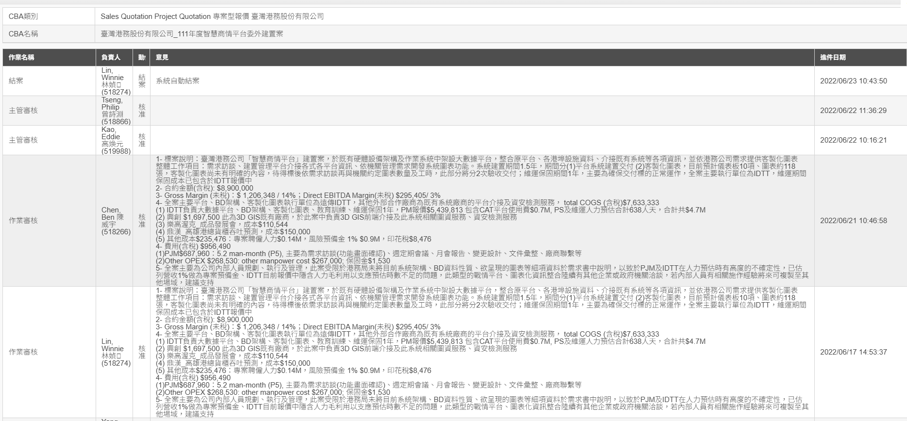

# 檔案來源: Planner 意見.docx

Planner 意見
1- 標案說明：臺灣港務公司「智慧商情平台」建置案，於既有硬體設備架構及作業系統中架設大數據平台，整合原平台、各港埠設施資料、介接既有系統等各項資訊，並依港務公司需求提供客製化圖表
整體工作項目：需求訪談、建置管理平台介接各式各平台資訊、依機關管理需求開發系統圖表功能。系統建置期間1.5年，期間分(1)平台系統建置交付 (2)客製化圖表，目前預計儀表板10項、圖表約118張，客製化圖表尚未有明確的內容，待得標後依需求訪談再與機關約定圖表數量及工時，此部分將分2次驗收交付；維運保固期間1年，主要為確保交付標的正常運作，全案主要執行單位為IDTT，維運期間保固成本已包含於IDTT報價中
2- 合約金額(含稅): $8,900,000
3- Gross Margin (未稅)：$ 1,206,348 / 14%；Direct EBITDA Margin(未稅) $295,405/ 3%
4- 全案主要平台、BD架構、客製化圖表執行單位為遠傳IDTT，其他外部合作廠商為既有系統廠商的平台介接及資安檢測服務， total COGS (含稅)$7,633,333
(1) IDTT負責大數據平台、BD架構、客製化圖表、教育訓練、維運保固1年，PM報價$5,439,813 包含CAT平台使用費$0.7M, PS及維運人力預估合計638人天，合計共$4.7M
(2) 興創 $1,697,500 此為3D GIS既有廠商，於此案中負責3D GIS前端介接及此系統相關圖資服務、資安檢測服務
(3) 樂高渥克_成品發展會，成本$110,544
(4) 鼎漢_高雄港總貨櫃吞吐預測，成本$150,000
(5) 其他成本$235,476：專案聘僱人力$0.14M，風險預備金 1% $0.9M，印花稅$8,476
4- 費用(含稅) $956,490
(1)PJM$687,960：5.2 man-month (P5), 主要為需求訪談(功能畫面確認)、週定期會議、月會報告、變更設計、文件彙整、廠商聯繫等
(2)Other OPEX $268,530: other manpower cost $267,000; 保固金$1,530
5- 全案主要為公司內部人員規劃、執行及管理，此案受限於港務局未將目前系統架構、BD資料性質、欲呈現的圖表等細項資料於需求書中說明，以致於PJM及IDTT在人力預估時有高度的不確定性，已估列營收1%做為專案預備金、IDTT目前報價中隱含人力毛利用以支應預估時數不足的問題，此類型的戰情平台、圖表化資訊整合陸續有其他企業或政府機關洽談，若內部人員有相關施作經驗將來可複製至其他場域，建議支持

